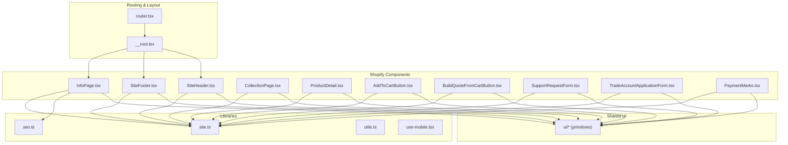
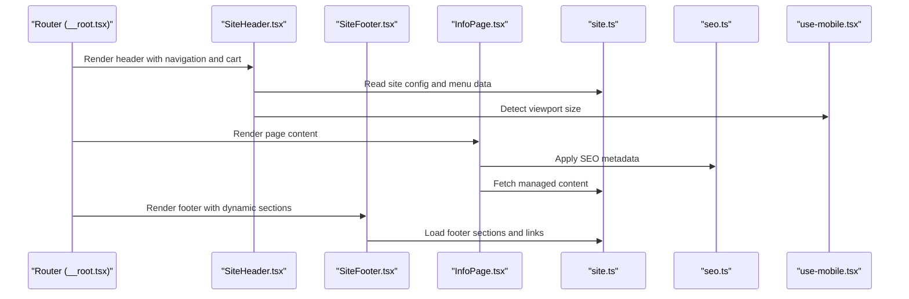
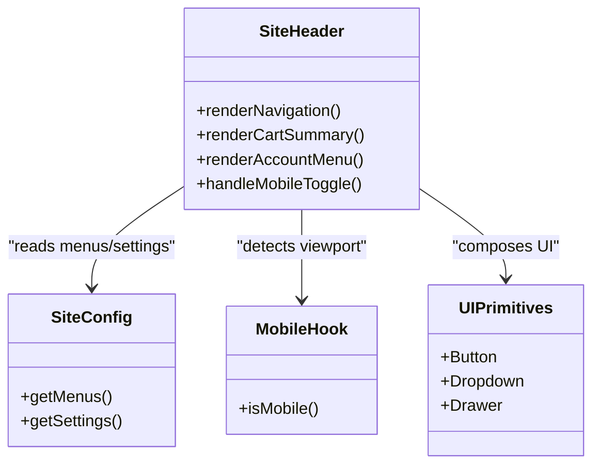
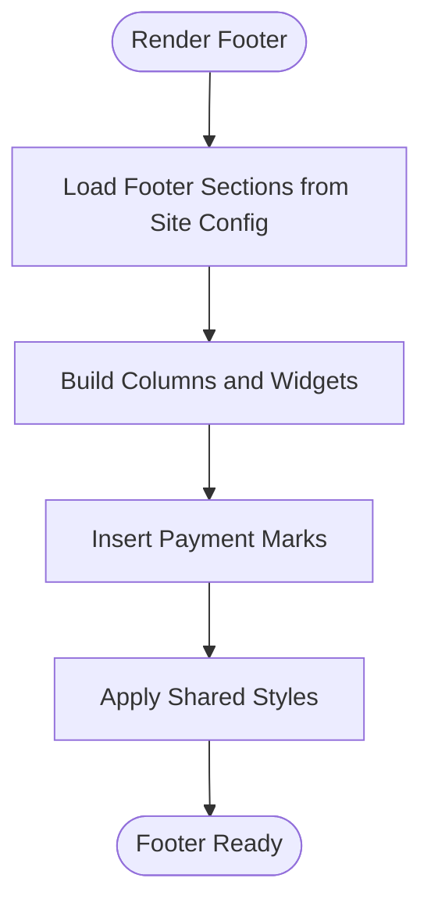
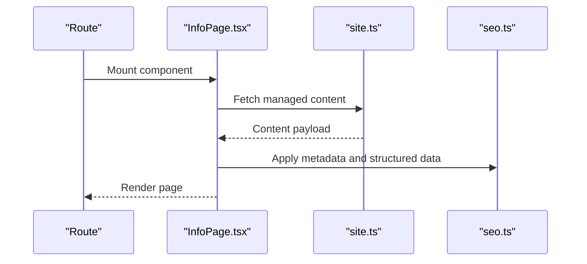
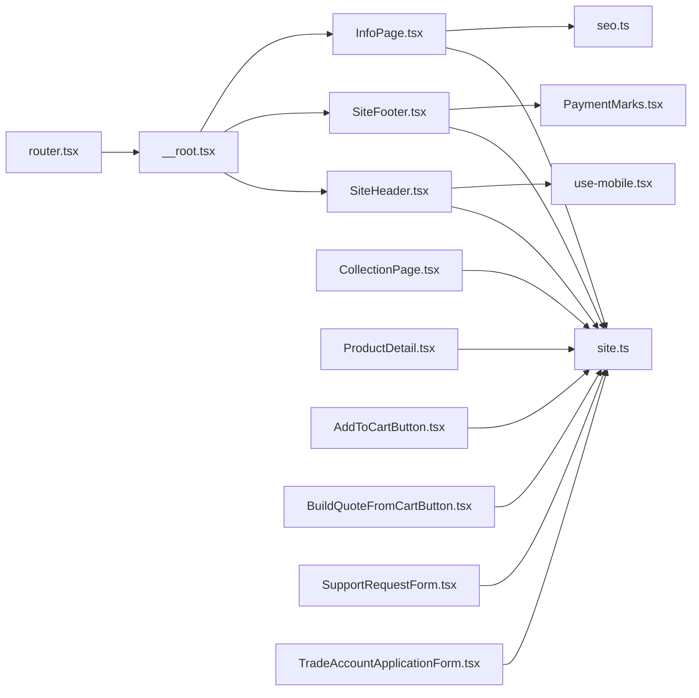

# Site Integration Components

<cite>
**Referenced Files in This Document**
- [SiteHeader.tsx](file://src/components/shopify/SiteHeader.tsx)
- [SiteFooter.tsx](file://src/components/shopify/SiteFooter.tsx)
- [InfoPage.tsx](file://src/components/shopify/InfoPage.tsx)
- [CollectionPage.tsx](file://src/components/shopify/CollectionPage.tsx)
- [ProductDetail.tsx](file://src/components/shopify/ProductDetail.tsx)
- [AddToCartButton.tsx](file://src/components/shopify/AddToCartButton.tsx)
- [BuildQuoteFromCartButton.tsx](file://src/components/shopify/BuildQuoteFromCartButton.tsx)
- [SupportRequestForm.tsx](file://src/components/shopify/SupportRequestForm.tsx)
- [TradeAccountApplicationForm.tsx](file://src/components/shopify/TradeAccountApplicationForm.tsx)
- [PaymentMarks.tsx](file://src/components/shopify/PaymentMarks.tsx)
- [use-mobile.tsx](file://src/hooks/use-mobile.tsx)
- [site.ts](file://src/lib/site.ts)
- [seo.ts](file://src/lib/seo.ts)
- [utils.ts](file://src/lib/utils.ts)
- [router.tsx](file://src/router.tsx)
- [__root.tsx](file://src/routes/__root.tsx)
</cite>

## Table of Contents
1. [Introduction](#introduction)
2. [Project Structure](#project-structure)
3. [Core Components](#core-components)
4. [Architecture Overview](#architecture-overview)
5. [Detailed Component Analysis](#detailed-component-analysis)
6. [Dependency Analysis](#dependency-analysis)
7. [Performance Considerations](#performance-considerations)
8. [Troubleshooting Guide](#troubleshooting-guide)
9. [Conclusion](#conclusion)
10. [Appendices](#appendices)

## Introduction
This document provides comprehensive documentation for site-wide Shopify integration components, focusing on the SiteHeader, SiteFooter, and InfoPage components. It explains how these components integrate with Shopify navigation, cart display, user account features, and dynamic content sections. The guide includes examples of extending these components, adding custom Shopify data, maintaining consistent styling, addressing responsive design considerations, ensuring accessibility compliance, and optimizing performance. It also documents customization patterns and extension points for site-wide functionality.

## Project Structure
The project organizes Shopify-specific UI components under src/components/shopify, with shared UI primitives under src/components/ui. Site-wide layout and routing are defined in src/routes and src/router.tsx. Utilities for SEO, site configuration, and mobile detection are located in src/lib and src/hooks.

**Diagram sources**
- [SiteHeader.tsx](file://src/components/shopify/SiteHeader.tsx)
- [SiteFooter.tsx](file://src/components/shopify/SiteFooter.tsx)
- [InfoPage.tsx](file://src/components/shopify/InfoPage.tsx)
- [CollectionPage.tsx](file://src/components/shopify/CollectionPage.tsx)
- [ProductDetail.tsx](file://src/components/shopify/ProductDetail.tsx)
- [AddToCartButton.tsx](file://src/components/shopify/AddToCartButton.tsx)
- [BuildQuoteFromCartButton.tsx](file://src/components/shopify/BuildQuoteFromCartButton.tsx)
- [SupportRequestForm.tsx](file://src/components/shopify/SupportRequestForm.tsx)
- [TradeAccountApplicationForm.tsx](file://src/components/shopify/TradeAccountApplicationForm.tsx)
- [PaymentMarks.tsx](file://src/components/shopify/PaymentMarks.tsx)
- [router.tsx](file://src/router.tsx)
- [__root.tsx](file://src/routes/__root.tsx)
- [site.ts](file://src/lib/site.ts)
- [seo.ts](file://src/lib/seo.ts)
- [utils.ts](file://src/lib/utils.ts)
- [use-mobile.tsx](file://src/hooks/use-mobile.tsx)

**Section sources**
- [router.tsx](file://src/router.tsx)
- [__root.tsx](file://src/routes/__root.tsx)
- [site.ts](file://src/lib/site.ts)
- [seo.ts](file://src/lib/seo.ts)
- [utils.ts](file://src/lib/utils.ts)
- [use-mobile.tsx](file://src/hooks/use-mobile.tsx)

## Core Components
This section summarizes the responsibilities and integration points of the primary site-wide components:

- SiteHeader
  - Integrates Shopify navigation menus and links.
  - Displays cart summary and actions.
  - Provides access to user account features.
  - Adapts to mobile viewports using a hook.

- SiteFooter
  - Renders Shopify-powered content sections and links.
  - Presents dynamic content such as payment marks and policy links.
  - Maintains consistent styling via shared UI primitives.

- InfoPage
  - Displays Shopify-managed informational content.
  - Applies SEO metadata and structured data where applicable.
  - Supports responsive layouts and accessible markup.

These components rely on shared utilities for site configuration, SEO, and mobile detection, and they compose reusable UI primitives for consistency.

**Section sources**
- [SiteHeader.tsx](file://src/components/shopify/SiteHeader.tsx)
- [SiteFooter.tsx](file://src/components/shopify/SiteFooter.tsx)
- [InfoPage.tsx](file://src/components/shopify/InfoPage.tsx)
- [use-mobile.tsx](file://src/hooks/use-mobile.tsx)
- [site.ts](file://src/lib/site.ts)
- [seo.ts](file://src/lib/seo.ts)
- [utils.ts](file://src/lib/utils.ts)

## Architecture Overview
The site-wide integration architecture centers around three key components that wrap application routes and provide global Shopify features.

**Diagram sources**
- [__root.tsx](file://src/routes/__root.tsx)
- [SiteHeader.tsx](file://src/components/shopify/SiteHeader.tsx)
- [SiteFooter.tsx](file://src/components/shopify/SiteFooter.tsx)
- [InfoPage.tsx](file://src/components/shopify/InfoPage.tsx)
- [site.ts](file://src/lib/site.ts)
- [seo.ts](file://src/lib/seo.ts)
- [use-mobile.tsx](file://src/hooks/use-mobile.tsx)

## Detailed Component Analysis

### SiteHeader Component
Responsibilities:
- Navigation: Renders Shopify navigation menus and links.
- Cart Display: Shows cart summary and quick actions.
- User Account: Provides access to account-related features.
- Responsive Behavior: Collapses into a mobile-friendly interface based on viewport size.

Integration Points:
- Uses site configuration and menu data from site utilities.
- Composes UI primitives for buttons, menus, and overlays.
- Leverages mobile detection hook for responsive behavior.

Extension Patterns:
- Add new top-level navigation items by updating site configuration.
- Integrate additional cart actions or badges by composing existing cart UI primitives.
- Extend account dropdown with custom links or status indicators.

Accessibility:
- Ensure keyboard navigability for menus and dropdowns.
- Provide ARIA attributes for expanded/collapsed states and focus management.
- Use semantic landmarks and headings for screen readers.

Responsive Design:
- Collapse navigation into a drawer or sheet on small screens.
- Adjust spacing and typography for readability across breakpoints.

Performance:
- Lazy-load heavy menu items or icons if needed.
- Memoize computed values for cart counts and menu structures.

**Diagram sources**
- [SiteHeader.tsx](file://src/components/shopify/SiteHeader.tsx)
- [site.ts](file://src/lib/site.ts)
- [use-mobile.tsx](file://src/hooks/use-mobile.tsx)

**Section sources**
- [SiteHeader.tsx](file://src/components/shopify/SiteHeader.tsx)
- [site.ts](file://src/lib/site.ts)
- [use-mobile.tsx](file://src/hooks/use-mobile.tsx)

### SiteFooter Component
Responsibilities:
- Content Sections: Renders Shopify-powered sections such as links, policies, and promotional content.
- Dynamic Content: Displays payment marks and other dynamic elements.
- Consistent Styling: Uses shared UI primitives for uniform appearance.

Integration Points:
- Reads footer sections and links from site configuration.
- Composes payment marks and policy links using UI primitives.
- Supports dynamic updates when Shopify content changes.

Extension Patterns:
- Add new footer columns or sections by updating site configuration.
- Introduce custom widgets or banners within footer sections.
- Localize footer text and links through site settings.

Accessibility:
- Use proper heading hierarchy and link descriptions.
- Ensure sufficient color contrast and focus indicators.
- Provide skip links to main content when necessary.

Responsive Design:
- Stack columns vertically on small screens.
- Reduce padding and font sizes for compact layouts.

Performance:
- Preload critical assets like logos and icons.
- Avoid unnecessary re-renders by memoizing static sections.

**Diagram sources**
- [SiteFooter.tsx](file://src/components/shopify/SiteFooter.tsx)
- [site.ts](file://src/lib/site.ts)
- [PaymentMarks.tsx](file://src/components/shopify/PaymentMarks.tsx)

**Section sources**
- [SiteFooter.tsx](file://src/components/shopify/SiteFooter.tsx)
- [site.ts](file://src/lib/site.ts)
- [PaymentMarks.tsx](file://src/components/shopify/PaymentMarks.tsx)

### InfoPage Component
Responsibilities:
- Displays Shopify-managed informational content such as policies, about pages, and resources.
- Applies SEO metadata and structured data for better search visibility.
- Ensures accessible and responsive presentation of content.

Integration Points:
- Fetches content from Shopify-managed sources via site utilities.
- Applies SEO tags and meta information using SEO utilities.
- Composes content blocks using UI primitives for consistent formatting.

Extension Patterns:
- Add custom content blocks or callouts by extending the content renderer.
- Integrate analytics events for page views and interactions.
- Support multiple locales by loading localized content and metadata.

Accessibility:
- Use semantic HTML elements (article, section, h1-h6).
- Provide alt text for images and captions for media.
- Ensure keyboard navigation and screen reader compatibility.

Responsive Design:
- Adapt typography and spacing for readability on all devices.
- Use fluid layouts and scalable images.

Performance:
- Defer non-critical scripts and styles.
- Cache content responses to reduce network overhead.

**Diagram sources**
- [InfoPage.tsx](file://src/components/shopify/InfoPage.tsx)
- [site.ts](file://src/lib/site.ts)
- [seo.ts](file://src/lib/seo.ts)

**Section sources**
- [InfoPage.tsx](file://src/components/shopify/InfoPage.tsx)
- [site.ts](file://src/lib/site.ts)
- [seo.ts](file://src/lib/seo.ts)

### Supporting Components
Additional components enhance the Shopify integration experience:

- CollectionPage: Displays product collections with filtering and pagination.
- ProductDetail: Shows detailed product information and add-to-cart actions.
- AddToCartButton: Handles cart addition interactions.
- BuildQuoteFromCartButton: Converts cart contents into quotes.
- SupportRequestForm: Captures support requests and integrates with backend services.
- TradeAccountApplicationForm: Manages trade account applications.
- PaymentMarks: Renders accepted payment methods and trust signals.

These components follow the same patterns of composition, responsiveness, accessibility, and performance optimization.

**Section sources**
- [CollectionPage.tsx](file://src/components/shopify/CollectionPage.tsx)
- [ProductDetail.tsx](file://src/components/shopify/ProductDetail.tsx)
- [AddToCartButton.tsx](file://src/components/shopify/AddToCartButton.tsx)
- [BuildQuoteFromCartButton.tsx](file://src/components/shopify/BuildQuoteFromCartButton.tsx)
- [SupportRequestForm.tsx](file://src/components/shopify/SupportRequestForm.tsx)
- [TradeAccountApplicationForm.tsx](file://src/components/shopify/TradeAccountApplicationForm.tsx)
- [PaymentMarks.tsx](file://src/components/shopify/PaymentMarks.tsx)

## Dependency Analysis
The following diagram illustrates dependencies between site-wide components and shared libraries.

**Diagram sources**
- [SiteHeader.tsx](file://src/components/shopify/SiteHeader.tsx)
- [SiteFooter.tsx](file://src/components/shopify/SiteFooter.tsx)
- [InfoPage.tsx](file://src/components/shopify/InfoPage.tsx)
- [CollectionPage.tsx](file://src/components/shopify/CollectionPage.tsx)
- [ProductDetail.tsx](file://src/components/shopify/ProductDetail.tsx)
- [AddToCartButton.tsx](file://src/components/shopify/AddToCartButton.tsx)
- [BuildQuoteFromCartButton.tsx](file://src/components/shopify/BuildQuoteFromCartButton.tsx)
- [SupportRequestForm.tsx](file://src/components/shopify/SupportRequestForm.tsx)
- [TradeAccountApplicationForm.tsx](file://src/components/shopify/TradeAccountApplicationForm.tsx)
- [PaymentMarks.tsx](file://src/components/shopify/PaymentMarks.tsx)
- [site.ts](file://src/lib/site.ts)
- [seo.ts](file://src/lib/seo.ts)
- [use-mobile.tsx](file://src/hooks/use-mobile.tsx)
- [router.tsx](file://src/router.tsx)
- [__root.tsx](file://src/routes/__root.tsx)

**Section sources**
- [site.ts](file://src/lib/site.ts)
- [seo.ts](file://src/lib/seo.ts)
- [use-mobile.tsx](file://src/hooks/use-mobile.tsx)
- [router.tsx](file://src/router.tsx)
- [__root.tsx](file://src/routes/__root.tsx)

## Performance Considerations
- Memoization: Memoize expensive computations such as menu trees and cart summaries to avoid unnecessary re-renders.
- Code Splitting: Lazy-load heavy components like product detail pages and forms to improve initial load time.
- Asset Optimization: Use optimized images and icons; preload critical assets like logos and fonts.
- Caching: Cache fetched Shopify content and metadata to reduce network requests.
- Accessibility and UX: Maintain smooth transitions and responsive interactions without blocking the main thread.

[No sources needed since this section provides general guidance]

## Troubleshooting Guide
Common issues and resolutions:
- Navigation not rendering: Verify site configuration and menu data availability; check for missing keys or malformed JSON.
- Cart count not updating: Ensure cart state synchronization and event listeners are correctly attached.
- Footer sections incomplete: Confirm footer sections are loaded from site configuration; validate content IDs and references.
- SEO metadata missing: Check SEO utility calls and ensure metadata is applied during component mount.
- Mobile menu not toggling: Validate mobile hook usage and ensure event handlers are bound properly.

**Section sources**
- [SiteHeader.tsx](file://src/components/shopify/SiteHeader.tsx)
- [SiteFooter.tsx](file://src/components/shopify/SiteFooter.tsx)
- [InfoPage.tsx](file://src/components/shopify/InfoPage.tsx)
- [site.ts](file://src/lib/site.ts)
- [seo.ts](file://src/lib/seo.ts)
- [use-mobile.tsx](file://src/hooks/use-mobile.tsx)

## Conclusion
The SiteHeader, SiteFooter, and InfoPage components form the backbone of site-wide Shopify integration. They provide robust navigation, cart display, user account features, and dynamic content rendering while adhering to responsive design, accessibility standards, and performance best practices. By leveraging shared utilities and UI primitives, these components maintain consistency and offer clear extension points for customization.

[No sources needed since this section summarizes without analyzing specific files]

## Appendices

### Customization Patterns and Extension Points
- Extending SiteHeader:
  - Add new navigation items via site configuration.
  - Integrate custom cart actions or badges by composing existing UI primitives.
  - Extend account dropdown with additional links or status indicators.

- Extending SiteFooter:
  - Add new footer columns or sections by updating site configuration.
  - Insert custom widgets or banners within footer sections.
  - Localize footer text and links through site settings.

- Extending InfoPage:
  - Add custom content blocks or callouts by extending the content renderer.
  - Integrate analytics events for page views and interactions.
  - Support multiple locales by loading localized content and metadata.

- Adding Custom Shopify Data:
  - Update site configuration to include new fields or sections.
  - Modify components to read and render additional data.
  - Ensure SEO metadata reflects new content types.

- Maintaining Consistent Styling:
  - Use shared UI primitives for buttons, cards, and layouts.
  - Follow established spacing and typography scales.
  - Apply theme tokens and CSS variables consistently.

- Responsive Design Considerations:
  - Use mobile-first approach and breakpoint-aware layouts.
  - Test across devices and orientations.
  - Optimize touch targets and gestures.

- Accessibility Compliance:
  - Implement ARIA attributes and roles appropriately.
  - Ensure keyboard navigability and focus management.
  - Provide descriptive labels and alt text for media.

- Performance Optimization:
  - Memoize computed values and debounce user inputs.
  - Lazy-load heavy components and defer non-critical scripts.
  - Cache API responses and leverage browser caching strategies.

[No sources needed since this section provides general guidance]