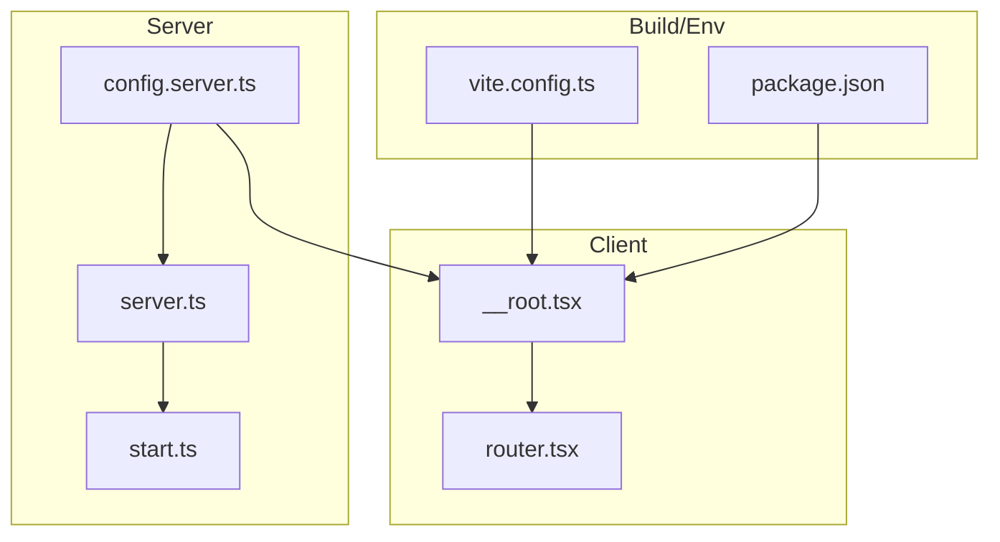
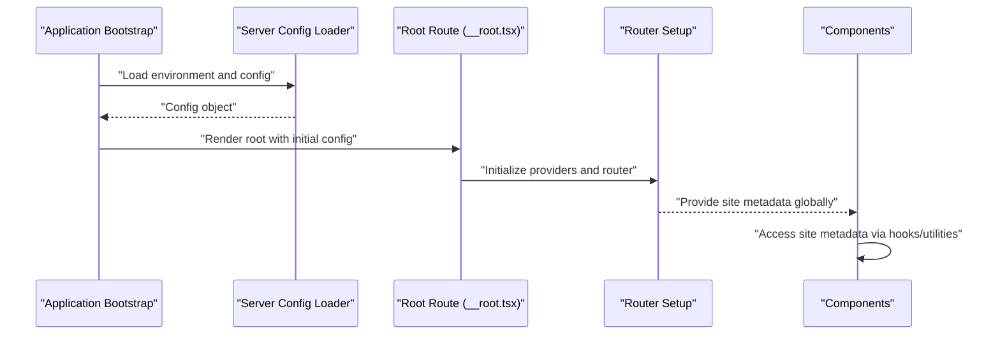
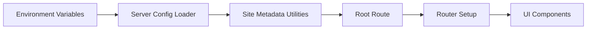

# Global State Architecture

<cite>
**Referenced Files in This Document**
- [src/lib/config.server.ts](file://src/lib/config.server.ts)
- [src/lib/site.ts](file://src/lib/site.ts)
- [src/routes/__root.tsx](file://src/routes/__root.tsx)
- [src/router.tsx](file://src/router.tsx)
- [src/server.ts](file://src/server.ts)
- [src/start.ts](file://src/start.ts)
- [vite.config.ts](file://vite.config.ts)
- [package.json](file://package.json)
</cite>

## Table of Contents
1. [Introduction](#introduction)
2. [Project Structure](#project-structure)
3. [Core Components](#core-components)
4. [Architecture Overview](#architecture-overview)
5. [Detailed Component Analysis](#detailed-component-analysis)
6. [Dependency Analysis](#dependency-analysis)
7. [Performance Considerations](#performance-considerations)
8. [Troubleshooting Guide](#troubleshooting-guide)
9. [Conclusion](#conclusion)
10. [Appendices](#appendices)

## Introduction
This document explains the global state architecture in SpareAutomation with a focus on site configuration management, root-level state initialization, and application-wide data sharing patterns. It covers how site metadata, theme settings, and global preferences are managed across the application, including examples of accessing and updating shared configuration, handling synchronization, persistence strategies, environment-specific configurations, and migration patterns. It also provides guidelines for extending global state while maintaining performance and memory efficiency.

## Project Structure
The global state is primarily centered around server-side configuration and client-side access to site metadata. The key areas include:
- Server configuration loader
- Site metadata provider and utilities
- Root route initialization that wires up global context
- Router setup and application bootstrap
- Build-time configuration and environment variables

**Diagram sources**
- [src/lib/config.server.ts](file://src/lib/config.server.ts)
- [src/server.ts](file://src/server.ts)
- [src/start.ts](file://src/start.ts)
- [src/routes/__root.tsx](file://src/routes/__root.tsx)
- [src/router.tsx](file://src/router.tsx)
- [vite.config.ts](file://vite.config.ts)
- [package.json](file://package.json)

**Section sources**
- [src/lib/config.server.ts](file://src/lib/config.server.ts)
- [src/lib/site.ts](file://src/lib/site.ts)
- [src/routes/__root.tsx](file://src/routes/__root.tsx)
- [src/router.tsx](file://src/router.tsx)
- [src/server.ts](file://src/server.ts)
- [src/start.ts](file://src/start.ts)
- [vite.config.ts](file://vite.config.ts)
- [package.json](file://package.json)

## Core Components
- Server configuration module: Loads and exposes runtime configuration values (including environment-specific settings).
- Site metadata module: Provides typed accessors for site metadata such as name, description, logo, and theme-related settings.
- Root route: Initializes global context providers and injects initial site configuration into the client.
- Router and bootstrap: Establishes the application shell and ensures global state is available before rendering routes.
- Build-time configuration: Defines environment variable exposure and build flags used by both server and client.

Key responsibilities:
- Centralize all global configuration in one place to avoid duplication.
- Provide typed accessors to prevent misuse of raw strings or numbers.
- Ensure consistent initialization order from server to client.
- Support environment-specific overrides without changing code paths.

**Section sources**
- [src/lib/config.server.ts](file://src/lib/config.server.ts)
- [src/lib/site.ts](file://src/lib/site.ts)
- [src/routes/__root.tsx](file://src/routes/__root.tsx)
- [src/router.tsx](file://src/router.tsx)
- [src/server.ts](file://src/server.ts)
- [src/start.ts](file://src/start.ts)
- [vite.config.ts](file://vite.config.ts)
- [package.json](file://package.json)

## Architecture Overview
Global state flows from server configuration into the client via the root route. The server loads configuration once at startup and makes it available to the client during hydration. The root route initializes any necessary providers and passes initial site metadata to components.

**Diagram sources**
- [src/lib/config.server.ts](file://src/lib/config.server.ts)
- [src/routes/__root.tsx](file://src/routes/__root.tsx)
- [src/router.tsx](file://src/router.tsx)

## Detailed Component Analysis

### Server Configuration Module
Purpose:
- Load environment variables and derive configuration values.
- Expose typed getters for features like API endpoints, feature flags, and defaults.
- Validate critical values and provide safe fallbacks.

Responsibilities:
- Environment detection and loading.
- Deriving computed configuration from base values.
- Ensuring consistency between server and client expectations.

Common usage patterns:
- Import configuration at server startup.
- Pass derived values to client through root route props or context.
- Use typed getters throughout the app to avoid stringly-typed access.

**Section sources**
- [src/lib/config.server.ts](file://src/lib/config.server.ts)

### Site Metadata Utilities
Purpose:
- Provide a single source of truth for site metadata and theme settings.
- Offer typed accessors for common fields (e.g., site name, description, logo URL, theme mode).
- Allow optional overrides based on environment or runtime flags.

Responsibilities:
- Normalize and validate metadata.
- Compute derived values (e.g., canonical URLs, default SEO tags).
- Expose simple APIs for components to read global preferences.

Integration points:
- Consumed by root route to initialize global context.
- Used by UI components to render branding and theme-aware elements.

**Section sources**
- [src/lib/site.ts](file://src/lib/site.ts)

### Root Route Initialization
Purpose:
- Initialize global providers and pass initial site configuration to the client.
- Ensure that all consumers can access site metadata immediately after hydration.

Responsibilities:
- Read server-derived configuration.
- Wrap the app with providers that expose site metadata globally.
- Handle errors gracefully if configuration is missing or invalid.

Best practices:
- Keep root minimal; delegate heavy logic to modules.
- Avoid mutating global state here; prefer immutable updates.
- Log warnings when expected configuration is absent.

**Section sources**
- [src/routes/__root.tsx](file://src/routes/__root.tsx)

### Router and Application Bootstrap
Purpose:
- Set up routing and ensure global state is available before rendering pages.
- Integrate with the root route’s providers.

Responsibilities:
- Configure route tree and navigation guards if needed.
- Ensure consistent initialization order.

**Section sources**
- [src/router.tsx](file://src/router.tsx)

### Server and Start Scripts
Purpose:
- Start the HTTP server and initialize the application.
- Load configuration early and prepare the environment for request handling.

Responsibilities:
- Parse CLI arguments and environment variables.
- Initialize logging and error capture.
- Graceful shutdown handling.

**Section sources**
- [src/server.ts](file://src/server.ts)
- [src/start.ts](file://src/start.ts)

### Build-Time Configuration and Environment Variables
Purpose:
- Define which environment variables are exposed to the client.
- Control build-time flags and asset behavior.

Responsibilities:
- Map environment variables to constants.
- Separate sensitive server-only variables from public ones.

**Section sources**
- [vite.config.ts](file://vite.config.ts)
- [package.json](file://package.json)

## Dependency Analysis
Global state dependencies flow from configuration to site utilities to the root route and then to components.

**Diagram sources**
- [src/lib/config.server.ts](file://src/lib/config.server.ts)
- [src/lib/site.ts](file://src/lib/site.ts)
- [src/routes/__root.tsx](file://src/routes/__root.tsx)
- [src/router.tsx](file://src/router.tsx)

**Section sources**
- [src/lib/config.server.ts](file://src/lib/config.server.ts)
- [src/lib/site.ts](file://src/lib/site.ts)
- [src/routes/__root.tsx](file://src/routes/__root.tsx)
- [src/router.tsx](file://src/router.tsx)

## Performance Considerations
- Prefer immutable updates to global state to minimize re-renders.
- Memoize derived values in site utilities to avoid recomputation.
- Avoid large objects in frequently updated contexts; split concerns into smaller slices.
- Use lazy loading for non-critical configuration features.
- Cache expensive computations behind stable keys.
- Minimize the number of subscribers to global state changes.

[No sources needed since this section provides general guidance]

## Troubleshooting Guide
Common issues and resolutions:
- Missing environment variables: Ensure required variables are present in deployment environments and validated at startup.
- Hydration mismatches: Verify that server and client receive identical initial configuration.
- Theme not applying: Confirm that theme settings are correctly passed from root to providers and consumed by components.
- Slow initial load: Profile root route and provider initialization; defer non-essential work.

Operational checks:
- Validate configuration schema at startup.
- Add structured logs for configuration loading and errors.
- Include health checks that verify essential site metadata availability.

**Section sources**
- [src/lib/config.server.ts](file://src/lib/config.server.ts)
- [src/routes/__root.tsx](file://src/routes/__root.tsx)

## Conclusion
SpareAutomation centralizes global state around server-loaded configuration and site metadata utilities, exposing them through the root route to the entire application. This approach ensures consistency, type safety, and clear separation between server and client concerns. By following the guidelines for persistence, environment-specific configuration, and migration patterns, teams can extend global state safely while preserving performance and maintainability.

[No sources needed since this section summarizes without analyzing specific files]

## Appendices

### Accessing Global State from Components
- Read site metadata using provided utilities or hooks exported by the site module.
- Avoid direct imports of environment variables in components; use typed accessors instead.
- For dynamic updates, dispatch actions through the global store or context setter rather than mutating state directly.

Example references:
- [src/lib/site.ts](file://src/lib/site.ts)
- [src/routes/__root.tsx](file://src/routes/__root.tsx)

### Updating Shared Configuration
- Use typed setters or action creators to update configuration slices.
- Batch multiple updates to reduce re-renders.
- Persist changes to storage if they should survive reloads.

Example references:
- [src/lib/site.ts](file://src/lib/site.ts)
- [src/routes/__root.tsx](file://src/routes/__root.tsx)

### Handling State Synchronization
- On hydration, reconcile server-provided configuration with local storage.
- Debounce frequent updates to avoid excessive writes.
- Use versioned schemas to detect and migrate stale state.

Example references:
- [src/lib/site.ts](file://src/lib/site.ts)
- [src/routes/__root.tsx](file://src/routes/__root.tsx)

### State Persistence Strategies
- Local storage for user preferences and theme settings.
- IndexedDB for larger datasets (e.g., cached quotes or product lists).
- Server-backed persistence for cross-device settings.

Guidelines:
- Version persisted state and implement migrations.
- Sanitize and validate before writing.
- Back off on write failures and retry asynchronously.

Example references:
- [src/lib/site.ts](file://src/lib/site.ts)

### Environment-Specific Configurations
- Use environment variables for secrets and endpoints.
- Expose only safe variables to the client via build-time configuration.
- Provide sensible defaults for development and strict validation for production.

Example references:
- [src/lib/config.server.ts](file://src/lib/config.server.ts)
- [vite.config.ts](file://vite.config.ts)
- [package.json](file://package.json)

### State Migration Patterns
- Maintain a version field in persisted state.
- Implement migration functions keyed by version.
- Run migrations on load before exposing state to components.

Example references:
- [src/lib/site.ts](file://src/lib/site.ts)

### Extending Global State Safely
- Add new configuration slices under a dedicated namespace.
- Provide typed getters and setters.
- Update root initialization to include new defaults.
- Document breaking changes and provide migration scripts.

Example references:
- [src/lib/site.ts](file://src/lib/site.ts)
- [src/routes/__root.tsx](file://src/routes/__root.tsx)