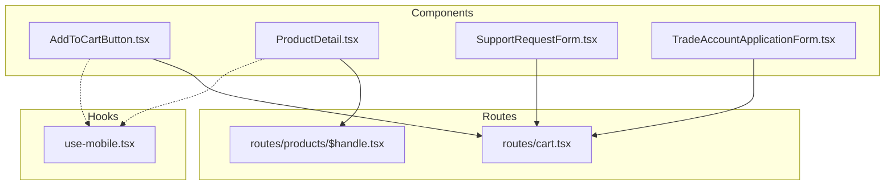
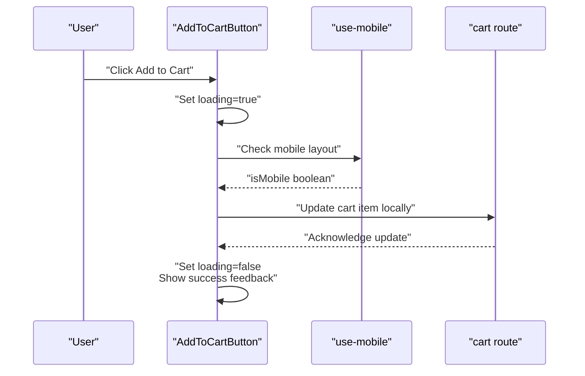
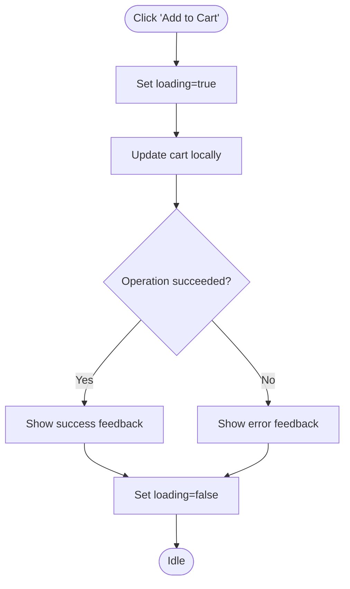
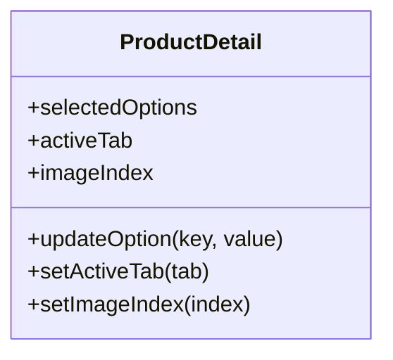
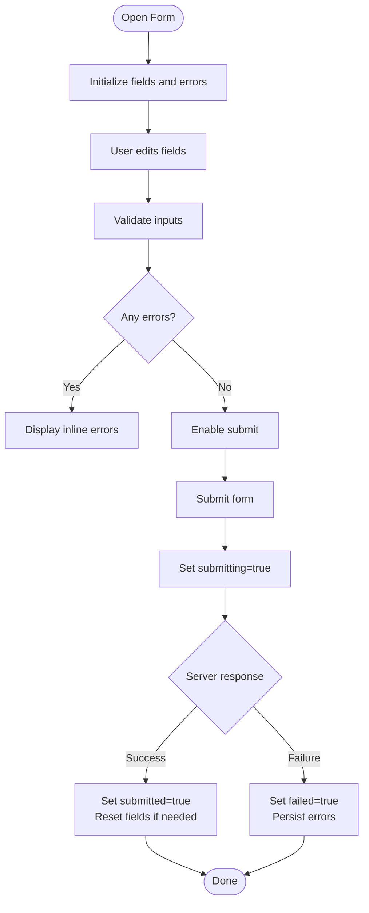
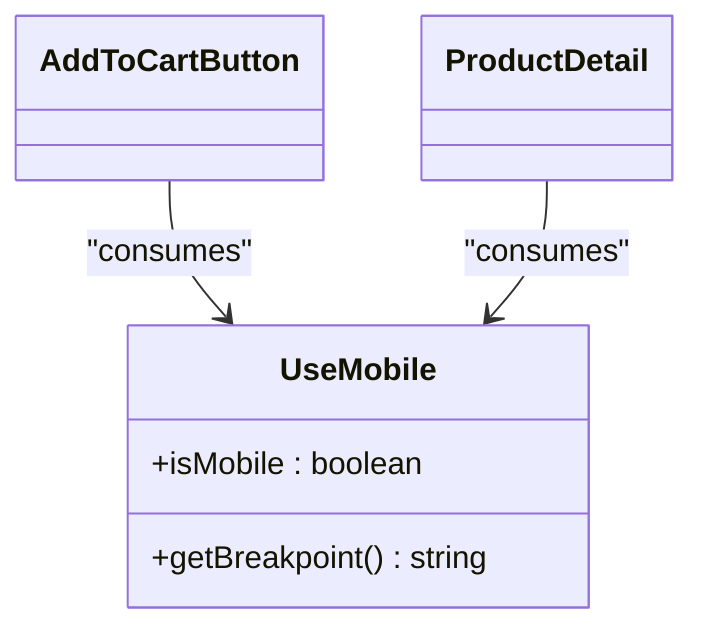
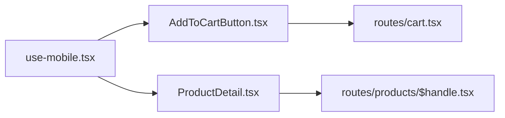

# Local Component State

<cite>
**Referenced Files in This Document**
- [AddToCartButton.tsx](file://src/components/shopify/AddToCartButton.tsx)
- [ProductDetail.tsx](file://src/components/shopify/ProductDetail.tsx)
- [SupportRequestForm.tsx](file://src/components/shopify/SupportRequestForm.tsx)
- [TradeAccountApplicationForm.tsx](file://src/components/shopify/TradeAccountApplicationForm.tsx)
- [use-mobile.tsx](file://src/hooks/use-mobile.tsx)
- [cart.tsx](file://src/routes/cart.tsx)
- [$handle.tsx](file://src/routes/products/$handle.tsx)
</cite>

## Table of Contents
1. [Introduction](#introduction)
2. [Project Structure](#project-structure)
3. [Core Components](#core-components)
4. [Architecture Overview](#architecture-overview)
5. [Detailed Component Analysis](#detailed-component-analysis)
6. [Dependency Analysis](#dependency-analysis)
7. [Performance Considerations](#performance-considerations)
8. [Troubleshooting Guide](#troubleshooting-guide)
9. [Conclusion](#conclusion)

## Introduction
This document explains local component state management patterns in SpareAutomation with a focus on React hooks usage (useState, useEffect), custom hooks for UI and responsiveness, form state handling, and temporary data within components. It provides concrete examples for cart button interactions, product detail page state, and mobile responsiveness state. It also covers component state lifecycle, cleanup patterns, performance optimization techniques, and guidance on when to use local vs global state, including lifting state and composition strategies.

## Project Structure
Local state is primarily implemented inside feature components under src/components/shopify and the mobile hook under src/hooks. Route-level pages may coordinate or lift state for multi-component flows such as product details and cart.

[No sources needed since this diagram shows conceptual structure]

## Core Components
This section highlights key components that demonstrate local state patterns:
- Add-to-cart interaction state (e.g., loading, success feedback)
- Product detail page state (e.g., selected options, tabs, image index)
- Form state for support requests and trade account applications (e.g., field values, validation, submission status)
- Mobile responsiveness state via a custom hook

These components typically use useState for ephemeral UI state and useEffect for side effects like debounced search or syncing with external services. The mobile hook encapsulates media query logic to keep components responsive without duplicating listeners.

**Section sources**
- [AddToCartButton.tsx](file://src/components/shopify/AddToCartButton.tsx)
- [ProductDetail.tsx](file://src/components/shopify/ProductDetail.tsx)
- [SupportRequestForm.tsx](file://src/components/shopify/SupportRequestForm.tsx)
- [TradeAccountApplicationForm.tsx](file://src/components/shopify/TradeAccountApplicationForm.tsx)
- [use-mobile.tsx](file://src/hooks/use-mobile.tsx)
- [cart.tsx](file://src/routes/cart.tsx)
- [$handle.tsx](file://src/routes/products/$handle.tsx)

## Architecture Overview
The following sequence illustrates how local state drives user interactions and updates within a component, using a typical add-to-cart flow as an example.

**Diagram sources**
- [AddToCartButton.tsx](file://src/components/shopify/AddToCartButton.tsx)
- [use-mobile.tsx](file://src/hooks/use-mobile.tsx)
- [cart.tsx](file://src/routes/cart.tsx)

## Detailed Component Analysis

### Add-to-Cart Interaction State
Local state commonly includes:
- Loading indicator during async operations
- Success/error feedback after action completion
- Temporary UI toggles (e.g., toast visibility)

Typical lifecycle:
- On click: set loading state
- Perform operation (e.g., update cart)
- Clear loading and show feedback
- Cleanup any timers or event listeners if used

**Diagram sources**
- [AddToCartButton.tsx](file://src/components/shopify/AddToCartButton.tsx)

**Section sources**
- [AddToCartButton.tsx](file://src/components/shopify/AddToCartButton.tsx)
- [cart.tsx](file://src/routes/cart.tsx)

### Product Detail Page State
Common local states:
- Selected variant/options
- Active tab or panel
- Image carousel index
- Temporary filters or notes

State often influences derived UI (e.g., price, availability) and may trigger side effects like analytics events or prefetching related content.

**Diagram sources**
- [ProductDetail.tsx](file://src/components/shopify/ProductDetail.tsx)

**Section sources**
- [ProductDetail.tsx](file://src/components/shopify/ProductDetail.tsx)
- [$handle.tsx](file://src/routes/products/$handle.tsx)

### Form State Management (Support Request and Trade Account)
Forms manage:
- Field values
- Validation errors
- Submission status (idle, submitting, submitted, failed)
- Temporary inputs not yet persisted

Patterns:
- Use useState per field or a combined object reducer
- Debounce heavy validations
- Reset or clear partial state on navigation away if appropriate
- Provide inline feedback and disable submit while submitting

**Diagram sources**
- [SupportRequestForm.tsx](file://src/components/shopify/SupportRequestForm.tsx)
- [TradeAccountApplicationForm.tsx](file://src/components/shopify/TradeAccountApplicationForm.tsx)

**Section sources**
- [SupportRequestForm.tsx](file://src/components/shopify/SupportRequestForm.tsx)
- [TradeAccountApplicationForm.tsx](file://src/components/shopify/TradeAccountApplicationForm.tsx)

### Mobile Responsiveness State
A custom hook centralizes media query logic to avoid duplication across components. Components consume the hook to adapt layouts conditionally.

**Diagram sources**
- [use-mobile.tsx](file://src/hooks/use-mobile.tsx)
- [AddToCartButton.tsx](file://src/components/shopify/AddToCartButton.tsx)
- [ProductDetail.tsx](file://src/components/shopify/ProductDetail.tsx)

**Section sources**
- [use-mobile.tsx](file://src/hooks/use-mobile.tsx)

## Dependency Analysis
Local state dependencies are minimal by design. Components depend on:
- React hooks (useState, useEffect)
- Custom hooks (e.g., use-mobile)
- Optional route context or parent props when lifting state

**Diagram sources**
- [use-mobile.tsx](file://src/hooks/use-mobile.tsx)
- [AddToCartButton.tsx](file://src/components/shopify/AddToCartButton.tsx)
- [ProductDetail.tsx](file://src/components/shopify/ProductDetail.tsx)
- [cart.tsx](file://src/routes/cart.tsx)
- [$handle.tsx](file://src/routes/products/$handle.tsx)

**Section sources**
- [use-mobile.tsx](file://src/hooks/use-mobile.tsx)
- [AddToCartButton.tsx](file://src/components/shopify/AddToCartButton.tsx)
- [ProductDetail.tsx](file://src/components/shopify/ProductDetail.tsx)
- [cart.tsx](file://src/routes/cart.tsx)
- [$handle.tsx](file://src/routes/products/$handle.tsx)

## Performance Considerations
- Prefer local state for UI-only concerns (loading, active tab, modal open/close).
- Avoid unnecessary re-renders by:
  - Splitting state into smaller slices where possible
  - Using functional state updates
  - Memoizing expensive computations derived from state
- Debounce input-driven side effects (search, live validation).
- Clean up subscriptions, timers, and event listeners in effect cleanup functions.
- Lift state only when multiple siblings need shared state; otherwise keep it local.
- Compose small components to isolate state and reduce render scope.

[No sources needed since this section provides general guidance]

## Troubleshooting Guide
Common issues and resolutions:
- Stale closures in effects: ensure dependencies include all referenced variables; prefer functional updates for state that depends on previous state.
- Memory leaks: remove event listeners and cancel timers in effect cleanup.
- Excessive re-renders: split state, memoize callbacks, and avoid creating new objects/functions on each render.
- Form state drift: normalize field names and reset on successful submission; persist draft state only when necessary.
- Mobile layout flicker: guard initial server-side rendering differences by deferring media queries until after mount.

[No sources needed since this section provides general guidance]

## Conclusion
Local component state in SpareAutomation follows clear, predictable patterns centered around useState and useEffect, with custom hooks abstracting cross-cutting concerns like responsiveness. Keep state close to where it is used, lift only when necessary, and compose components to maintain clarity and performance. For complex scenarios, consider introducing global state at the route or app level once local state becomes hard to manage.