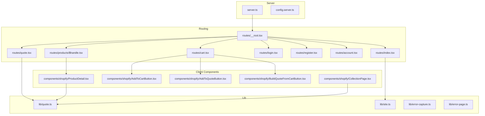
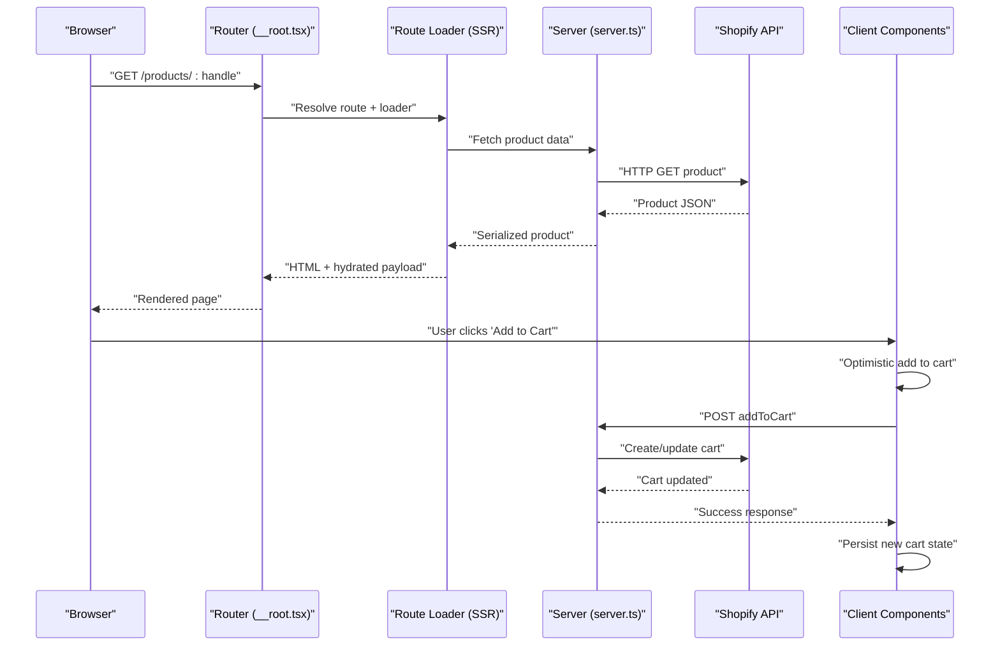
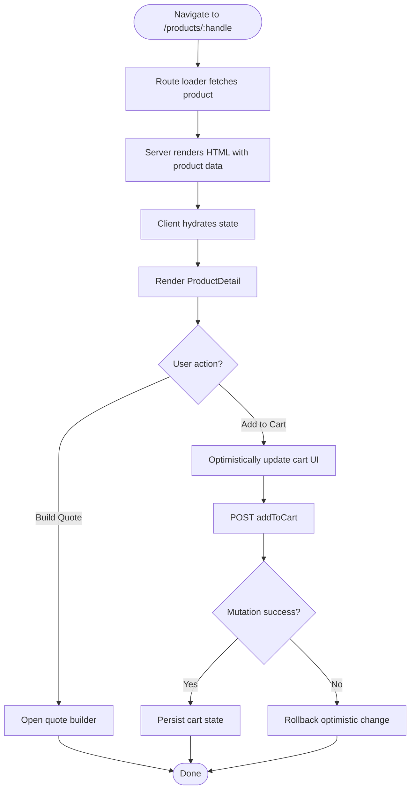
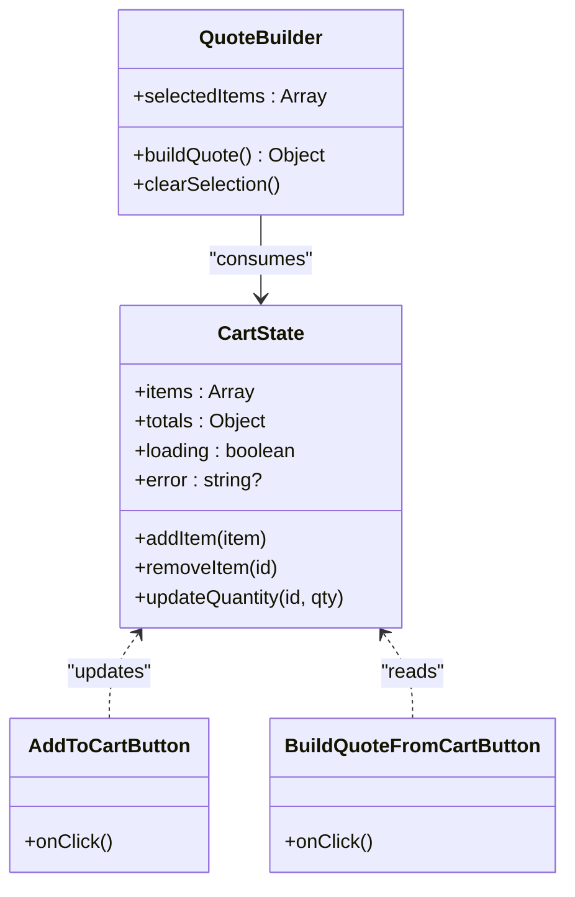
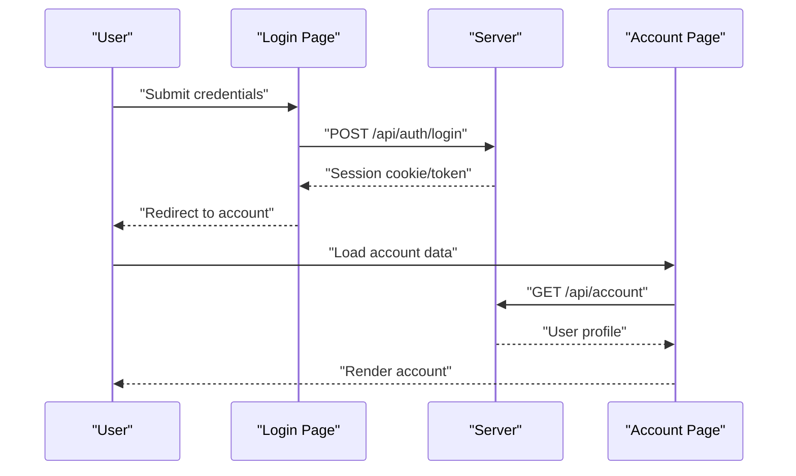
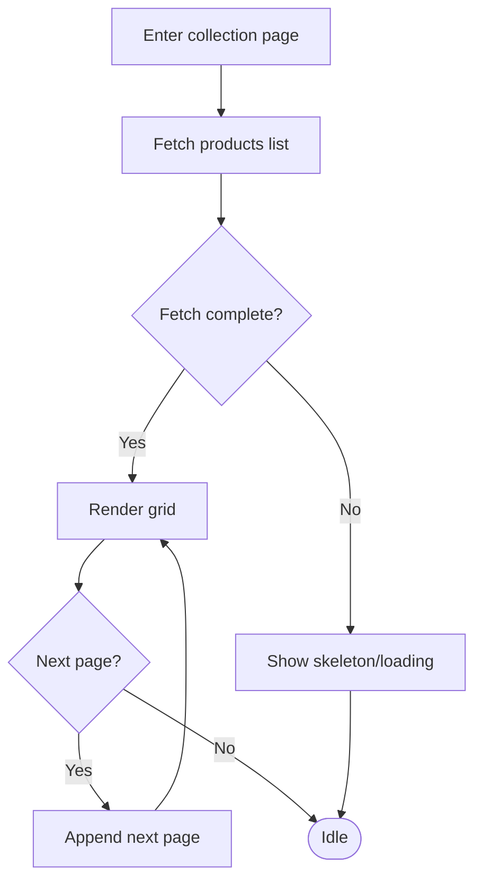
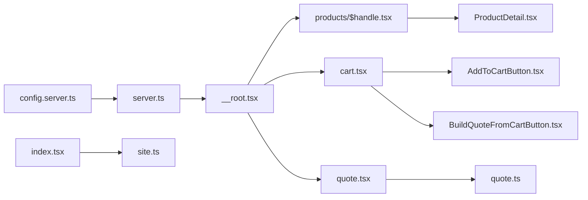
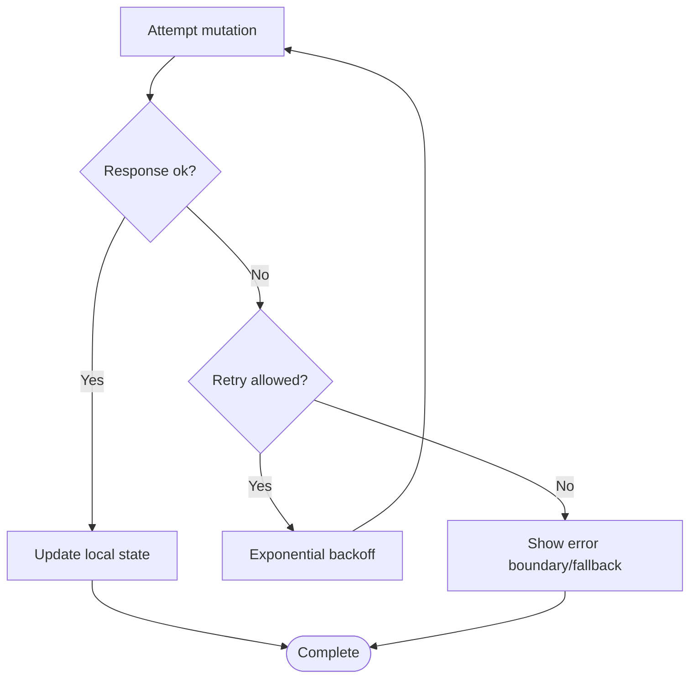

# Server State Handling

<cite>
**Referenced Files in This Document**
- [server.ts](file://src/server.ts)
- [router.tsx](file://src/router.tsx)
- [__root.tsx](file://src/routes/__root.tsx)
- [config.server.ts](file://src/lib/config.server.ts)
- [error-capture.ts](file://src/lib/error-capture.ts)
- [error-page.ts](file://src/lib/error-page.ts)
- [quote.ts](file://src/lib/quote.ts)
- [site.ts](file://src/lib/site.ts)
- [index.tsx](file://src/routes/index.tsx)
- [products/$handle.tsx](file://src/routes/products/$handle.tsx)
- [cart.tsx](file://src/routes/cart.tsx)
- [login.tsx](file://src/routes/login.tsx)
- [register.tsx](file://src/routes/register.tsx)
- [account.tsx](file://src/routes/account.tsx)
- [quote.tsx](file://src/routes/quote.tsx)
- [AddToCartButton.tsx](file://src/components/shopify/AddToCartButton.tsx)
- [AddToQuoteButton.tsx](file://src/components/shopify/AddToQuoteButton.tsx)
- [BuildQuoteFromCartButton.tsx](file://src/components/shopify/BuildQuoteFromCartButton.tsx)
- [ProductDetail.tsx](file://src/components/shopify/ProductDetail.tsx)
- [CollectionPage.tsx](file://src/components/shopify/CollectionPage.tsx)
</cite>

## Table of Contents
1. [Introduction](#introduction)
2. [Project Structure](#project-structure)
3. [Core Components](#core-components)
4. [Architecture Overview](#architecture-overview)
5. [Detailed Component Analysis](#detailed-component-analysis)
6. [Dependency Analysis](#dependency-analysis)
7. [Performance Considerations](#performance-considerations)
8. [Troubleshooting Guide](#troubleshooting-guide)
9. [Conclusion](#conclusion)

## Introduction
This document explains how server state is handled and synchronized across the client and server in SpareAutomation. It covers communication patterns, request/response lifecycle, caching strategies, error handling with retries and optimistic updates, loading states, hydration during server-side rendering (SSR), multi-client synchronization considerations, and best practices for managing server state dependencies and optimizing network requests.

## Project Structure
The project uses a modern full-stack setup with a Node/Bun server, React Router-based routing, and Shopify integration for commerce flows. Key areas relevant to server state:
- Server entry and configuration
- Route-level data fetching and SSR
- Client components that trigger API calls and manage local UI state
- Shared utilities for quoting and site metadata

**Diagram sources**
- [server.ts](file://src/server.ts)
- [config.server.ts](file://src/lib/config.server.ts)
- [__root.tsx](file://src/routes/__root.tsx)
- [index.tsx](file://src/routes/index.tsx)
- [products/$handle.tsx](file://src/routes/products/$handle.tsx)
- [cart.tsx](file://src/routes/cart.tsx)
- [login.tsx](file://src/routes/login.tsx)
- [register.tsx](file://src/routes/register.tsx)
- [account.tsx](file://src/routes/account.tsx)
- [quote.tsx](file://src/routes/quote.tsx)
- [ProductDetail.tsx](file://src/components/shopify/ProductDetail.tsx)
- [AddToCartButton.tsx](file://src/components/shopify/AddToCartButton.tsx)
- [AddToQuoteButton.tsx](file://src/components/shopify/AddToQuoteButton.tsx)
- [BuildQuoteFromCartButton.tsx](file://src/components/shopify/BuildQuoteFromCartButton.tsx)
- [CollectionPage.tsx](file://src/components/shopify/CollectionPage.tsx)
- [quote.ts](file://src/lib/quote.ts)
- [site.ts](file://src/lib/site.ts)
- [error-capture.ts](file://src/lib/error-capture.ts)
- [error-page.ts](file://src/lib/error-page.ts)

**Section sources**
- [server.ts](file://src/server.ts)
- [router.tsx](file://src/router.tsx)
- [__root.tsx](file://src/routes/__root.tsx)
- [config.server.ts](file://src/lib/config.server.ts)

## Core Components
- Server bootstrap and configuration: initializes runtime, loads environment, and sets up middleware and routes.
- Root route: provides global layout, error boundaries, and shared providers.
- Data loaders and route handlers: fetch server state on the server for SSR and revalidate on the client.
- Client components: manage user interactions, trigger mutations, and update local UI state optimistically where appropriate.
- Utilities: quote builder and site metadata helpers used by routes and components.

Key responsibilities:
- Fetching product and cart data on the server for initial render.
- Hydrating client state from server payloads.
- Managing loading, success, and error states at both route and component levels.
- Coordinating optimistic updates for non-critical actions (e.g., adding to cart or quote).

**Section sources**
- [__root.tsx](file://src/routes/__root.tsx)
- [index.tsx](file://src/routes/index.tsx)
- [products/$handle.tsx](file://src/routes/products/$handle.tsx)
- [cart.tsx](file://src/routes/cart.tsx)
- [quote.tsx](file://src/routes/quote.tsx)
- [quote.ts](file://src/lib/quote.ts)
- [site.ts](file://src/lib/site.ts)

## Architecture Overview
The application follows a hybrid SSR/CSR pattern:
- On first load, the server renders HTML using fetched data (hydration payload).
- The client hydrates this state and continues to manage subsequent updates via client-side requests.
- Components use local state for transient UI behavior and rely on route-level data for authoritative server state.

**Diagram sources**
- [__root.tsx](file://src/routes/__root.tsx)
- [server.ts](file://src/server.ts)
- [products/$handle.tsx](file://src/routes/products/$handle.tsx)
- [AddToCartButton.tsx](file://src/components/shopify/AddToCartButton.tsx)

## Detailed Component Analysis

### Product Detail Flow
- Server-side: The product route loader fetches product details from Shopify and serializes them into the initial HTML.
- Client-side: After hydration, the ProductDetail component can refetch if needed and handle interactive actions like adding to cart or building quotes.

**Diagram sources**
- [products/$handle.tsx](file://src/routes/products/$handle.tsx)
- [ProductDetail.tsx](file://src/components/shopify/ProductDetail.tsx)
- [AddToCartButton.tsx](file://src/components/shopify/AddToCartButton.tsx)
- [BuildQuoteFromCartButton.tsx](file://src/components/shopify/BuildQuoteFromCartButton.tsx)

**Section sources**
- [products/$handle.tsx](file://src/routes/products/$handle.tsx)
- [ProductDetail.tsx](file://src/components/shopify/ProductDetail.tsx)
- [AddToCartButton.tsx](file://src/components/shopify/AddToCartButton.tsx)
- [BuildQuoteFromCartButton.tsx](file://src/components/shopify/BuildQuoteFromCartButton.tsx)

### Cart and Quote Builder
- Cart route manages cart items and totals, coordinating with Shopify APIs.
- Quote builder composes selected products into a quote object, leveraging shared quote utilities.

**Diagram sources**
- [cart.tsx](file://src/routes/cart.tsx)
- [AddToCartButton.tsx](file://src/components/shopify/AddToCartButton.tsx)
- [BuildQuoteFromCartButton.tsx](file://src/components/shopify/BuildQuoteFromCartButton.tsx)
- [quote.ts](file://src/lib/quote.ts)

**Section sources**
- [cart.tsx](file://src/routes/cart.tsx)
- [quote.ts](file://src/lib/quote.ts)
- [AddToCartButton.tsx](file://src/components/shopify/AddToCartButton.tsx)
- [BuildQuoteFromCartButton.tsx](file://src/components/shopify/BuildQuoteFromCartButton.tsx)

### Authentication and Account
- Login and registration flows manage session state and redirect after successful authentication.
- Account page displays authenticated user context and related data.

**Diagram sources**
- [login.tsx](file://src/routes/login.tsx)
- [register.tsx](file://src/routes/register.tsx)
- [account.tsx](file://src/routes/account.tsx)

**Section sources**
- [login.tsx](file://src/routes/login.tsx)
- [register.tsx](file://src/routes/register.tsx)
- [account.tsx](file://src/routes/account.tsx)

### Collection Page
- Displays paginated product listings, typically fetched from Shopify.
- Manages loading and error states while supporting navigation and filtering.

**Diagram sources**
- [CollectionPage.tsx](file://src/components/shopify/CollectionPage.tsx)

**Section sources**
- [CollectionPage.tsx](file://src/components/shopify/CollectionPage.tsx)

## Dependency Analysis
- Server depends on configuration and environment variables for Shopify credentials and feature flags.
- Routes depend on lib utilities for quoting and site metadata.
- Client components depend on route-provided data and may perform additional mutations.

**Diagram sources**
- [config.server.ts](file://src/lib/config.server.ts)
- [server.ts](file://src/server.ts)
- [__root.tsx](file://src/routes/__root.tsx)
- [index.tsx](file://src/routes/index.tsx)
- [products/$handle.tsx](file://src/routes/products/$handle.tsx)
- [cart.tsx](file://src/routes/cart.tsx)
- [quote.tsx](file://src/routes/quote.tsx)
- [ProductDetail.tsx](file://src/components/shopify/ProductDetail.tsx)
- [AddToCartButton.tsx](file://src/components/shopify/AddToCartButton.tsx)
- [BuildQuoteFromCartButton.tsx](file://src/components/shopify/BuildQuoteFromCartButton.tsx)
- [quote.ts](file://src/lib/quote.ts)
- [site.ts](file://src/lib/site.ts)

**Section sources**
- [config.server.ts](file://src/lib/config.server.ts)
- [server.ts](file://src/server.ts)
- [__root.tsx](file://src/routes/__root.tsx)
- [index.tsx](file://src/routes/index.tsx)
- [products/$handle.tsx](file://src/routes/products/$handle.tsx)
- [cart.tsx](file://src/routes/cart.tsx)
- [quote.tsx](file://src/routes/quote.tsx)
- [ProductDetail.tsx](file://src/components/shopify/ProductDetail.tsx)
- [AddToCartButton.tsx](file://src/components/shopify/AddToCartButton.tsx)
- [BuildQuoteFromCartButton.tsx](file://src/components/shopify/BuildQuoteFromCartButton.tsx)
- [quote.ts](file://src/lib/quote.ts)
- [site.ts](file://src/lib/site.ts)

## Performance Considerations
- Prefer SSR for critical content (product details, collections) to reduce time-to-first-byte and improve SEO.
- Use optimistic updates for low-risk actions (e.g., adding to cart) to make UI feel instant; ensure robust rollback on failure.
- Implement pagination and infinite scroll for large lists to avoid heavy payloads.
- Cache static assets and leverage browser cache headers for images and scripts.
- Debounce search inputs and throttle repeated mutations to minimize network churn.
- Avoid unnecessary re-renders by memoizing derived data and splitting components.

[No sources needed since this section provides general guidance]

## Troubleshooting Guide
Common issues and recovery strategies:
- Network failures: Wrap API calls with retry logic and exponential backoff; surface user-friendly errors and allow retry actions.
- Partial hydration mismatches: Ensure server and client serialize/deserialize data consistently; guard against undefined values during hydration.
- Error boundaries: Use root-level error boundaries to catch rendering errors and display fallback UI without crashing the app.
- Logging and capture: Centralize error reporting and include contextual information (route, request ID, payload summary).

**Diagram sources**
- [error-capture.ts](file://src/lib/error-capture.ts)
- [error-page.ts](file://src/lib/error-page.ts)

**Section sources**
- [error-capture.ts](file://src/lib/error-capture.ts)
- [error-page.ts](file://src/lib/error-page.ts)

## Conclusion
SpareAutomation combines SSR for fast initial loads with client-side interactivity for dynamic features. By hydrating server state, applying optimistic updates judiciously, and implementing robust error handling and retries, the application delivers a responsive and resilient user experience. Following the guidelines above will help maintain consistent state across clients, optimize network usage, and provide clear error recovery paths.

[No sources needed since this section summarizes without analyzing specific files]