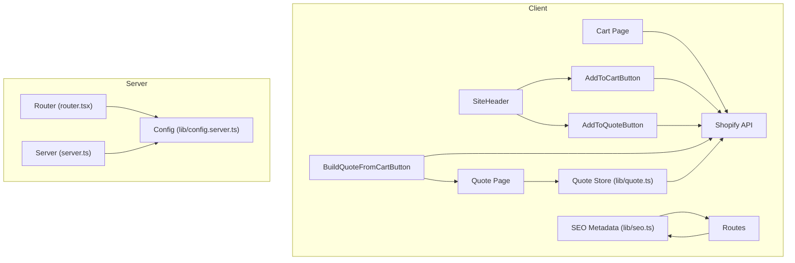
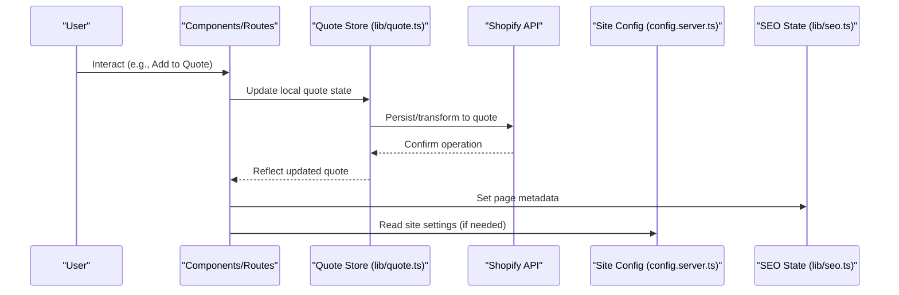
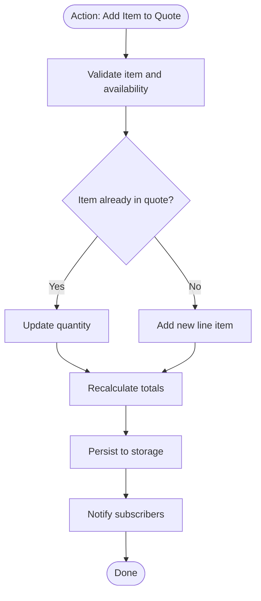
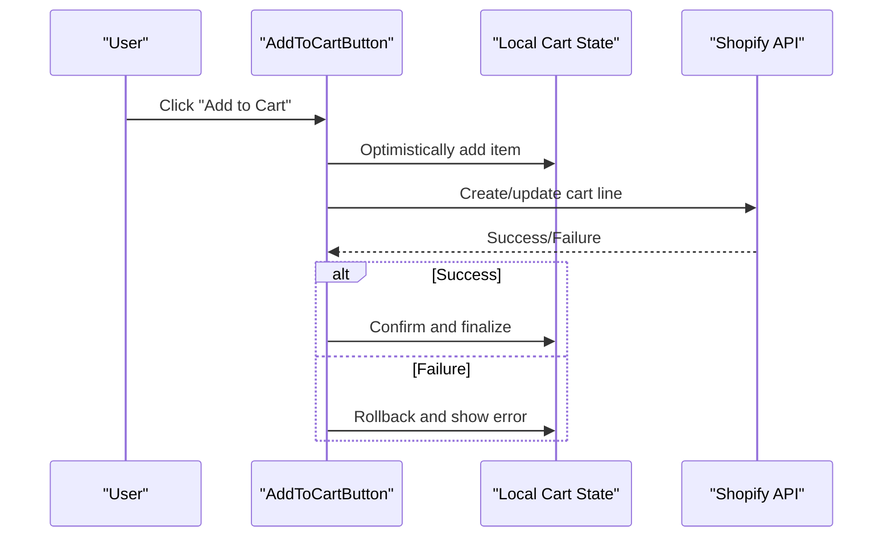
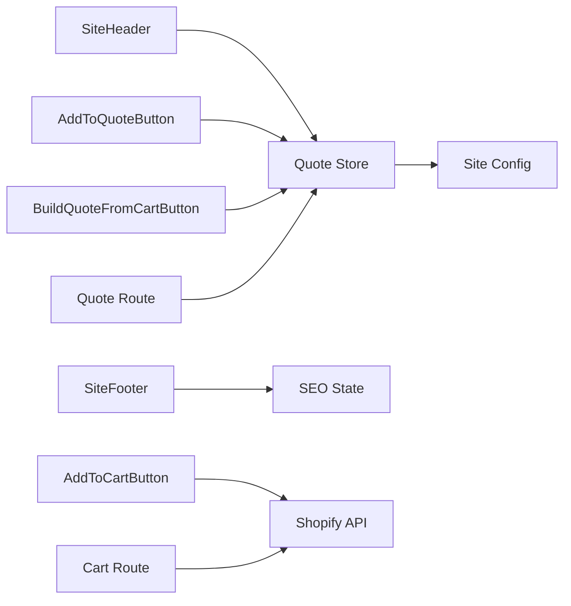

# State Management

<cite>
**Referenced Files in This Document**
- [src/lib/site.ts](file://src/lib/site.ts)
- [src/lib/quote.ts](file://src/lib/quote.ts)
- [src/lib/seo.ts](file://src/lib/seo.ts)
- [src/lib/config.server.ts](file://src/lib/config.server.ts)
- [src/routes/cart.tsx](file://src/routes/cart.tsx)
- [src/routes/quote.tsx](file://src/routes/quote.tsx)
- [src/components/shopify/AddToCartButton.tsx](file://src/components/shopify/AddToCartButton.tsx)
- [src/components/shopify/AddToQuoteButton.tsx](file://src/components/shopify/AddToQuoteButton.tsx)
- [src/components/shopify/BuildQuoteFromCartButton.tsx](file://src/components/shopify/BuildQuoteFromCartButton.tsx)
- [src/components/shopify/SiteHeader.tsx](file://src/components/shopify/SiteHeader.tsx)
- [src/components/shopify/SiteFooter.tsx](file://src/components/shopify/SiteFooter.tsx)
- [src/router.tsx](file://src/router.tsx)
- [src/server.ts](file://src/server.ts)
</cite>

## Table of Contents
1. Introduction
2. Project Structure
3. Core Components
4. Architecture Overview
5. Detailed Component Analysis
6. Dependency Analysis
7. Performance Considerations
8. Troubleshooting Guide
9. Conclusion

## Introduction
This document explains the state management strategies used across SpareAutomation, focusing on:
- Global site configuration and runtime settings
- Local component state patterns for UI interactions
- Server state handling via Shopify integration
- SEO metadata state
- Cart and quote lifecycles with persistence and synchronization
- Caching, optimistic updates, and performance considerations
- Guidelines for adding new state modules and debugging issues

The goal is to provide a clear mental model of how data flows between client components, local stores, server APIs, and persistent storage, while keeping the system maintainable and performant.

## Project Structure
State-related code is organized by concern rather than by feature:
- Site configuration and runtime settings live under lib/site.ts and lib/config.server.ts
- Quote domain logic lives under lib/quote.ts
- SEO metadata state lives under lib/seo.ts
- Routes expose cart and quote pages that orchestrate user workflows
- Shopify UI components encapsulate actions like add-to-cart and add-to-quote
- Router and server files wire up routing and server-side concerns

[No sources needed since this diagram shows conceptual workflow, not actual code structure]

## Core Components
- Site configuration: Centralized runtime settings loaded from server config and exposed to the client. Used to control feature flags, environment-specific behavior, and global UI options.
- Quote store: In-memory plus persisted state for quotes, including items, totals, and lifecycle transitions. Provides utilities to build quotes from cart and manage quote operations.
- SEO state: Declarative metadata state per route or page, enabling dynamic title, description, and structured data updates.
- Cart integration: Shopify-backed cart operations through dedicated buttons and routes, with persistence and synchronization to server state.

Key responsibilities:
- Keep global site configuration immutable at runtime after initialization
- Provide typed helpers for quote manipulation and serialization
- Ensure SEO metadata updates are scoped to current route context
- Maintain consistent cart/quote state across navigation and refresh

**Section sources**
- [src/lib/site.ts](file://src/lib/site.ts)
- [src/lib/quote.ts](file://src/lib/quote.ts)
- [src/lib/seo.ts](file://src/lib/seo.ts)
- [src/lib/config.server.ts](file://src/lib/config.server.ts)

## Architecture Overview
The application follows a layered approach:
- Presentation layer: React components and routes
- Domain layer: Quote store and utility functions
- Integration layer: Shopify API calls
- Configuration layer: Server-provided site settings
- Metadata layer: SEO state per route

**Diagram sources**
- [src/lib/quote.ts](file://src/lib/quote.ts)
- [src/lib/seo.ts](file://src/lib/seo.ts)
- [src/lib/config.server.ts](file://src/lib/config.server.ts)
- [src/components/shopify/AddToQuoteButton.tsx](file://src/components/shopify/AddToQuoteButton.tsx)
- [src/routes/quote.tsx](file://src/routes/quote.tsx)

## Detailed Component Analysis

### Site Configuration Management
Responsibilities:
- Load environment-specific settings on the server
- Expose a stable interface for client code to read site-wide options
- Avoid direct mutation; treat configuration as immutable after load

Guidelines:
- Use typed configuration objects with defaults
- Separate server-only secrets from client-safe values
- Cache configuration at startup to avoid repeated reads

**Section sources**
- [src/lib/config.server.ts](file://src/lib/config.server.ts)
- [src/lib/site.ts](file://src/lib/site.ts)
- [src/server.ts](file://src/server.ts)
- [src/router.tsx](file://src/router.tsx)

### Quote Management
Responsibilities:
- Maintain quote items, totals, and status
- Provide functions to add/remove items, update quantities, and build quotes from cart
- Persist quote state across sessions using browser storage
- Serialize/deserialize safely to avoid corruption

Patterns:
- Immutable updates: derive new state from previous state
- Persistence: write to storage on meaningful changes
- Sync: reconcile with server when available

**Diagram sources**
- [src/lib/quote.ts](file://src/lib/quote.ts)
- [src/components/shopify/AddToQuoteButton.tsx](file://src/components/shopify/AddToQuoteButton.tsx)
- [src/components/shopify/BuildQuoteFromCartButton.tsx](file://src/components/shopify/BuildQuoteFromCartButton.tsx)
- [src/routes/quote.tsx](file://src/routes/quote.tsx)

**Section sources**
- [src/lib/quote.ts](file://src/lib/quote.ts)
- [src/components/shopify/AddToQuoteButton.tsx](file://src/components/shopify/AddToQuoteButton.tsx)
- [src/components/shopify/BuildQuoteFromCartButton.tsx](file://src/components/shopify/BuildQuoteFromCartButton.tsx)
- [src/routes/quote.tsx](file://src/routes/quote.tsx)

### Cart State Persistence and Synchronization
Responsibilities:
- Manage cart items locally and persist across sessions
- Sync with Shopify backend to reflect real-time inventory/pricing
- Handle conflicts and retries gracefully

Flow:
- User adds product to cart
- Local cart updates immediately (optimistic)
- Background sync persists to Shopify
- On success, confirm UI; on failure, rollback and show error

**Diagram sources**
- [src/components/shopify/AddToCartButton.tsx](file://src/components/shopify/AddToCartButton.tsx)
- [src/routes/cart.tsx](file://src/routes/cart.tsx)

**Section sources**
- [src/components/shopify/AddToCartButton.tsx](file://src/components/shopify/AddToCartButton.tsx)
- [src/routes/cart.tsx](file://src/routes/cart.tsx)

### SEO State Management
Responsibilities:
- Maintain page-level metadata such as title, description, and canonical URL
- Update metadata reactively based on route and content
- Ensure SSR-friendly updates where applicable

Guidelines:
- Scope SEO state to route boundaries
- Avoid unnecessary re-renders by memoizing metadata objects
- Coordinate with layout components to apply metadata consistently

**Section sources**
- [src/lib/seo.ts](file://src/lib/seo.ts)
- [src/components/shopify/SiteHeader.tsx](file://src/components/shopify/SiteHeader.tsx)
- [src/components/shopify/SiteFooter.tsx](file://src/components/shopify/SiteFooter.tsx)

### Local Component State Patterns
Recommendations:
- Prefer local state for transient UI concerns (modals, form inputs)
- Lift state only when shared across multiple components
- Use derived state to compute totals, filters, and summaries
- Keep side effects close to their source (e.g., API calls inside event handlers or effects)

Examples:
- Toggle states in modals and drawers
- Form input state with validation feedback
- Temporary selection state before committing to global stores

[No sources needed since this section provides general guidance]

### Server State Handling Approaches
Recommendations:
- Treat server responses as single source of truth for authoritative data
- Normalize data shapes to minimize duplication
- Implement caching layers for frequently accessed resources
- Use optimistic updates judiciously with robust rollback paths

Integration points:
- Shopify API calls from components and stores
- Route loaders/fetchers for initial data hydration
- Error boundaries and retry strategies for resilience

**Section sources**
- [src/components/shopify/AddToCartButton.tsx](file://src/components/shopify/AddToCartButton.tsx)
- [src/components/shopify/AddToQuoteButton.tsx](file://src/components/shopify/AddToQuoteButton.tsx)
- [src/components/shopify/BuildQuoteFromCartButton.tsx](file://src/components/shopify/BuildQuoteFromCartButton.tsx)
- [src/routes/cart.tsx](file://src/routes/cart.tsx)
- [src/routes/quote.tsx](file://src/routes/quote.tsx)

## Dependency Analysis
High-level dependencies among state-related modules:
- Components depend on stores and utilities
- Stores depend on configuration and external APIs
- Routes coordinate UI and state updates
- SEO state depends on route context

**Diagram sources**
- [src/components/shopify/SiteHeader.tsx](file://src/components/shopify/SiteHeader.tsx)
- [src/components/shopify/SiteFooter.tsx](file://src/components/shopify/SiteFooter.tsx)
- [src/components/shopify/AddToCartButton.tsx](file://src/components/shopify/AddToCartButton.tsx)
- [src/components/shopify/AddToQuoteButton.tsx](file://src/components/shopify/AddToQuoteButton.tsx)
- [src/components/shopify/BuildQuoteFromCartButton.tsx](file://src/components/shopify/BuildQuoteFromCartButton.tsx)
- [src/routes/cart.tsx](file://src/routes/cart.tsx)
- [src/routes/quote.tsx](file://src/routes/quote.tsx)
- [src/lib/quote.ts](file://src/lib/quote.ts)
- [src/lib/seo.ts](file://src/lib/seo.ts)
- [src/lib/config.server.ts](file://src/lib/config.server.ts)

**Section sources**
- [src/components/shopify/SiteHeader.tsx](file://src/components/shopify/SiteHeader.tsx)
- [src/components/shopify/SiteFooter.tsx](file://src/components/shopify/SiteFooter.tsx)
- [src/components/shopify/AddToCartButton.tsx](file://src/components/shopify/AddToCartButton.tsx)
- [src/components/shopify/AddToQuoteButton.tsx](file://src/components/shopify/AddToQuoteButton.tsx)
- [src/components/shopify/BuildQuoteFromCartButton.tsx](file://src/components/shopify/BuildQuoteFromCartButton.tsx)
- [src/routes/cart.tsx](file://src/routes/cart.tsx)
- [src/routes/quote.tsx](file://src/routes/quote.tsx)
- [src/lib/quote.ts](file://src/lib/quote.ts)
- [src/lib/seo.ts](file://src/lib/seo.ts)
- [src/lib/config.server.ts](file://src/lib/config.server.ts)

## Performance Considerations
- State serialization:
  - Keep serialized payloads minimal; exclude transient UI flags
  - Use deterministic ordering for arrays and objects to reduce diffs
- Memory management:
  - Avoid retaining large historical snapshots unless necessary
  - Clean up subscriptions and timers on unmount
- State tree optimization:
  - Normalize entities to avoid duplication
  - Derive computed values lazily to prevent unnecessary recalculations
- Caching strategies:
  - Cache static site configuration and SEO templates
  - Apply short-lived caches for frequently accessed catalog data
- Optimistic updates:
  - Always implement rollback paths for failed mutations
  - Debounce rapid successive updates to reduce churn

[No sources needed since this section provides general guidance]

## Troubleshooting Guide
Common issues and resolutions:
- Stale quote state after refresh:
  - Verify persistence hooks run during initialization
  - Check deserialization errors and fallbacks
- Cart/quote mismatch:
  - Inspect network requests to Shopify and ensure idempotent operations
  - Confirm conflict resolution logic reconciles server state
- SEO not updating:
  - Ensure route-scoped metadata updates occur after data loads
  - Check layout components applying metadata consistently
- Performance regressions:
  - Profile state updates and identify excessive re-renders
  - Memoize expensive computations and split large state slices

Debugging tips:
- Log state transitions around critical actions (add/remove items, build quote)
- Snapshot state before and after mutations to detect unexpected changes
- Use browser dev tools to inspect storage contents and network payloads

**Section sources**
- [src/lib/quote.ts](file://src/lib/quote.ts)
- [src/routes/cart.tsx](file://src/routes/cart.tsx)
- [src/routes/quote.tsx](file://src/routes/quote.tsx)
- [src/lib/seo.ts](file://src/lib/seo.ts)

## Conclusion
SpareAutomation’s state management balances simplicity and scalability:
- Global configuration is centralized and immutable at runtime
- Quote and cart states are persisted and synchronized with Shopify
- SEO metadata is managed per route with minimal overhead
- Clear separation of concerns enables predictable data flow and easier maintenance

Adopting the guidelines above will help you extend state modules safely, keep performance high, and debug issues efficiently.