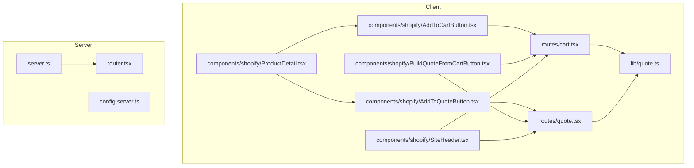
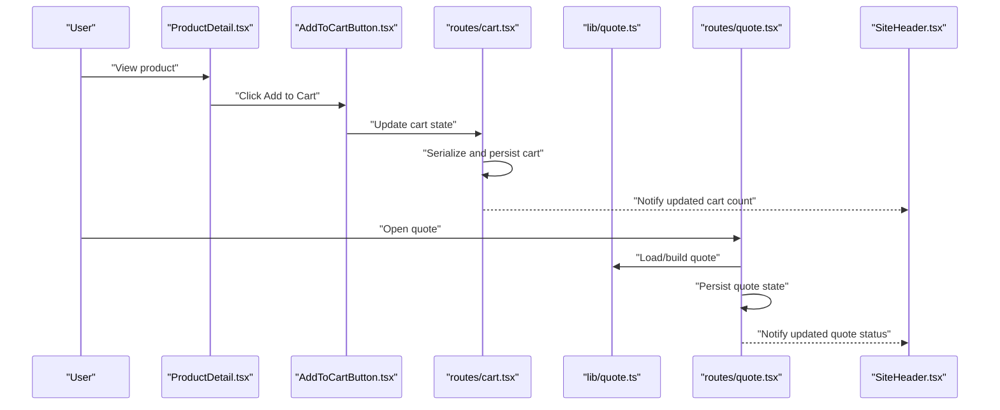
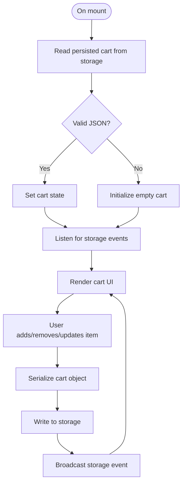
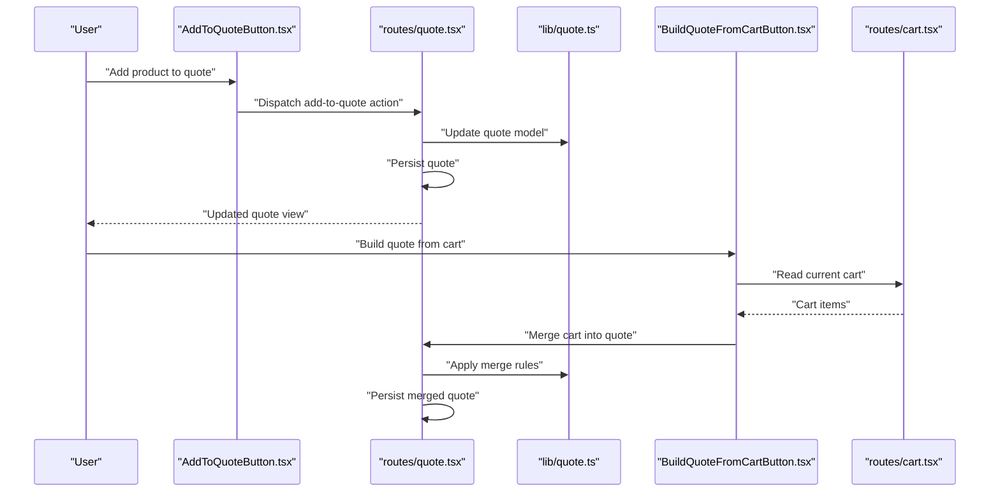
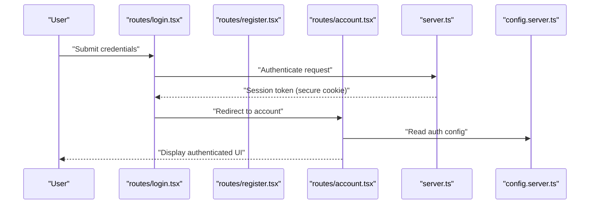
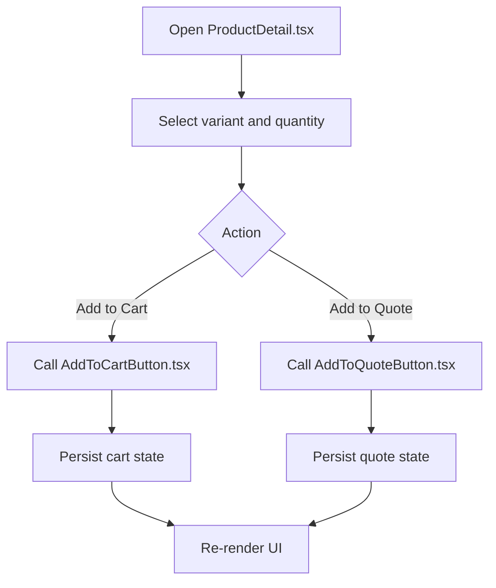
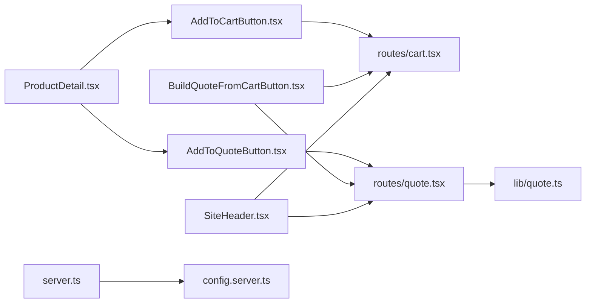

# State Persistence Strategies

<cite>
**Referenced Files in This Document**
- [cart.tsx](file://src/routes/cart.tsx)
- [quote.tsx](file://src/routes/quote.tsx)
- [quote.ts](file://src/lib/quote.ts)
- [AddToCartButton.tsx](file://src/components/shopify/AddToCartButton.tsx)
- [AddToQuoteButton.tsx](file://src/components/shopify/AddToQuoteButton.tsx)
- [BuildQuoteFromCartButton.tsx](file://src/components/shopify/BuildQuoteFromCartButton.tsx)
- [ProductDetail.tsx](file://src/components/shopify/ProductDetail.tsx)
- [SiteHeader.tsx](file://src/components/shopify/SiteHeader.tsx)
- [login.tsx](file://src/routes/login.tsx)
- [register.tsx](file://src/routes/register.tsx)
- [account.tsx](file://src/routes/account.tsx)
- [cookies.tsx](file://src/routes/cookies.tsx)
- [__root.tsx](file://src/routes/__root.tsx)
- [router.tsx](file://src/router.tsx)
- [server.ts](file://src/server.ts)
- [config.server.ts](file://src/lib/config.server.ts)
</cite>

## Table of Contents
1. [Introduction](#introduction)
2. [Project Structure](#project-structure)
3. [Core Components](#core-components)
4. [Architecture Overview](#architecture-overview)
5. [Detailed Component Analysis](#detailed-component-analysis)
6. [Dependency Analysis](#dependency-analysis)
7. [Performance Considerations](#performance-considerations)
8. [Troubleshooting Guide](#troubleshooting-guide)
9. [Conclusion](#conclusion)
10. [Appendices](#appendices)

## Introduction
This document explains state persistence strategies used across SpareAutomation, focusing on:
- Client-side storage for cart data and quotes
- User preferences and session management
- Cross-tab synchronization patterns
- Data serialization/deserialization, storage limits, and security considerations
- Migration, backup/restore, and corruption handling
- Guidelines for choosing the right persistence mechanism by data type and usage pattern

The goal is to provide a clear, actionable guide for developers implementing or extending stateful features such as shopping carts, quote builders, and user sessions.

## Project Structure
State-related logic spans routes, components, and shared libraries:
- Routes define page-level state (cart, quote, account)
- Components encapsulate UI interactions that mutate local state
- Shared library modules centralize quote operations and utilities
- Server configuration and router setup influence how server-side state interacts with client state

**Diagram sources**
- [cart.tsx](file://src/routes/cart.tsx)
- [quote.tsx](file://src/routes/quote.tsx)
- [AddToCartButton.tsx](file://src/components/shopify/AddToCartButton.tsx)
- [AddToQuoteButton.tsx](file://src/components/shopify/AddToQuoteButton.tsx)
- [BuildQuoteFromCartButton.tsx](file://src/components/shopify/BuildQuoteFromCartButton.tsx)
- [ProductDetail.tsx](file://src/components/shopify/ProductDetail.tsx)
- [SiteHeader.tsx](file://src/components/shopify/SiteHeader.tsx)
- [quote.ts](file://src/lib/quote.ts)
- [server.ts](file://src/server.ts)
- [config.server.ts](file://src/lib/config.server.ts)
- [router.tsx](file://src/router.tsx)

**Section sources**
- [cart.tsx](file://src/routes/cart.tsx)
- [quote.tsx](file://src/routes/quote.tsx)
- [quote.ts](file://src/lib/quote.ts)
- [AddToCartButton.tsx](file://src/components/shopify/AddToCartButton.tsx)
- [AddToQuoteButton.tsx](file://src/components/shopify/AddToQuoteButton.tsx)
- [BuildQuoteFromCartButton.tsx](file://src/components/shopify/BuildQuoteFromCartButton.tsx)
- [ProductDetail.tsx](file://src/components/shopify/ProductDetail.tsx)
- [SiteHeader.tsx](file://src/components/shopify/SiteHeader.tsx)
- [server.ts](file://src/server.ts)
- [config.server.ts](file://src/lib/config.server.ts)
- [router.tsx](file://src/router.tsx)

## Core Components
- Cart route: manages cart items, quantities, and checkout flow; persists cart state to enable recovery after reloads.
- Quote route: builds and displays quotes; integrates with quote library for transformations and persistence.
- Quote library: centralizes quote operations (create, update, merge), including any client-side persistence helpers.
- Shopify components: Add-to-cart and add-to-quote buttons trigger state mutations; Build-from-cart button merges cart into quote.
- Site header: provides quick access to cart and quote states and may reflect persisted counts.

Key responsibilities:
- Serialize and deserialize structured state for storage
- Handle storage capacity errors gracefully
- Keep UI in sync with persisted state
- Coordinate cross-tab updates via storage events

**Section sources**
- [cart.tsx](file://src/routes/cart.tsx)
- [quote.tsx](file://src/routes/quote.tsx)
- [quote.ts](file://src/lib/quote.ts)
- [AddToCartButton.tsx](file://src/components/shopify/AddToCartButton.tsx)
- [AddToQuoteButton.tsx](file://src/components/shopify/AddToQuoteButton.tsx)
- [BuildQuoteFromCartButton.tsx](file://src/components/shopify/BuildQuoteFromCartButton.tsx)
- [SiteHeader.tsx](file://src/components/shopify/SiteHeader.tsx)

## Architecture Overview
The application uses a layered approach:
- UI layer (components) triggers actions
- Route layer orchestrates business logic and persistence
- Library layer encapsulates reusable state operations
- Optional server integration for authenticated flows and secure tokens

**Diagram sources**
- [ProductDetail.tsx](file://src/components/shopify/ProductDetail.tsx)
- [AddToCartButton.tsx](file://src/components/shopify/AddToCartButton.tsx)
- [cart.tsx](file://src/routes/cart.tsx)
- [quote.ts](file://src/lib/quote.ts)
- [quote.tsx](file://src/routes/quote.tsx)
- [SiteHeader.tsx](file://src/components/shopify/SiteHeader.tsx)

## Detailed Component Analysis

### Cart Persistence Strategy
- Purpose: Persist cart items, variants, and quantities across sessions and tabs.
- Storage mechanism: Uses browser storage to keep cart data available after reloads and across tabs.
- Serialization: Converts cart objects to strings for storage and parses them back on load.
- Sync: Listens for storage changes to keep multiple tabs consistent.
- Error handling: Catches quota exceeded and invalid JSON scenarios; falls back to in-memory state when necessary.

**Diagram sources**
- [cart.tsx](file://src/routes/cart.tsx)

**Section sources**
- [cart.tsx](file://src/routes/cart.tsx)
- [AddToCartButton.tsx](file://src/components/shopify/AddToCartButton.tsx)
- [SiteHeader.tsx](file://src/components/shopify/SiteHeader.tsx)

### Quote Persistence Strategy
- Purpose: Maintain a persistent quote across sessions, enabling users to build complex orders over time.
- Operations: Create, update, merge, and export quotes; integrate with cart-to-quote conversion.
- Storage: Persists quote structure using serialized formats suitable for long-term retention.
- Cross-tab: Updates propagate via storage events to keep all open tabs synchronized.

**Diagram sources**
- [AddToQuoteButton.tsx](file://src/components/shopify/AddToQuoteButton.tsx)
- [quote.tsx](file://src/routes/quote.tsx)
- [quote.ts](file://src/lib/quote.ts)
- [BuildQuoteFromCartButton.tsx](file://src/components/shopify/BuildQuoteFromCartButton.tsx)
- [cart.tsx](file://src/routes/cart.tsx)

**Section sources**
- [quote.tsx](file://src/routes/quote.tsx)
- [quote.ts](file://src/lib/quote.ts)
- [AddToQuoteButton.tsx](file://src/components/shopify/AddToQuoteButton.tsx)
- [BuildQuoteFromCartButton.tsx](file://src/components/shopify/BuildQuoteFromCartButton.tsx)

### User Authentication State
- Login and registration routes manage user credentials and session establishment.
- Authenticated state can be reflected in UI (e.g., account link, personalized content).
- For sensitive tokens, prefer secure, httpOnly cookies managed by the server rather than localStorage.

**Diagram sources**
- [login.tsx](file://src/routes/login.tsx)
- [register.tsx](file://src/routes/register.tsx)
- [account.tsx](file://src/routes/account.tsx)
- [server.ts](file://src/server.ts)
- [config.server.ts](file://src/lib/config.server.ts)

**Section sources**
- [login.tsx](file://src/routes/login.tsx)
- [register.tsx](file://src/routes/register.tsx)
- [account.tsx](file://src/routes/account.tsx)
- [server.ts](file://src/server.ts)
- [config.server.ts](file://src/lib/config.server.ts)

### Product Detail Interactions
- Product detail page coordinates adding items to cart or quote based on user intent.
- Ensures correct variant selection and quantity before dispatching actions.

**Diagram sources**
- [ProductDetail.tsx](file://src/components/shopify/ProductDetail.tsx)
- [AddToCartButton.tsx](file://src/components/shopify/AddToCartButton.tsx)
- [AddToQuoteButton.tsx](file://src/components/shopify/AddToQuoteButton.tsx)

**Section sources**
- [ProductDetail.tsx](file://src/components/shopify/ProductDetail.tsx)
- [AddToCartButton.tsx](file://src/components/shopify/AddToCartButton.tsx)
- [AddToQuoteButton.tsx](file://src/components/shopify/AddToQuoteButton.tsx)

## Dependency Analysis
- Components depend on route-level state controllers for persistence.
- Quote library centralizes quote logic and may encapsulate persistence details.
- Server and configuration files influence how authentication and secure cookies are handled.

**Diagram sources**
- [ProductDetail.tsx](file://src/components/shopify/ProductDetail.tsx)
- [AddToCartButton.tsx](file://src/components/shopify/AddToCartButton.tsx)
- [AddToQuoteButton.tsx](file://src/components/shopify/AddToQuoteButton.tsx)
- [BuildQuoteFromCartButton.tsx](file://src/components/shopify/BuildQuoteFromCartButton.tsx)
- [cart.tsx](file://src/routes/cart.tsx)
- [quote.tsx](file://src/routes/quote.tsx)
- [quote.ts](file://src/lib/quote.ts)
- [SiteHeader.tsx](file://src/components/shopify/SiteHeader.tsx)
- [server.ts](file://src/server.ts)
- [config.server.ts](file://src/lib/config.server.ts)

**Section sources**
- [ProductDetail.tsx](file://src/components/shopify/ProductDetail.tsx)
- [AddToCartButton.tsx](file://src/components/shopify/AddToCartButton.tsx)
- [AddToQuoteButton.tsx](file://src/components/shopify/AddToQuoteButton.tsx)
- [BuildQuoteFromCartButton.tsx](file://src/components/shopify/BuildQuoteFromCartButton.tsx)
- [cart.tsx](file://src/routes/cart.tsx)
- [quote.tsx](file://src/routes/quote.tsx)
- [quote.ts](file://src/lib/quote.ts)
- [SiteHeader.tsx](file://src/components/shopify/SiteHeader.tsx)
- [server.ts](file://src/server.ts)
- [config.server.ts](file://src/lib/config.server.ts)

## Performance Considerations
- Minimize serialization overhead by storing only essential fields.
- Debounce frequent writes to avoid excessive storage operations.
- Use efficient data structures (e.g., keyed maps) for large lists like cart items.
- Avoid storing large images or base64 blobs in storage; reference remote URLs instead.
- Monitor storage quotas and implement graceful degradation when nearing limits.

[No sources needed since this section provides general guidance]

## Troubleshooting Guide
Common issues and resolutions:
- Quota exceeded: Detect write failures and prompt users to clear old data or reduce cart size.
- Corrupted state: Validate stored JSON on load; if invalid, reset to defaults and log an error.
- Cross-tab desync: Ensure storage events are handled consistently; reconcile timestamps or versioned state if needed.
- Security risks: Never store sensitive tokens in localStorage; use secure, httpOnly cookies managed by the server.

Guidance for diagnosing:
- Inspect storage contents via browser dev tools.
- Verify storage event listeners are attached and firing.
- Check for unhandled exceptions during parse/write operations.

**Section sources**
- [cart.tsx](file://src/routes/cart.tsx)
- [quote.tsx](file://src/routes/quote.tsx)
- [quote.ts](file://src/lib/quote.ts)

## Conclusion
SpareAutomation’s state persistence strategy centers on robust client-side storage for cart and quote data, with careful attention to serialization, cross-tab synchronization, and error handling. Authentication-sensitive state should be managed via secure server-side cookies. By following the guidelines above—choosing appropriate storage mechanisms per data type, implementing migration and corruption handling, and optimizing performance—you can maintain reliable, secure, and user-friendly state across sessions and devices.

[No sources needed since this section summarizes without analyzing specific files]

## Appendices

### Choosing the Right Persistence Mechanism
- Small, non-sensitive, frequently accessed data: localStorage or sessionStorage depending on lifetime needs.
- Large datasets: IndexedDB for structured, queryable storage.
- Sensitive tokens: Secure, httpOnly cookies set by the server.
- Cross-device state: Server-side database with user accounts.

[No sources needed since this section provides general guidance]

### Data Migration and Backup/Restore
- Version your persisted schemas and apply migrations on load.
- Provide explicit backup/export and restore/import flows for critical state (quotes).
- On corruption, fallback to defaults and offer a restore option from backups.

[No sources needed since this section provides general guidance]

### Cookies and Privacy
- Review cookie usage and policies; inform users about tracking and preferences.
- Respect user consent and provide controls to manage cookies.

**Section sources**
- [cookies.tsx](file://src/routes/cookies.tsx)