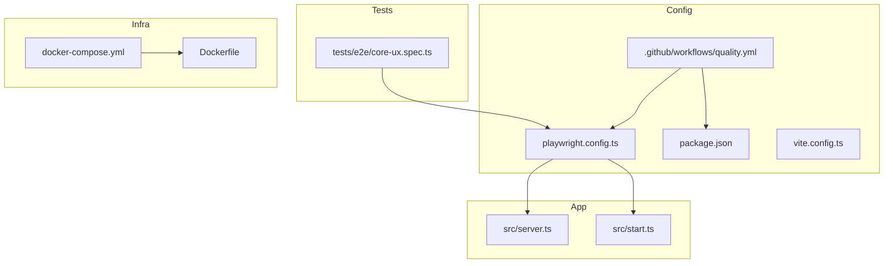
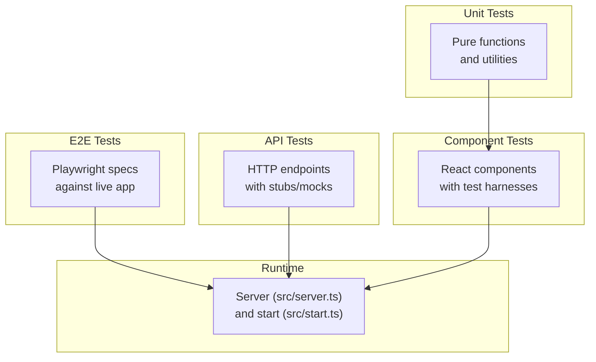
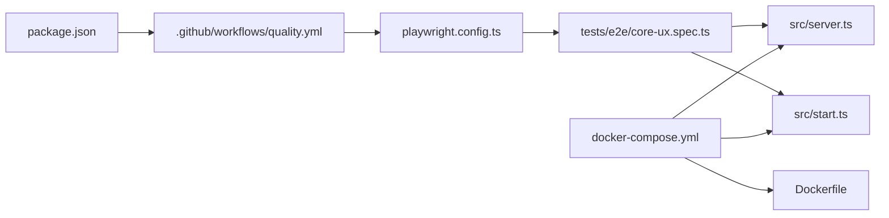

# Testing Strategy

<cite>
**Referenced Files in This Document**
- [playwright.config.ts](file://playwright.config.ts)
- [tests/e2e/core-ux.spec.ts](file://tests/e2e/core-ux.spec.ts)
- [.github/workflows/quality.yml](file://.github/workflows/quality.yml)
- [package.json](file://package.json)
- [vite.config.ts](file://vite.config.ts)
- [src/server.ts](file://src/server.ts)
- [src/start.ts](file://src/start.ts)
- [docker-compose.yml](file://docker-compose.yml)
- [Dockerfile](file://Dockerfile)
</cite>

## Table of Contents
1. [Introduction](#introduction)
2. [Project Structure](#project-structure)
3. [Core Components](#core-components)
4. [Architecture Overview](#architecture-overview)
5. [Detailed Component Analysis](#detailed-component-analysis)
6. [Dependency Analysis](#dependency-analysis)
7. [Performance Considerations](#performance-considerations)
8. [Troubleshooting Guide](#troubleshooting-guide)
9. [Conclusion](#conclusion)
10. [Appendices](#appendices)

## Introduction
This document describes the testing strategy for SpareAutomation with a focus on the testing pyramid, unit and component testing patterns, end-to-end (E2E) testing using Playwright, test configuration and organization, and continuous integration setup. It also covers mocking strategies, test data management, environment setup, performance and accessibility considerations, cross-browser compatibility, debugging techniques, CI/CD pipeline integration, result analysis, and guidelines for writing effective and reliable tests.

## Project Structure
The repository includes an E2E test suite under tests/e2e and a Playwright configuration at the project root. A GitHub Actions workflow is present to run quality checks, which can include tests. The application server entry points are provided under src, and containerization artifacts exist for consistent environments.

**Diagram sources**
- [playwright.config.ts](file://playwright.config.ts)
- [tests/e2e/core-ux.spec.ts](file://tests/e2e/core-ux.spec.ts)
- [.github/workflows/quality.yml](file://.github/workflows/quality.yml)
- [package.json](file://package.json)
- [vite.config.ts](file://vite.config.ts)
- [src/server.ts](file://src/server.ts)
- [src/start.ts](file://src/start.ts)
- [docker-compose.yml](file://docker-compose.yml)
- [Dockerfile](file://Dockerfile)

**Section sources**
- [playwright.config.ts](file://playwright.config.ts)
- [tests/e2e/core-ux.spec.ts](file://tests/e2e/core-ux.spec.ts)
- [.github/workflows/quality.yml](file://.github/workflows/quality.yml)
- [package.json](file://package.json)
- [vite.config.ts](file://vite.config.ts)
- [src/server.ts](file://src/server.ts)
- [src/start.ts](file://src/start.ts)
- [docker-compose.yml](file://docker-compose.yml)
- [Dockerfile](file://Dockerfile)

## Core Components
- End-to-end testing: Playwright is configured at the project root and has at least one core UX spec under tests/e2e.
- Continuous Integration: A GitHub Actions workflow exists for quality checks; it should be extended to execute Playwright tests.
- Application runtime: Server entry points are defined in src/server.ts and src/start.ts, which E2E tests will target.
- Build tooling: vite.config.ts may influence how assets and routes are served during development and testing.
- Containerization: Dockerfile and docker-compose.yml provide reproducible environments for running tests consistently across machines and CI.

Key responsibilities:
- playwright.config.ts: Browser selection, base URL, timeouts, parallelism, reporting, and any global fixtures or hooks.
- tests/e2e/core-ux.spec.ts: High-level user flows that validate critical paths such as navigation, product browsing, cart operations, and checkout initiation.
- .github/workflows/quality.yml: Orchestration of linting, type checks, and test execution in CI.
- package.json: Scripts and dependencies used by both local runs and CI.

**Section sources**
- [playwright.config.ts](file://playwright.config.ts)
- [tests/e2e/core-ux.spec.ts](file://tests/e2e/core-ux.spec.ts)
- [.github/workflows/quality.yml](file://.github/workflows/quality.yml)
- [package.json](file://package.json)
- [vite.config.ts](file://vite.config.ts)
- [src/server.ts](file://src/server.ts)
- [src/start.ts](file://src/start.ts)
- [docker-compose.yml](file://docker-compose.yml)
- [Dockerfile](file://Dockerfile)

## Architecture Overview
The testing architecture follows a testing pyramid:
- Unit tests: Validate pure functions and isolated logic within components and utilities.
- Component tests: Verify React components in isolation, including interactions and state changes.
- API tests: Exercise backend endpoints directly, with mocks for external services when needed.
- E2E tests: Use Playwright to drive real browsers and validate complete user journeys against a running app instance.

[No sources needed since this diagram shows conceptual workflow, not actual code structure]

## Detailed Component Analysis

### Playwright Configuration
Purpose:
- Define browser contexts, base URLs, timeouts, retries, parallelism, and reporters.
- Provide global setup/teardown hooks if needed.
- Configure environment variables and test workers.

Key areas to review:
- Browsers and devices matrix for cross-browser coverage.
- Base URL pointing to the running application.
- Global timeouts and per-test timeouts.
- Parallel worker count and shard settings for speed.
- Reporting outputs (HTML, JSON, JUnit) for CI consumption.

Operational notes:
- Ensure the app is started before running tests.
- Use environment-specific base URLs for dev/staging/prod-like environments.
- Enable video/screenshot capture for failed tests to aid debugging.

**Section sources**
- [playwright.config.ts](file://playwright.config.ts)

### E2E Test Suite: Core UX
Scope:
- Critical user flows such as landing page load, product listing, product detail view, adding items to cart, and quote/cart transitions.
- Navigation between key pages and basic form interactions.

Structure:
- Spec file under tests/e2e/core-ux.spec.ts.
- Organize tests by feature area with clear describe blocks and test names.
- Use stable selectors and avoid brittle CSS selectors where possible.

Best practices:
- Keep tests independent and idempotent.
- Seed necessary data via APIs or admin UI before tests.
- Assert on visible UI elements and meaningful outcomes rather than internal states.

Example flow (conceptual):
- Navigate to home page -> browse products -> open product detail -> add to cart -> verify cart badge updates -> proceed to checkout initiation.

**Section sources**
- [tests/e2e/core-ux.spec.ts](file://tests/e2e/core-ux.spec.ts)

### Continuous Integration Setup
Current state:
- A GitHub Actions workflow exists under .github/workflows/quality.yml.

Recommended enhancements:
- Add a dedicated job to install dependencies, build the app, start the server, and run Playwright tests.
- Cache node_modules and Playwright browsers to reduce CI time.
- Upload test artifacts (reports, videos, screenshots) on failure.
- Run tests in parallel using multiple jobs or shards.
- Fail the pipeline on test failures and flaky test detection.

CI sequence (conceptual):
- Checkout code -> restore cache -> install deps -> build -> start server -> run Playwright -> upload artifacts.

**Section sources**
- [.github/workflows/quality.yml](file://.github/workflows/quality.yml)

### Application Runtime and Environment
Entry points:
- src/server.ts and src/start.ts define how the application starts and serves requests.

Environment considerations:
- Use environment variables for base URLs, feature flags, and service endpoints.
- Provide a local docker-compose setup to spin up the app and any required services for E2E runs.
- Ensure deterministic behavior by seeding data and controlling external integrations.

Containerization:
- Dockerfile builds the app image.
- docker-compose.yml orchestrates services for local and CI environments.

**Section sources**
- [src/server.ts](file://src/server.ts)
- [src/start.ts](file://src/start.ts)
- [docker-compose.yml](file://docker-compose.yml)
- [Dockerfile](file://Dockerfile)

### Build Tooling Influence on Tests
vite.config.ts:
- May affect asset handling, routing, and proxy configurations.
- Ensure development server behavior aligns with test expectations (e.g., static assets availability).

**Section sources**
- [vite.config.ts](file://vite.config.ts)

## Dependency Analysis
Relationships among testing and runtime components:

**Diagram sources**
- [package.json](file://package.json)
- [.github/workflows/quality.yml](file://.github/workflows/quality.yml)
- [playwright.config.ts](file://playwright.config.ts)
- [tests/e2e/core-ux.spec.ts](file://tests/e2e/core-ux.spec.ts)
- [src/server.ts](file://src/server.ts)
- [src/start.ts](file://src/start.ts)
- [docker-compose.yml](file://docker-compose.yml)
- [Dockerfile](file://Dockerfile)

**Section sources**
- [package.json](file://package.json)
- [.github/workflows/quality.yml](file://.github/workflows/quality.yml)
- [playwright.config.ts](file://playwright.config.ts)
- [tests/e2e/core-ux.spec.ts](file://tests/e2e/core-ux.spec.ts)
- [src/server.ts](file://src/server.ts)
- [src/start.ts](file://src/start.ts)
- [docker-compose.yml](file://docker-compose.yml)
- [Dockerfile](file://Dockerfile)

## Performance Considerations
- Parallelization: Increase Playwright workers and shard suites to reduce total runtime.
- Headless mode: Prefer headless execution in CI for speed.
- Resource limits: Set appropriate timeouts and resource constraints to avoid flakiness.
- Network simulation: Throttle network conditions selectively for realistic performance validation.
- Metrics collection: Capture performance metrics in E2E where feasible (e.g., Lighthouse CI integration).

[No sources needed since this section provides general guidance]

## Troubleshooting Guide
Common issues and remedies:
- Flaky tests:
  - Stabilize selectors and use explicit waits.
  - Add retries only for known transient conditions.
  - Isolate shared state and seed data deterministically.
- Timeouts:
  - Tune global and per-test timeouts based on environment performance.
  - Avoid long synchronous operations in tests.
- Debugging:
  - Enable Playwright UI mode for interactive debugging.
  - Inspect HTML reports, videos, and screenshots from failed runs.
  - Use logging and step traces to pinpoint failures.
- CI failures:
  - Ensure caches are invalidated correctly.
  - Reproduce locally using the same containerized environment.
  - Check artifact uploads for detailed logs.

**Section sources**
- [playwright.config.ts](file://playwright.config.ts)
- [.github/workflows/quality.yml](file://.github/workflows/quality.yml)

## Conclusion
SpareAutomation’s testing approach centers on a robust E2E layer with Playwright, supported by a CI workflow and containerized runtime. To strengthen reliability and coverage, introduce unit and component tests, expand API tests with controlled mocks, and enhance CI with caching, parallelism, and rich reporting. Follow the guidelines below to maintain high-quality, fast, and dependable tests.

[No sources needed since this section summarizes without analyzing specific files]

## Appendices

### Testing Pyramid Guidelines
- Unit tests:
  - Focus on pure functions, utility modules, and business logic.
  - Keep them fast, deterministic, and isolated.
- Component tests:
  - Render components with minimal dependencies.
  - Simulate user interactions and assert rendered output and side effects.
- API tests:
  - Hit real endpoints in a test database or sandbox.
  - Mock external services using stubs or service virtualization.
- E2E tests:
  - Cover critical user journeys and cross-service integrations.
  - Keep scenarios concise and focused on user value.

[No sources needed since this section provides general guidance]

### Mocking Strategies
- External services:
  - Use request interception or service stubs to simulate responses.
  - Version mock payloads and keep them close to production schemas.
- Third-party SDKs:
  - Wrap SDK calls behind interfaces and inject test doubles.
- File system and time:
  - Use in-memory stores and fake timers for deterministic behavior.

[No sources needed since this section provides general guidance]

### Test Data Management
- Seeding:
  - Pre-seed essential entities via APIs or admin tools before E2E runs.
- Cleanup:
  - Reset state after each test to ensure isolation.
- Data factories:
  - Centralize creation helpers to avoid duplication and drift.

[No sources needed since this section provides general guidance]

### Cross-Browser Compatibility
- Matrix:
  - Test on Chromium, Firefox, and WebKit.
- Device emulation:
  - Include common mobile viewports and device pixel ratios.
- Platform parity:
  - Validate platform-specific behaviors only when necessary.

[No sources needed since this section provides general guidance]

### Accessibility Testing
- Automated checks:
  - Integrate axe-core or similar into component and E2E tests.
- Manual audits:
  - Periodically audit complex flows with screen readers and keyboard-only navigation.

[No sources needed since this section provides general guidance]

### Performance Testing
- Load testing:
  - Use dedicated tools to simulate concurrent users for critical endpoints.
- Budgeting:
  - Enforce budgets for bundle size, first paint, and interactivity.
- Monitoring:
  - Track regressions over time with baseline comparisons.

[No sources needed since this section provides general guidance]

### Writing Effective Tests
- Naming:
  - Use descriptive names that convey intent and context.
- Assertions:
  - Assert on observable outcomes, not implementation details.
- Readability:
  - Extract reusable steps and page objects for complex flows.
- Maintenance:
  - Refactor brittle selectors and stabilize timing.

[No sources needed since this section provides general guidance]

### CI/CD Pipeline Integration
- Jobs:
  - Separate jobs for lint/type checks, unit/component tests, API tests, and E2E tests.
- Artifacts:
  - Publish Playwright reports and media attachments.
- Notifications:
  - Alert on failures and flaky test trends.

**Section sources**
- [.github/workflows/quality.yml](file://.github/workflows/quality.yml)

### Test Result Analysis
- Reports:
  - Review HTML reports for visual diffs and trace details.
- Trends:
  - Track pass/fail rates and duration over time.
- Root cause:
  - Correlate failures with recent commits and environment changes.

**Section sources**
- [playwright.config.ts](file://playwright.config.ts)

### Concrete Examples (Conceptual)
- User flow example:
  - Home -> Product Listing -> Product Detail -> Add to Cart -> Cart Badge Update -> Initiate Quote.
- API integration example:
  - Create order -> confirm response schema -> assert downstream events.
- Component interaction example:
  - Toggle switch -> verify state change -> assert re-rendered content.

[No sources needed since these examples are conceptual]