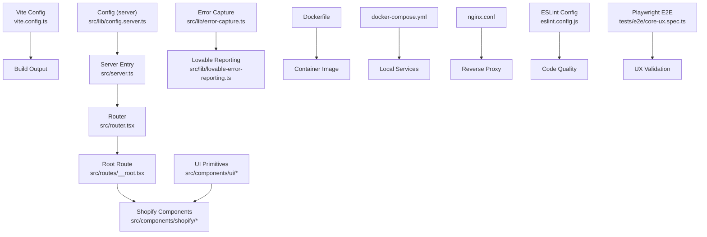
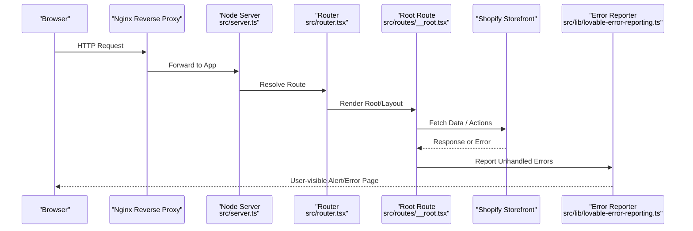
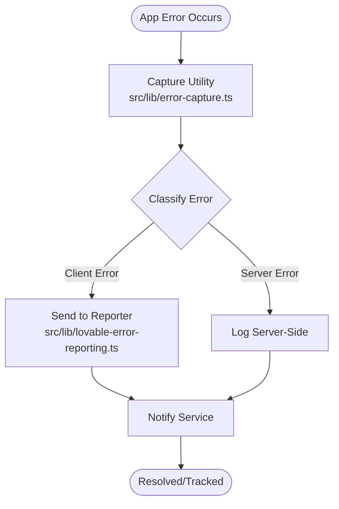
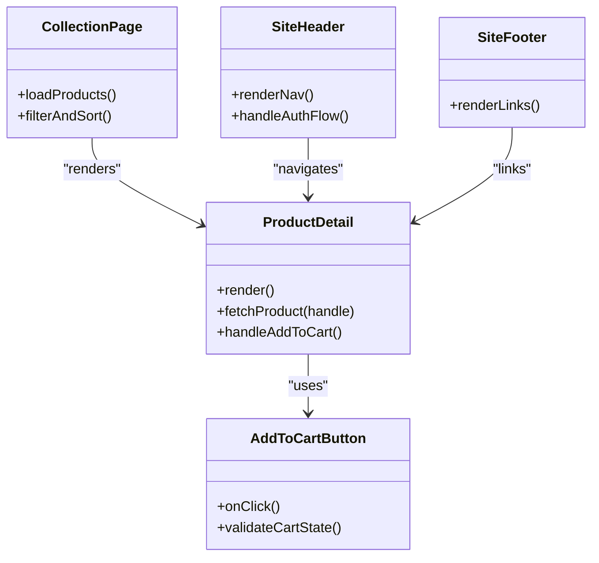
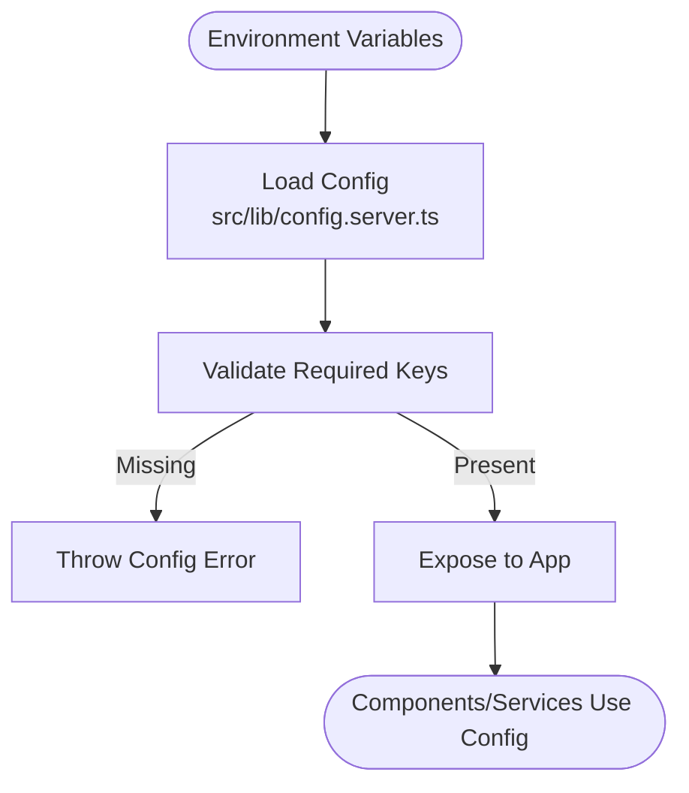
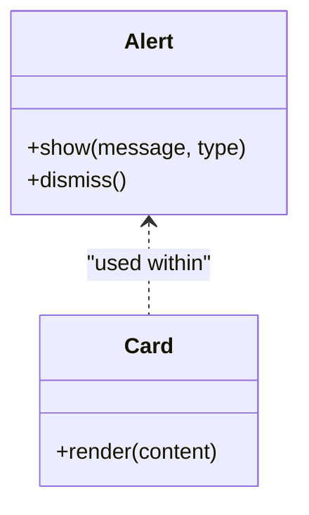
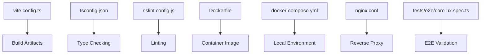

# Troubleshooting & FAQ

<cite>
**Referenced Files in This Document**
- [README.md](file://README.md)
- [package.json](file://package.json)
- [vite.config.ts](file://vite.config.ts)
- [tsconfig.json](file://tsconfig.json)
- [eslint.config.js](file://eslint.config.js)
- [Dockerfile](file://Dockerfile)
- [docker-compose.yml](file://docker-compose.yml)
- [nginx.conf](file://nginx.conf)
- [src/server.ts](file://src/server.ts)
- [src/start.ts](file://src/start.ts)
- [src/router.tsx](file://src/router.tsx)
- [src/routes/__root.tsx](file://src/routes/__root.tsx)
- [src/lib/config.server.ts](file://src/lib/config.server.ts)
- [src/lib/error-capture.ts](file://src/lib/error-capture.ts)
- [src/lib/error-page.ts](file://src/lib/error-page.ts)
- [src/lib/lovable-error-reporting.ts](file://src/lib/lovable-error-reporting.ts)
- [src/components/shopify/ProductDetail.tsx](file://src/components/shopify/ProductDetail.tsx)
- [src/components/shopify/AddToCartButton.tsx](file://src/components/shopify/AddToCartButton.tsx)
- [src/components/shopify/CollectionPage.tsx](file://src/components/shopify/CollectionPage.tsx)
- [src/components/shopify/SiteHeader.tsx](file://src/components/shopify/SiteHeader.tsx)
- [src/components/shopify/SiteFooter.tsx](file://src/components/shopify/SiteFooter.tsx)
- [src/components/ui/alert.tsx](file://src/components/ui/alert.tsx)
- [src/components/ui/card.tsx](file://src/components/ui/card.tsx)
- [tests/e2e/core-ux.spec.ts](file://tests/e2e/core-ux.spec.ts)
- [.github/workflows/quality.yml](file://.github/workflows/quality.yml)
</cite>

## Table of Contents
1. Introduction
2. Project Structure
3. Core Components
4. Architecture Overview
5. Detailed Component Analysis
6. Dependency Analysis
7. Performance Considerations
8. Troubleshooting Guide
9. Conclusion
10. Appendices

## Introduction
This document provides comprehensive troubleshooting guidance and frequently asked questions for SpareAutomation. It focuses on development, deployment, and production issues with Shopify integration, API connectivity, authentication failures, error capture and reporting, log analysis, performance diagnostics, configuration and customization, migration guides, compatibility matrices, and community support.

## Project Structure
SpareAutomation is a Vite-based application with React components, server entry points, Dockerized deployment, and e2e tests. Key areas relevant to troubleshooting include:
- Server runtime and startup
- Error capture and reporting utilities
- Shopify UI components
- Configuration and environment setup
- Build and lint tooling
- Containerization and reverse proxy configuration
- E2E test harness

**Diagram sources**
- [vite.config.ts](file://vite.config.ts)
- [src/server.ts](file://src/server.ts)
- [src/router.tsx](file://src/router.tsx)
- [src/routes/__root.tsx](file://src/routes/__root.tsx)
- [src/lib/config.server.ts](file://src/lib/config.server.ts)
- [src/lib/error-capture.ts](file://src/lib/error-capture.ts)
- [src/lib/lovable-error-reporting.ts](file://src/lib/lovable-error-reporting.ts)
- [src/components/shopify/ProductDetail.tsx](file://src/components/shopify/ProductDetail.tsx)
- [src/components/shopify/AddToCartButton.tsx](file://src/components/shopify/AddToCartButton.tsx)
- [src/components/shopify/CollectionPage.tsx](file://src/components/shopify/CollectionPage.tsx)
- [src/components/shopify/SiteHeader.tsx](file://src/components/shopify/SiteHeader.tsx)
- [src/components/shopify/SiteFooter.tsx](file://src/components/shopify/SiteFooter.tsx)
- [src/components/ui/alert.tsx](file://src/components/ui/alert.tsx)
- [src/components/ui/card.tsx](file://src/components/ui/card.tsx)
- [Dockerfile](file://Dockerfile)
- [docker-compose.yml](file://docker-compose.yml)
- [nginx.conf](file://nginx.conf)
- [eslint.config.js](file://eslint.config.js)
- [tests/e2e/core-ux.spec.ts](file://tests/e2e/core-ux.spec.ts)

**Section sources**
- [README.md](file://README.md)
- [package.json](file://package.json)
- [vite.config.ts](file://vite.config.ts)
- [tsconfig.json](file://tsconfig.json)
- [eslint.config.js](file://eslint.config.js)
- [Dockerfile](file://Dockerfile)
- [docker-compose.yml](file://docker-compose.yml)
- [nginx.conf](file://nginx.conf)
- [src/server.ts](file://src/server.ts)
- [src/start.ts](file://src/start.ts)
- [src/router.tsx](file://src/router.tsx)
- [src/routes/__root.tsx](file://src/routes/__root.tsx)
- [src/lib/config.server.ts](file://src/lib/config.server.ts)
- [src/lib/error-capture.ts](file://src/lib/error-capture.ts)
- [src/lib/lovable-error-reporting.ts](file://src/lib/lovable-error-reporting.ts)
- [src/components/shopify/ProductDetail.tsx](file://src/components/shopify/ProductDetail.tsx)
- [src/components/shopify/AddToCartButton.tsx](file://src/components/shopify/AddToCartButton.tsx)
- [src/components/shopify/CollectionPage.tsx](file://src/components/shopify/CollectionPage.tsx)
- [src/components/shopify/SiteHeader.tsx](file://src/components/shopify/SiteHeader.tsx)
- [src/components/shopify/SiteFooter.tsx](file://src/components/shopify/SiteFooter.tsx)
- [src/components/ui/alert.tsx](file://src/components/ui/alert.tsx)
- [src/components/ui/card.tsx](file://src/components/ui/card.tsx)
- [tests/e2e/core-ux.spec.ts](file://tests/e2e/core-ux.spec.ts)

## Core Components
- Server runtime and startup: The server entry point initializes the runtime and wires routing. Startup scripts orchestrate build and run phases.
- Router and root route: Central router defines routes; the root route sets up global layout and error boundaries.
- Shopify components: Product detail, collection pages, cart actions, header/footer integrate with Shopify storefront flows.
- Error capture and reporting: Utilities centralize error capture and forward to external reporting services.
- Configuration: Server-side configuration loader reads environment variables and exposes settings to the app.
- UI primitives: Reusable alert and card components used across the app for consistent user feedback.

**Section sources**
- [src/server.ts](file://src/server.ts)
- [src/start.ts](file://src/start.ts)
- [src/router.tsx](file://src/router.tsx)
- [src/routes/__root.tsx](file://src/routes/__root.tsx)
- [src/components/shopify/ProductDetail.tsx](file://src/components/shopify/ProductDetail.tsx)
- [src/components/shopify/AddToCartButton.tsx](file://src/components/shopify/AddToCartButton.tsx)
- [src/components/shopify/CollectionPage.tsx](file://src/components/shopify/CollectionPage.tsx)
- [src/components/shopify/SiteHeader.tsx](file://src/components/shopify/SiteHeader.tsx)
- [src/components/shopify/SiteFooter.tsx](file://src/components/shopify/SiteFooter.tsx)
- [src/lib/error-capture.ts](file://src/lib/error-capture.ts)
- [src/lib/lovable-error-reporting.ts](file://src/lib/lovable-error-reporting.ts)
- [src/lib/config.server.ts](file://src/lib/config.server.ts)
- [src/components/ui/alert.tsx](file://src/components/ui/alert.tsx)
- [src/components/ui/card.tsx](file://src/components/ui/card.tsx)

## Architecture Overview
The system runs a Vite-built frontend served by a Node server. Shopify storefront interactions occur via client components. Errors are captured centrally and reported through an error reporting utility. Deployment uses Docker and nginx as a reverse proxy.

**Diagram sources**
- [src/server.ts](file://src/server.ts)
- [src/router.tsx](file://src/router.tsx)
- [src/routes/__root.tsx](file://src/routes/__root.tsx)
- [src/lib/lovable-error-reporting.ts](file://src/lib/lovable-error-reporting.ts)
- [nginx.conf](file://nginx.conf)

## Detailed Component Analysis

### Error Capture and Reporting
Centralized error capture aggregates errors from the app and forwards them to a reporting service. This enables consistent logging and remote visibility.

**Diagram sources**
- [src/lib/error-capture.ts](file://src/lib/error-capture.ts)
- [src/lib/lovable-error-reporting.ts](file://src/lib/lovable-error-reporting.ts)

**Section sources**
- [src/lib/error-capture.ts](file://src/lib/error-capture.ts)
- [src/lib/lovable-error-reporting.ts](file://src/lib/lovable-error-reporting.ts)

### Shopify Integration Components
Shopify-related components handle product display, collections, cart operations, and site chrome. These components often perform network calls to Shopify APIs and must handle network failures, rate limits, and invalid responses gracefully.

**Diagram sources**
- [src/components/shopify/ProductDetail.tsx](file://src/components/shopify/ProductDetail.tsx)
- [src/components/shopify/AddToCartButton.tsx](file://src/components/shopify/AddToCartButton.tsx)
- [src/components/shopify/CollectionPage.tsx](file://src/components/shopify/CollectionPage.tsx)
- [src/components/shopify/SiteHeader.tsx](file://src/components/shopify/SiteHeader.tsx)
- [src/components/shopify/SiteFooter.tsx](file://src/components/shopify/SiteFooter.tsx)

**Section sources**
- [src/components/shopify/ProductDetail.tsx](file://src/components/shopify/ProductDetail.tsx)
- [src/components/shopify/AddToCartButton.tsx](file://src/components/shopify/AddToCartButton.tsx)
- [src/components/shopify/CollectionPage.tsx](file://src/components/shopify/CollectionPage.tsx)
- [src/components/shopify/SiteHeader.tsx](file://src/components/shopify/SiteHeader.tsx)
- [src/components/shopify/SiteFooter.tsx](file://src/components/shopify/SiteFooter.tsx)

### Configuration Loader
Server-side configuration loads environment variables and exposes them to the application. Misconfiguration typically leads to runtime errors or missing features.

**Diagram sources**
- [src/lib/config.server.ts](file://src/lib/config.server.ts)

**Section sources**
- [src/lib/config.server.ts](file://src/lib/config.server.ts)

### UI Feedback Components
Alert and card components provide consistent user-facing feedback for errors and informational messages.

**Diagram sources**
- [src/components/ui/alert.tsx](file://src/components/ui/alert.tsx)
- [src/components/ui/card.tsx](file://src/components/ui/card.tsx)

**Section sources**
- [src/components/ui/alert.tsx](file://src/components/ui/alert.tsx)
- [src/components/ui/card.tsx](file://src/components/ui/card.tsx)

## Dependency Analysis
Key dependencies and their roles:
- Vite config controls build behavior and asset handling.
- TypeScript config ensures type safety and module resolution.
- ESLint config enforces code quality rules.
- Dockerfile builds container images for deployment.
- docker-compose orchestrates local services.
- nginx.conf configures reverse proxy and static assets.
- Playwright e2e tests validate core UX flows.

**Diagram sources**
- [vite.config.ts](file://vite.config.ts)
- [tsconfig.json](file://tsconfig.json)
- [eslint.config.js](file://eslint.config.js)
- [Dockerfile](file://Dockerfile)
- [docker-compose.yml](file://docker-compose.yml)
- [nginx.conf](file://nginx.conf)
- [tests/e2e/core-ux.spec.ts](file://tests/e2e/core-ux.spec.ts)

**Section sources**
- [vite.config.ts](file://vite.config.ts)
- [tsconfig.json](file://tsconfig.json)
- [eslint.config.js](file://eslint.config.js)
- [Dockerfile](file://Dockerfile)
- [docker-compose.yml](file://docker-compose.yml)
- [nginx.conf](file://nginx.conf)
- [tests/e2e/core-ux.spec.ts](file://tests/e2e/core-ux.spec.ts)

## Performance Considerations
- Minimize unnecessary re-renders in Shopify components by memoizing data and avoiding heavy computations during render.
- Cache product and collection data where appropriate to reduce Shopify API calls.
- Use lazy loading for non-critical components and assets.
- Monitor network requests to Shopify endpoints and implement retries/backoff for transient failures.
- Profile bundle size and tree-shake unused modules via Vite configuration.
- Ensure proper compression and caching headers via nginx configuration.

[No sources needed since this section provides general guidance]

## Troubleshooting Guide

### Development Issues
- Build fails due to TypeScript errors:
  - Run type checks using the project’s configured tooling.
  - Inspect tsconfig for module resolution and target settings.
- Linting errors block CI:
  - Review eslint configuration and fix rule violations.
- Vite build warnings:
  - Check vite config for deprecated options or asset paths.

**Section sources**
- [tsconfig.json](file://tsconfig.json)
- [eslint.config.js](file://eslint.config.js)
- [vite.config.ts](file://vite.config.ts)

### Deployment Issues
- Container image build fails:
  - Verify Dockerfile instructions and base image compatibility.
- Local services do not start:
  - Validate docker-compose definitions and port mappings.
- Reverse proxy returns 502/504:
  - Confirm nginx upstream configuration and backend health.

**Section sources**
- [Dockerfile](file://Dockerfile)
- [docker-compose.yml](file://docker-compose.yml)
- [nginx.conf](file://nginx.conf)

### Shopify Integration Problems
- Products not loading:
  - Check network requests to Shopify endpoints.
  - Validate product handles and collection IDs.
- Cart actions fail:
  - Inspect AddToCartButton logic and error states.
- Header navigation broken:
  - Review SiteHeader links and auth flow integration.

**Section sources**
- [src/components/shopify/ProductDetail.tsx](file://src/components/shopify/ProductDetail.tsx)
- [src/components/shopify/AddToCartButton.tsx](file://src/components/shopify/AddToCartButton.tsx)
- [src/components/shopify/SiteHeader.tsx](file://src/components/shopify/SiteHeader.tsx)

### API Connection Issues
- Timeouts or intermittent failures:
  - Implement retry with exponential backoff.
  - Log request/response metadata for diagnosis.
- Rate limiting:
  - Throttle requests and cache responses when safe.

**Section sources**
- [src/components/shopify/CollectionPage.tsx](file://src/components/shopify/CollectionPage.tsx)

### Authentication Failures
- Login redirects loop:
  - Verify token storage and expiration handling.
- Missing permissions:
  - Confirm scopes and account status.

**Section sources**
- [src/components/shopify/SiteHeader.tsx](file://src/components/shopify/SiteHeader.tsx)

### Error Capture and Reporting
- Errors not appearing in dashboard:
  - Ensure error capture utility is initialized before rendering.
  - Validate reporter configuration and network access.
- Duplicate reports:
  - Deduplicate error payloads by correlation ID.

**Section sources**
- [src/lib/error-capture.ts](file://src/lib/error-capture.ts)
- [src/lib/lovable-error-reporting.ts](file://src/lib/lovable-error-reporting.ts)

### Log Analysis
- Server logs:
  - Centralize logs and include request IDs.
- Frontend logs:
  - Attach context (route, component, payload) to error reports.

**Section sources**
- [src/server.ts](file://src/server.ts)
- [src/lib/error-capture.ts](file://src/lib/error-capture.ts)

### Performance Troubleshooting
- Slow page loads:
  - Profile network waterfall and identify slow Shopify calls.
- High memory usage:
  - Investigate large object retention in components.
- Bundle size bloat:
  - Analyze Vite output and remove unused dependencies.

**Section sources**
- [vite.config.ts](file://vite.config.ts)

### Frequently Asked Questions
- How to configure environment variables?
  - Use the server-side configuration loader to read required keys.
- How to customize UI feedback?
  - Extend alert and card components for consistent styling.
- Where are routes defined?
  - Routes are managed by the router and root route.

**Section sources**
- [src/lib/config.server.ts](file://src/lib/config.server.ts)
- [src/components/ui/alert.tsx](file://src/components/ui/alert.tsx)
- [src/components/ui/card.tsx](file://src/components/ui/card.tsx)
- [src/router.tsx](file://src/router.tsx)
- [src/routes/__root.tsx](file://src/routes/__root.tsx)

### Step-by-Step Diagnostic Procedures
- Reproduce locally:
  - Start services via docker-compose and open browser dev tools.
- Capture network traces:
  - Filter Shopify endpoints and inspect payloads.
- Isolate components:
  - Temporarily disable non-essential components to narrow scope.
- Validate configuration:
  - Print sanitized config values at startup.

**Section sources**
- [docker-compose.yml](file://docker-compose.yml)
- [src/lib/config.server.ts](file://src/lib/config.server.ts)

### Command-Line Tools for Debugging
- Type checking:
  - Use the project’s configured TypeScript runner.
- Linting:
  - Run ESLint against source files.
- E2E testing:
  - Execute Playwright tests to validate core UX flows.

**Section sources**
- [tsconfig.json](file://tsconfig.json)
- [eslint.config.js](file://eslint.config.js)
- [tests/e2e/core-ux.spec.ts](file://tests/e2e/core-ux.spec.ts)

### Monitoring Dashboards
- Integrate error reporting into your monitoring stack.
- Track key metrics: error rates, latency, Shopify API response times.
- Set alerts for critical thresholds.

[No sources needed since this section provides general guidance]

### Migration Guides and Breaking Changes
- Version upgrades:
  - Review package.json dependencies and update cautiously.
  - Validate build and runtime after updates.
- Compatibility matrix:
  - Ensure Node version and Docker base image align with requirements.

**Section sources**
- [package.json](file://package.json)
- [Dockerfile](file://Dockerfile)

### Reporting Bugs and Contributing Fixes
- Bug reports:
  - Include steps to reproduce, environment details, and logs.
- Contribution workflow:
  - Follow linting and type checks before submitting changes.
- Community support:
  - Refer to repository documentation and issue tracker.

**Section sources**
- [README.md](file://README.md)
- [eslint.config.js](file://eslint.config.js)
- [.github/workflows/quality.yml](file://.github/workflows/quality.yml)

## Conclusion
Use this guide to systematically diagnose and resolve issues across development, deployment, and production. Leverage centralized error capture, robust logging, and e2e tests to maintain reliability. For ongoing improvements, follow contribution guidelines and keep dependencies updated.

## Appendices

### Quick Reference Checklist
- Environment variables validated
- Shopify endpoints reachable
- Error reporting initialized
- Logs centralized and searchable
- E2E tests passing
- Container builds succeed
- Reverse proxy configured correctly

[No sources needed since this section provides general guidance]