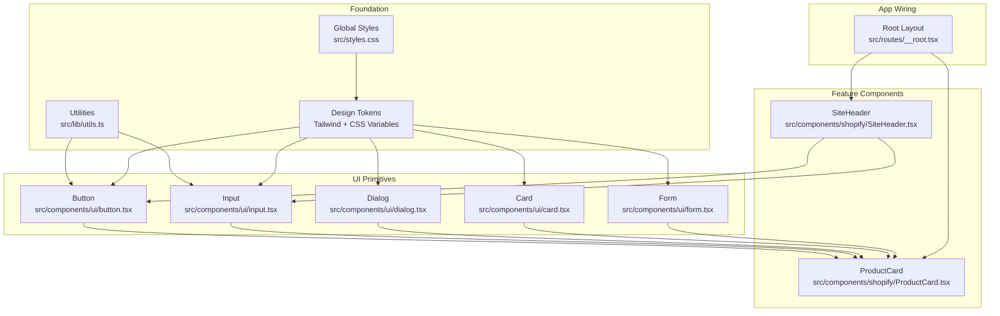
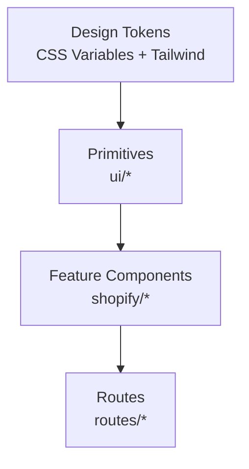
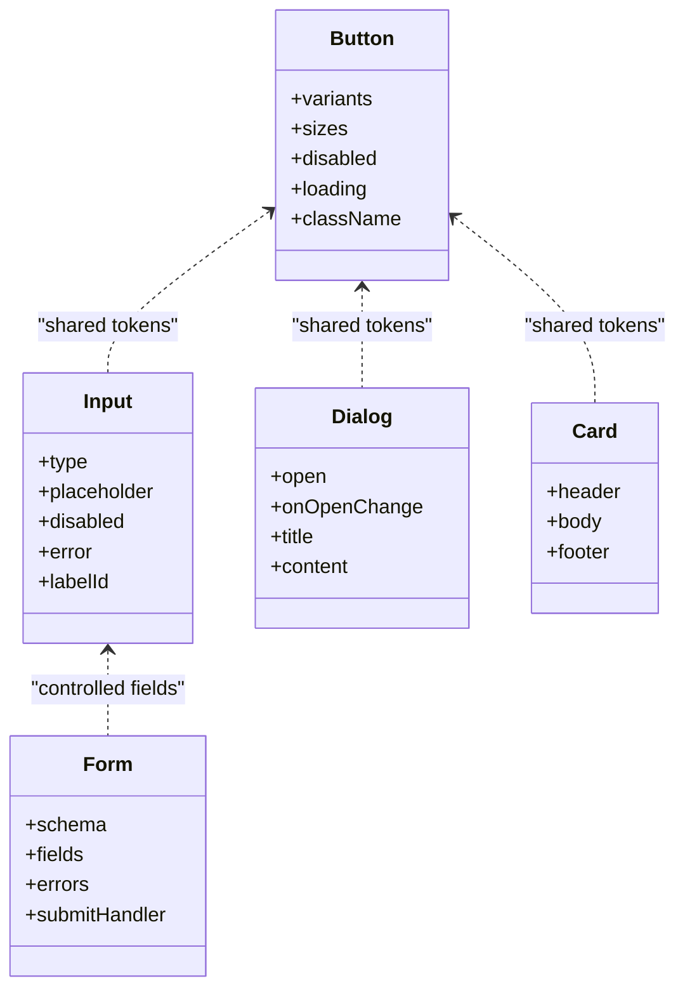
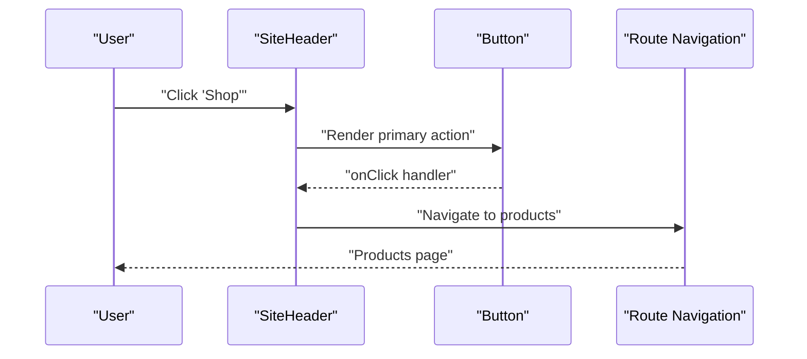
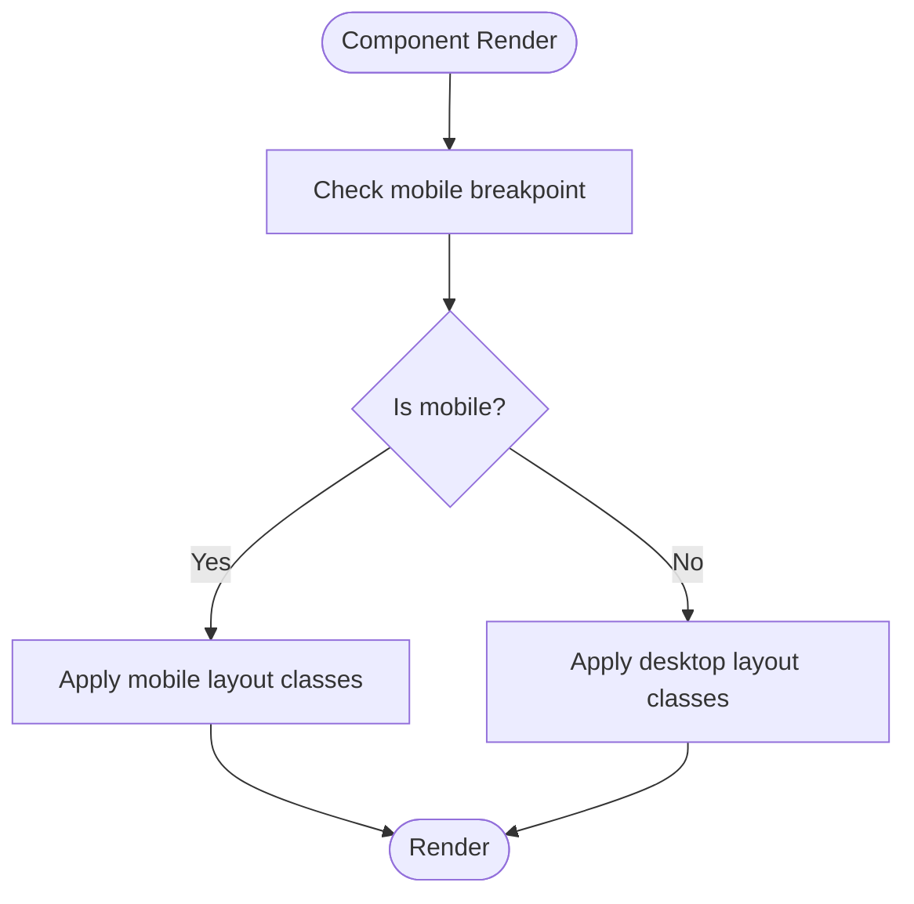
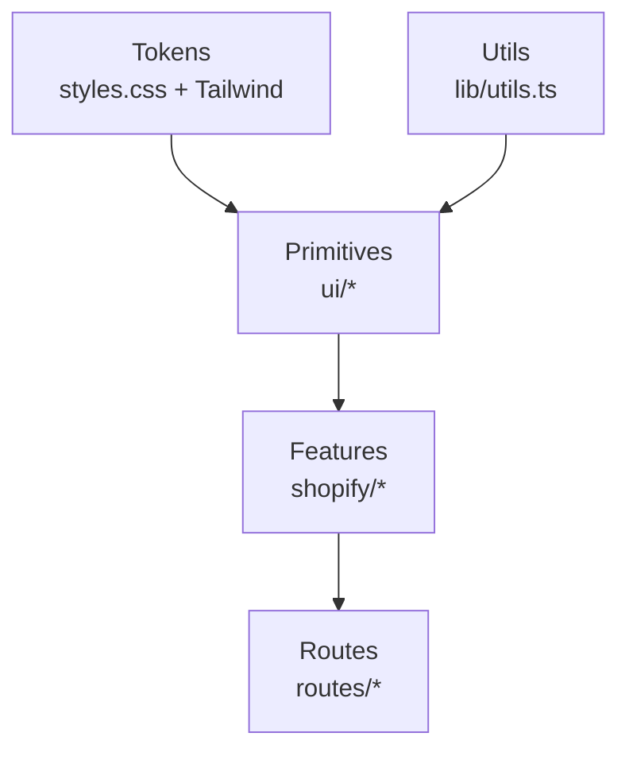

# Component Architecture & Foundation

<cite>
**Referenced Files in This Document**
- [components.json](file://components.json)
- [src/styles.css](file://src/styles.css)
- [src/lib/utils.ts](file://src/lib/utils.ts)
- [src/hooks/use-mobile.tsx](file://src/hooks/use-mobile.tsx)
- [src/components/ui/button.tsx](file://src/components/ui/button.tsx)
- [src/components/ui/input.tsx](file://src/components/ui/input.tsx)
- [src/components/ui/dialog.tsx](file://src/components/ui/dialog.tsx)
- [src/components/ui/card.tsx](file://src/components/ui/card.tsx)
- [src/components/ui/form.tsx](file://src/components/ui/form.tsx)
- [src/components/shopify/ProductCard.tsx](file://src/components/shopify/ProductCard.tsx)
- [src/components/shopify/SiteHeader.tsx](file://src/components/shopify/SiteHeader.tsx)
- [src/routes/__root.tsx](file://src/routes/__root.tsx)
- [vite.config.ts](file://vite.config.ts)
</cite>

## Table of Contents
1. [Introduction](#introduction)
2. [Project Structure](#project-structure)
3. [Core Components](#core-components)
4. [Architecture Overview](#architecture-overview)
5. [Detailed Component Analysis](#detailed-component-analysis)
6. [Dependency Analysis](#dependency-analysis)
7. [Performance Considerations](#performance-considerations)
8. [Troubleshooting Guide](#troubleshooting-guide)
9. [Conclusion](#conclusion)
10. [Appendices](#appendices)

## Introduction
This document explains the UI component architecture and foundation layer used across SpareAutomation. It focuses on the shadcn/ui-based component system, design tokens, architectural patterns, composition principles, prop drilling strategies, state management approaches within components, accessibility standards, responsive design foundations, custom hooks usage, utility integration, theme customization, performance considerations, bundle optimization, and code splitting strategies for components.

The goal is to provide a clear, progressive guide that helps both new and experienced contributors create consistent, accessible, and performant UI features aligned with established patterns.

## Project Structure
At a high level, the UI foundation is organized into:
- Design tokens and global styles
- shadcn/ui primitive components under src/components/ui
- Feature-specific composite components under src/components/shopify
- Shared utilities and hooks under src/lib and src/hooks
- Route-level composition and layout wiring under src/routes

**Diagram sources**
- [src/styles.css](file://src/styles.css)
- [src/lib/utils.ts](file://src/lib/utils.ts)
- [src/components/ui/button.tsx](file://src/components/ui/button.tsx)
- [src/components/ui/input.tsx](file://src/components/ui/input.tsx)
- [src/components/ui/dialog.tsx](file://src/components/ui/dialog.tsx)
- [src/components/ui/card.tsx](file://src/components/ui/card.tsx)
- [src/components/ui/form.tsx](file://src/components/ui/form.tsx)
- [src/components/shopify/ProductCard.tsx](file://src/components/shopify/ProductCard.tsx)
- [src/components/shopify/SiteHeader.tsx](file://src/components/shopify/SiteHeader.tsx)
- [src/routes/__root.tsx](file://src/routes/__root.tsx)

**Section sources**
- [components.json](file://components.json)
- [src/styles.css](file://src/styles.css)
- [src/lib/utils.ts](file://src/lib/utils.ts)
- [src/hooks/use-mobile.tsx](file://src/hooks/use-mobile.tsx)
- [src/components/ui/button.tsx](file://src/components/ui/button.tsx)
- [src/components/ui/input.tsx](file://src/components/ui/input.tsx)
- [src/components/ui/dialog.tsx](file://src/components/ui/dialog.tsx)
- [src/components/ui/card.tsx](file://src/components/ui/card.tsx)
- [src/components/ui/form.tsx](file://src/components/ui/form.tsx)
- [src/components/shopify/ProductCard.tsx](file://src/components/shopify/ProductCard.tsx)
- [src/components/shopify/SiteHeader.tsx](file://src/components/shopify/SiteHeader.tsx)
- [src/routes/__root.tsx](file://src/routes/__root.tsx)

## Core Components
The foundation relies on shadcn/ui primitives that are fully themed via Tailwind and CSS variables. Key primitives include Button, Input, Dialog, Card, and Form. These components:
- Compose Tailwind utility classes with semantic HTML elements
- Expose typed props for variants, sizes, states, and accessibility attributes
- Integrate with shared utilities (e.g., class merging) to ensure predictable styling
- Follow ARIA best practices and keyboard navigation patterns provided by Radix primitives where applicable

Guidelines for using primitives:
- Prefer explicit variant and size props over ad-hoc overrides
- Use className to extend rather than replace base styles
- Keep behavior logic in feature components; keep primitives presentational and accessible

**Section sources**
- [src/components/ui/button.tsx](file://src/components/ui/button.tsx)
- [src/components/ui/input.tsx](file://src/components/ui/input.tsx)
- [src/components/ui/dialog.tsx](file://src/components/ui/dialog.tsx)
- [src/components/ui/card.tsx](file://src/components/ui/card.tsx)
- [src/components/ui/form.tsx](file://src/components/ui/form.tsx)
- [src/lib/utils.ts](file://src/lib/utils.ts)

## Architecture Overview
The UI architecture follows a layered approach:
- Global tokens and styles define colors, typography, spacing, and breakpoints
- shadcn/ui primitives implement accessible building blocks
- Feature components compose primitives to implement domain screens and interactions
- Routes wire top-level layouts and feature modules

[No sources needed since this diagram shows conceptual workflow, not actual code structure]

## Detailed Component Analysis

### shadcn/ui Primitives
- Button: Provides variant, size, disabled, and loading states; composes Tailwind classes and forwards refs/attributes for accessibility.
- Input: Wraps native input with consistent styling, validation states, and label association patterns.
- Dialog: Uses Radix primitives for focus trapping, portal rendering, and keyboard handling; composes overlay and content regions.
- Card: Semantic container with header/body/footer sections; composes spacing and elevation via tokens.
- Form: Integrates form libraries and schema validation; provides controlled inputs and error messaging.

**Diagram sources**
- [src/components/ui/button.tsx](file://src/components/ui/button.tsx)
- [src/components/ui/input.tsx](file://src/components/ui/input.tsx)
- [src/components/ui/dialog.tsx](file://src/components/ui/dialog.tsx)
- [src/components/ui/card.tsx](file://src/components/ui/card.tsx)
- [src/components/ui/form.tsx](file://src/components/ui/form.tsx)

**Section sources**
- [src/components/ui/button.tsx](file://src/components/ui/button.tsx)
- [src/components/ui/input.tsx](file://src/components/ui/input.tsx)
- [src/components/ui/dialog.tsx](file://src/components/ui/dialog.tsx)
- [src/components/ui/card.tsx](file://src/components/ui/card.tsx)
- [src/components/ui/form.tsx](file://src/components/ui/form.tsx)

### Feature Components Composition
Feature components compose primitives to implement business flows. For example:
- ProductCard composes Card, Button, and Input-like controls to display product details and actions.
- SiteHeader composes Button and other primitives to provide navigation and user actions.

**Diagram sources**
- [src/components/shopify/SiteHeader.tsx](file://src/components/shopify/SiteHeader.tsx)
- [src/components/ui/button.tsx](file://src/components/ui/button.tsx)

**Section sources**
- [src/components/shopify/ProductCard.tsx](file://src/components/shopify/ProductCard.tsx)
- [src/components/shopify/SiteHeader.tsx](file://src/components/shopify/SiteHeader.tsx)

### Responsive Design Foundations
Responsive behavior is implemented through:
- Tailwind breakpoint utilities applied directly in components
- Custom hook useMobile for programmatic responsiveness when needed
- Consistent spacing and typography scales driven by tokens

**Diagram sources**
- [src/hooks/use-mobile.tsx](file://src/hooks/use-mobile.tsx)

**Section sources**
- [src/hooks/use-mobile.tsx](file://src/hooks/use-mobile.tsx)

### Accessibility Standards Implementation
Accessibility is embedded at the foundation:
- Primitives leverage Radix primitives for correct ARIA roles, focus management, and keyboard interaction
- Labels and IDs are associated for inputs and buttons
- Color contrast and focus indicators follow token-driven themes
- Screen reader-friendly text and landmarks are maintained in composite components

Best practices:
- Always associate labels with inputs
- Provide descriptive aria-labels or aria-labelledby where needed
- Ensure sufficient color contrast using tokens
- Test keyboard navigation and screen reader announcements

**Section sources**
- [src/components/ui/dialog.tsx](file://src/components/ui/dialog.tsx)
- [src/components/ui/input.tsx](file://src/components/ui/input.tsx)
- [src/components/ui/button.tsx](file://src/components/ui/button.tsx)

### Theme Customization Mechanisms
Theme customization is achieved via:
- CSS variables for colors, spacing, and typography
- Tailwind configuration mapping tokens to utility classes
- Global styles file applying base tokens and resets

Guidelines:
- Define new tokens in CSS variables and map them to Tailwind
- Avoid hardcoding values in components; prefer tokens
- Validate contrast and readability after theme changes

**Section sources**
- [src/styles.css](file://src/styles.css)
- [components.json](file://components.json)

### Utility Functions Integration
Shared utilities centralize common operations such as class name merging and formatting helpers. Components should import from these utilities to maintain consistency and reduce duplication.

Usage patterns:
- Merge dynamic className arrays safely
- Format dates, numbers, and currency consistently
- Normalize strings and validate inputs

**Section sources**
- [src/lib/utils.ts](file://src/lib/utils.ts)

### Custom Hooks Usage
Custom hooks encapsulate reusable logic:
- useMobile exposes responsive state for conditional rendering
- Additional hooks can be created for data fetching, caching, and UI state

Guidelines:
- Keep hooks focused and testable
- Return stable interfaces and memoized values where appropriate
- Combine hooks with primitives to build feature-specific behaviors

**Section sources**
- [src/hooks/use-mobile.tsx](file://src/hooks/use-mobile.tsx)

### Prop Drilling Strategies
To avoid deep prop drilling:
- Lift state to the nearest common ancestor
- Use context for cross-cutting concerns like theme, locale, or auth
- Prefer composition over inheritance; pass only necessary props down

Example pattern:
- Wrap a section with a context provider
- Consume context in nested components instead of passing props through intermediate layers

[No sources needed since this section doesn't analyze specific files]

### State Management Approaches Within Components
- Local state for ephemeral UI interactions (e.g., open/close dialogs)
- Controlled inputs for forms integrated with form schemas
- Context for shared UI state across siblings
- External stores for complex application-wide state if needed

Guidelines:
- Keep state close to where it is used
- Derive computed values from state to minimize re-renders
- Memoize expensive computations and callbacks

[No sources needed since this section doesn't analyze specific files]

### Creating New Components: Guidelines
Follow these steps to create new components aligned with the foundation:
- Start with a primitive or compose existing primitives
- Use tokens exclusively for styling; avoid inline styles
- Implement accessibility attributes and keyboard support
- Add responsive variants using Tailwind utilities or useMobile
- Export typed props and default variants
- Document usage and constraints in comments or docs

[No sources needed since this section doesn't analyze specific files]

## Dependency Analysis
The dependency graph illustrates how tokens and utilities flow into primitives and then into feature components.

**Diagram sources**
- [src/styles.css](file://src/styles.css)
- [src/lib/utils.ts](file://src/lib/utils.ts)
- [src/components/ui/button.tsx](file://src/components/ui/button.tsx)
- [src/components/ui/input.tsx](file://src/components/ui/input.tsx)
- [src/components/ui/dialog.tsx](file://src/components/ui/dialog.tsx)
- [src/components/ui/card.tsx](file://src/components/ui/card.tsx)
- [src/components/ui/form.tsx](file://src/components/ui/form.tsx)
- [src/components/shopify/ProductCard.tsx](file://src/components/shopify/ProductCard.tsx)
- [src/components/shopify/SiteHeader.tsx](file://src/components/shopify/SiteHeader.tsx)
- [src/routes/__root.tsx](file://src/routes/__root.tsx)

**Section sources**
- [src/components/shopify/ProductCard.tsx](file://src/components/shopify/ProductCard.tsx)
- [src/components/shopify/SiteHeader.tsx](file://src/components/shopify/SiteHeader.tsx)
- [src/routes/__root.tsx](file://src/routes/__root.tsx)

## Performance Considerations
- Prefer memoization for heavy computations and callbacks
- Use React.lazy and Suspense for route-level code splitting
- Avoid unnecessary re-renders by keeping state minimal and colocated
- Leverage Tailwind’s tree-shaking to remove unused styles
- Defer non-critical UI (e.g., analytics widgets) with lazy loading
- Profile component render times and optimize bottlenecks

Bundle optimization tips:
- Split large feature components per route
- Remove dead code paths and unused dependencies
- Use static assets and images optimized for web delivery

[No sources needed since this section provides general guidance]

## Troubleshooting Guide
Common issues and resolutions:
- Styling conflicts: Ensure className merging uses utilities and tokens; avoid overriding base styles directly
- Accessibility regressions: Verify ARIA attributes and keyboard navigation in dialogs and forms
- Responsive glitches: Confirm breakpoint usage and test on multiple devices
- Theme inconsistencies: Validate CSS variable mappings and Tailwind token assignments
- Performance regressions: Identify excessive re-renders and apply memoization or state co-location

Debugging steps:
- Inspect computed styles and verify token values
- Use browser dev tools to audit accessibility
- Measure render times and identify hotspots
- Review dependency graphs for unexpected imports

[No sources needed since this section provides general guidance]

## Conclusion
SpareAutomation’s UI architecture centers on a robust foundation of design tokens, shadcn/ui primitives, and well-composed feature components. By adhering to the established patterns—token-driven styling, accessibility-first primitives, thoughtful prop and state management, and responsive design—you can build consistent, maintainable, and high-performance interfaces. The guidelines and diagrams in this document serve as a reference for creating new components and extending the system effectively.

[No sources needed since this section summarizes without analyzing specific files]

## Appendices

### Configuration Reference
- components.json: shadcn/ui configuration and registry settings
- vite.config.ts: bundler configuration affecting code splitting and asset handling

**Section sources**
- [components.json](file://components.json)
- [vite.config.ts](file://vite.config.ts)