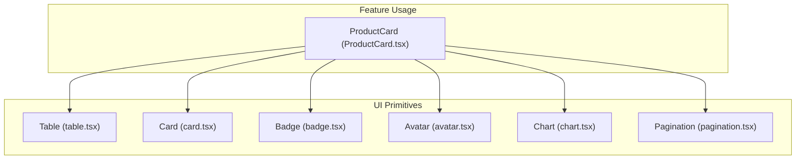
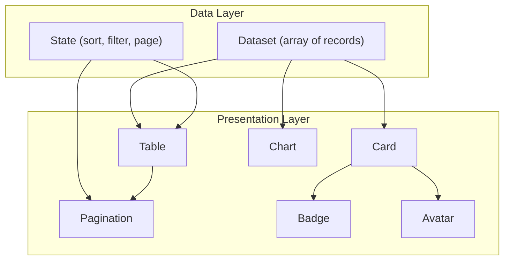
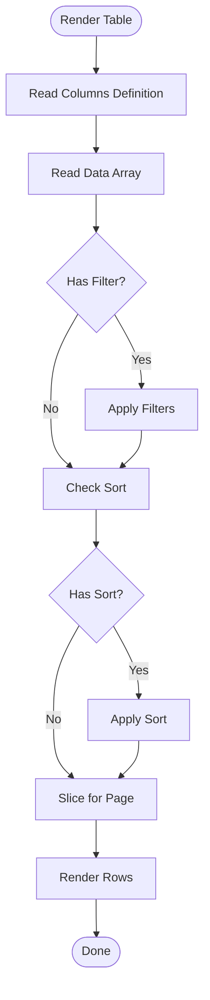
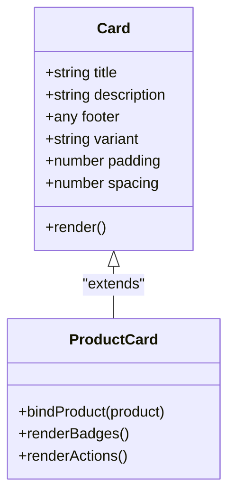
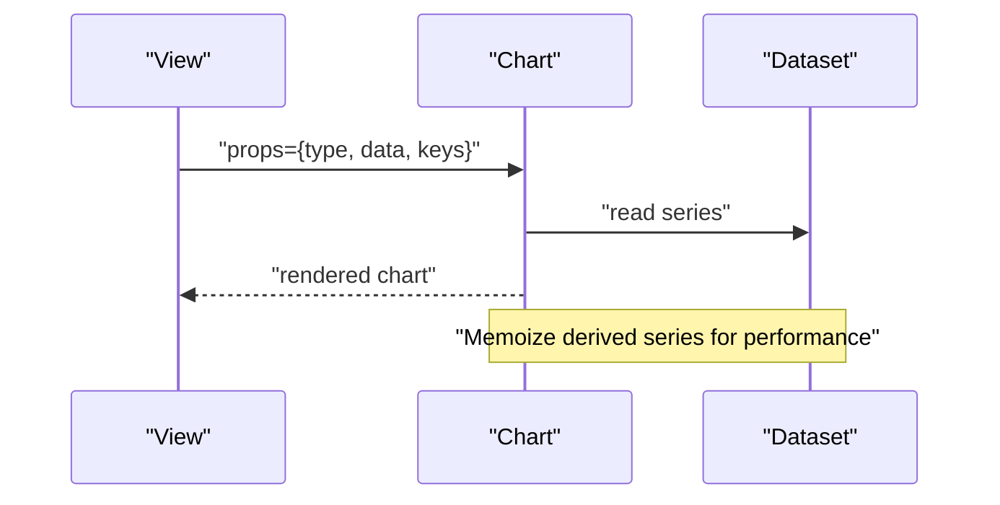
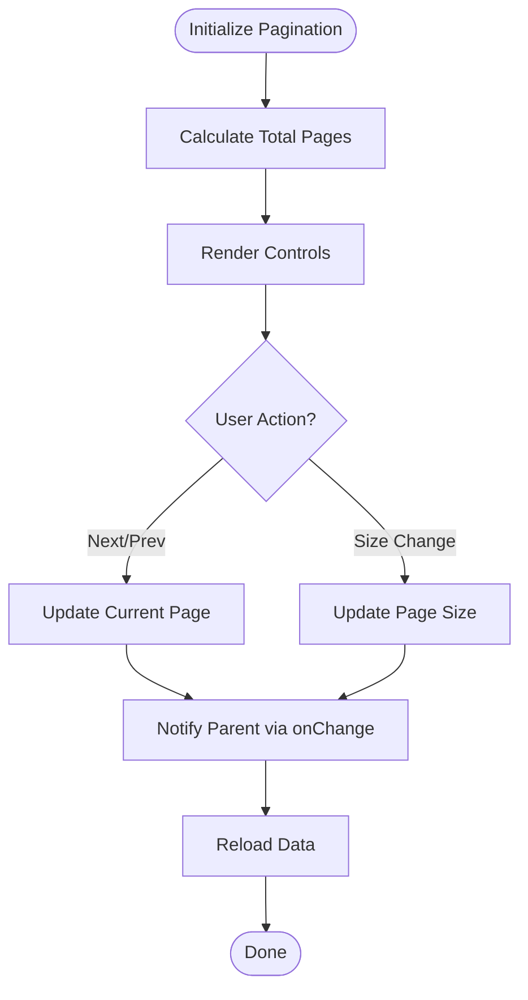
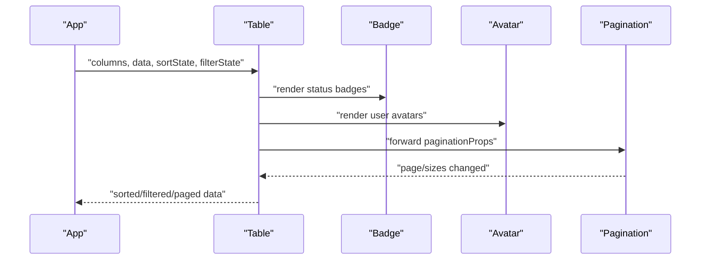
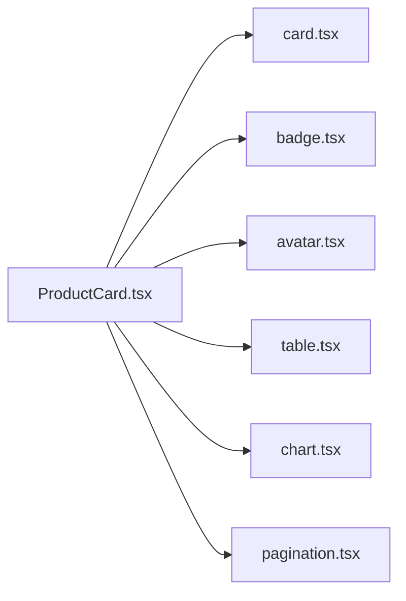

# Data Display Components

<cite>
**Referenced Files in This Document**
- [table.tsx](file://src/components/ui/table.tsx)
- [card.tsx](file://src/components/ui/card.tsx)
- [badge.tsx](file://src/components/ui/badge.tsx)
- [avatar.tsx](file://src/components/ui/avatar.tsx)
- [chart.tsx](file://src/components/ui/chart.tsx)
- [pagination.tsx](file://src/components/ui/pagination.tsx)
- [ProductCard.tsx](file://src/components/shopify/ProductCard.tsx)
</cite>

## Table of Contents
1. [Introduction](#introduction)
2. [Project Structure](#project-structure)
3. [Core Components](#core-components)
4. [Architecture Overview](#architecture-overview)
5. [Detailed Component Analysis](#detailed-component-analysis)
6. [Dependency Analysis](#dependency-analysis)
7. [Performance Considerations](#performance-considerations)
8. [Troubleshooting Guide](#troubleshooting-guide)
9. [Conclusion](#conclusion)
10. [Appendices](#appendices)

## Introduction
This document provides comprehensive guidance for data display components: Table, Card, Badge, Avatar, Chart, and Pagination. It focuses on props, data binding patterns, customization options, responsive presentation, chart configuration, and performance strategies for large datasets. The goal is to help you present structured information effectively across a variety of use cases, from simple lists to complex dashboards.

## Project Structure
The data display components are implemented as reusable UI primitives under the ui directory and are consumed by feature-specific components such as product cards. The structure emphasizes separation between base UI elements and domain usage.

[No sources needed since this diagram shows conceptual workflow, not actual code structure]

## Core Components
This section outlines each component’s purpose, typical props, data binding patterns, and customization approaches. Where applicable, it also highlights integration points with other components.

- Table
  - Purpose: Render tabular data with headers, rows, and optional controls like sorting, filtering, and pagination.
  - Typical props: columns definition, data array, row key accessor, header labels, cell renderers, sort state, filter state, pagination props, loading and empty states, class overrides.
  - Data binding: Bind an array of records to rows; map column definitions to header cells and cell renderers; derive sort/filter state from local or external state.
  - Customization: Provide custom cell renderers per column; override header styling; inject action buttons into rows; compose with Pagination.

- Card
  - Purpose: Encapsulate related content and actions within a bordered container.
  - Typical props: title, description, footer, variant, class overrides, padding, spacing.
  - Data binding: Pass structured metadata (title, description, image, price) to card sections; conditionally render badges or avatars inside.
  - Customization: Use variants for different contexts (e.g., product vs. info); adjust layout via spacing props; nest other components (Table, Chart).

- Badge
  - Purpose: Display small status or categorical indicators.
  - Typical props: label, variant (e.g., success, warning), size, rounded, class overrides.
  - Data binding: Map enum values or flags to badge variants; bind text dynamically.
  - Customization: Compose with icons; adjust sizes for dense layouts.

- Avatar
  - Purpose: Represent users or entities with images or initials fallbacks.
  - Typical props: src, alt, fallback text, size, shape, class overrides.
  - Data binding: Bind user profile image URL; compute initials when image fails.
  - Customization: Size variants; circular or square shapes; tooltip integration.

- Chart
  - Purpose: Visualize numeric data using charts (bar, line, area, pie).
  - Typical props: type, data array, x/y keys, colors, legend, tooltips, responsive sizing, animation settings.
  - Data binding: Transform dataset into chart-friendly format; update series on data changes.
  - Customization: Theme colors, axis formatting, interactivity toggles, export options.

- Pagination
  - Purpose: Navigate through paginated datasets.
  - Typical props: total items, page size, current page, onChange handler, showSizeChanger, boundary links.
  - Data binding: Derive page index and size from URL or local state; trigger data reload on change.
  - Customization: Label formats, disabled states, keyboard navigation.

**Section sources**
- [table.tsx](file://src/components/ui/table.tsx)
- [card.tsx](file://src/components/ui/card.tsx)
- [badge.tsx](file://src/components/ui/badge.tsx)
- [avatar.tsx](file://src/components/ui/avatar.tsx)
- [chart.tsx](file://src/components/ui/chart.tsx)
- [pagination.tsx](file://src/components/ui/pagination.tsx)

## Architecture Overview
The data display architecture composes primitives to build rich views. Feature components consume these primitives and orchestrate data flow, state management, and responsiveness.

[No sources needed since this diagram shows conceptual workflow, not actual code structure]

## Detailed Component Analysis

### Table Component
- Responsibilities:
  - Render headers and rows based on column definitions.
  - Support sorting and filtering via controlled state.
  - Integrate with Pagination for large datasets.
- Props overview:
  - columns: Array of column descriptors (label, key, sortable, filterable, cell renderer).
  - data: Array of record objects.
  - rowKey: Unique identifier field for stable rendering.
  - sortState: Controlled sort configuration (column, direction).
  - filterState: Controlled filter configuration (field, value).
  - paginationProps: Props forwarded to Pagination.
  - loading/empty/error: State-driven UI messages.
  - className/style: Styling hooks.
- Data binding patterns:
  - Map columns to header cells and cell renderers.
  - Apply sort and filter transformations before rendering.
  - Use rowKey to optimize re-renders.
- Customization:
  - Provide custom cell renderers for complex content (badges, avatars, actions).
  - Inject toolbar above table for search and filters.
  - Compose with Pagination below table.

**Diagram sources**
- [table.tsx](file://src/components/ui/table.tsx)

**Section sources**
- [table.tsx](file://src/components/ui/table.tsx)

### Card Component
- Responsibilities:
  - Provide a consistent container for grouped content.
  - Support titles, descriptions, footers, and nested components.
- Props overview:
  - title, description, footer.
  - variant: visual style preset.
  - padding, spacing: layout control.
  - className/style: styling hooks.
- Data binding patterns:
  - Bind product or entity metadata to card sections.
  - Conditionally render badges and avatars based on data attributes.
- Customization:
  - Use variant to switch between product, info, or summary styles.
  - Nest Table or Chart for detailed views within a card.

**Diagram sources**
- [card.tsx](file://src/components/ui/card.tsx)
- [ProductCard.tsx](file://src/components/shopify/ProductCard.tsx)

**Section sources**
- [card.tsx](file://src/components/ui/card.tsx)
- [ProductCard.tsx](file://src/components/shopify/ProductCard.tsx)

### Badge Component
- Responsibilities:
  - Display compact status or category indicators.
- Props overview:
  - label: text content.
  - variant: semantic color mapping.
  - size: small, medium, large.
  - rounded: boolean for pill shape.
  - className/style: styling hooks.
- Data binding patterns:
  - Map enums or flags to badge variants.
  - Compute dynamic labels from data fields.
- Customization:
  - Combine with icons for richer semantics.
  - Adjust size for dense tables or cards.

**Section sources**
- [badge.tsx](file://src/components/ui/badge.tsx)

### Avatar Component
- Responsibilities:
  - Show user or entity imagery with fallback initials.
- Props overview:
  - src: image URL.
  - alt: accessibility text.
  - fallback: initial letters if image fails.
  - size: small, medium, large.
  - shape: circle or square.
  - className/style: styling hooks.
- Data binding patterns:
  - Bind profile image URLs; compute initials from names.
  - Handle error states gracefully.
- Customization:
  - Tooltip integration for additional context.
  - Consistent sizing across list and detail views.

**Section sources**
- [avatar.tsx](file://src/components/ui/avatar.tsx)

### Chart Component
- Responsibilities:
  - Render charts for numeric data visualization.
- Props overview:
  - type: bar, line, area, pie.
  - data: array of series or categories.
  - xKey, yKey: data field mappings.
  - colors: theme palette.
  - legend, tooltip: interactive features.
  - responsive: boolean for adaptive sizing.
  - animation: transition settings.
- Data binding patterns:
  - Transform datasets into chart-ready structures.
  - Update series on data changes; memoize derived data.
- Customization:
  - Axis formatting and labels.
  - Toggle interactivity and export options.

**Diagram sources**
- [chart.tsx](file://src/components/ui/chart.tsx)

**Section sources**
- [chart.tsx](file://src/components/ui/chart.tsx)

### Pagination Component
- Responsibilities:
  - Navigate through paginated datasets.
- Props overview:
  - totalItems: total number of records.
  - pageSize: records per page.
  - currentPage: active page index.
  - onChange: callback for page or size changes.
  - showSizeChanger: toggle page size selection.
  - boundaryLinks: first/last page shortcuts.
- Data binding patterns:
  - Derive page index and size from URL or local state.
  - Trigger data reload on change events.
- Customization:
  - Label formats and disabled states.
  - Keyboard navigation support.

**Diagram sources**
- [pagination.tsx](file://src/components/ui/pagination.tsx)

**Section sources**
- [pagination.tsx](file://src/components/ui/pagination.tsx)

### Complex Table Implementation Example
This example demonstrates combining Table, Badge, Avatar, and Pagination to create a rich data view.

**Diagram sources**
- [table.tsx](file://src/components/ui/table.tsx)
- [badge.tsx](file://src/components/ui/badge.tsx)
- [avatar.tsx](file://src/components/ui/avatar.tsx)
- [pagination.tsx](file://src/components/ui/pagination.tsx)

**Section sources**
- [table.tsx](file://src/components/ui/table.tsx)
- [badge.tsx](file://src/components/ui/badge.tsx)
- [avatar.tsx](file://src/components/ui/avatar.tsx)
- [pagination.tsx](file://src/components/ui/pagination.tsx)

## Dependency Analysis
The following diagram illustrates how feature components depend on UI primitives.

**Diagram sources**
- [ProductCard.tsx](file://src/components/shopify/ProductCard.tsx)
- [card.tsx](file://src/components/ui/card.tsx)
- [badge.tsx](file://src/components/ui/badge.tsx)
- [avatar.tsx](file://src/components/ui/avatar.tsx)
- [table.tsx](file://src/components/ui/table.tsx)
- [chart.tsx](file://src/components/ui/chart.tsx)
- [pagination.tsx](file://src/components/ui/pagination.tsx)

**Section sources**
- [ProductCard.tsx](file://src/components/shopify/ProductCard.tsx)
- [card.tsx](file://src/components/ui/card.tsx)
- [badge.tsx](file://src/components/ui/badge.tsx)
- [avatar.tsx](file://src/components/ui/avatar.tsx)
- [table.tsx](file://src/components/ui/table.tsx)
- [chart.tsx](file://src/components/ui/chart.tsx)
- [pagination.tsx](file://src/components/ui/pagination.tsx)

## Performance Considerations
- Large datasets in Tables:
  - Use server-side pagination and filtering to minimize DOM nodes.
  - Implement virtual scrolling for very long lists to keep only visible rows in memory.
  - Memoize expensive computations (sorting, filtering) and avoid unnecessary re-renders.
  - Provide stable row keys to optimize reconciliation.
- Charts:
  - Aggregate or downsample data for large series.
  - Debounce updates and throttle redraws during interactions.
  - Disable animations for heavy datasets; enable selectively for small sets.
- Cards and Badges:
  - Avoid deep nesting; prefer flat layouts for better rendering performance.
  - Use lazy loading for images and deferred rendering for off-screen cards.
- Memory optimization:
  - Release references to large datasets when navigating away.
  - Use object pooling for frequently created temporary structures.
  - Prefer immutable updates to reduce diffing overhead.

[No sources needed since this section provides general guidance]

## Troubleshooting Guide
- Table issues:
  - Missing rowKey leads to unstable renders; ensure unique identifiers.
  - Sorting/filtering not applied: verify controlled state bindings and transformation order.
  - Pagination mismatch: confirm totalItems calculation and pageSize alignment.
- Chart issues:
  - Incorrect x/y keys cause blank charts; validate data schema.
  - Performance drops: check for excessive series or missing memoization.
- Card/Badge/Avatar issues:
  - Inconsistent styling: review variant mappings and className overrides.
  - Image failures: ensure fallback initials and error states are handled.

**Section sources**
- [table.tsx](file://src/components/ui/table.tsx)
- [chart.tsx](file://src/components/ui/chart.tsx)
- [card.tsx](file://src/components/ui/card.tsx)
- [badge.tsx](file://src/components/ui/badge.tsx)
- [avatar.tsx](file://src/components/ui/avatar.tsx)
- [pagination.tsx](file://src/components/ui/pagination.tsx)

## Conclusion
By composing Table, Card, Badge, Avatar, Chart, and Pagination thoughtfully, you can build responsive, performant, and accessible data displays. Focus on clear data binding patterns, controlled state, and performance strategies tailored to your dataset size. Use variants and customization hooks to maintain consistency while adapting to diverse contexts.

[No sources needed since this section summarizes without analyzing specific files]

## Appendices

### Responsive Data Presentation Patterns
- Mobile-first layouts: stack cards vertically; collapse table columns into cards or expandable rows.
- Adaptive charts: switch types or simplify axes on smaller screens.
- Pagination UX: provide quick jump controls and larger touch targets.

[No sources needed since this section provides general guidance]

### Best Practices Checklist
- Define explicit prop interfaces for all components.
- Keep state close to where it is used; lift only when necessary.
- Memoize derived data and expensive computations.
- Test edge cases: empty data, loading states, errors.
- Ensure accessibility: labels, roles, keyboard navigation.

[No sources needed since this section provides general guidance]