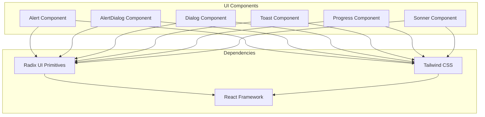
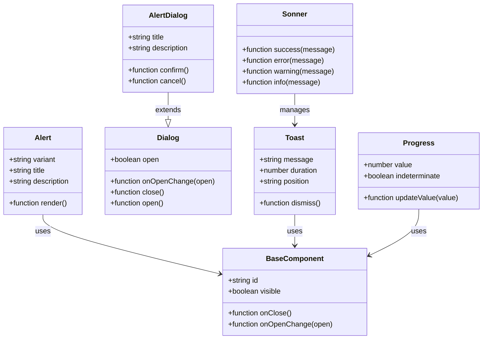
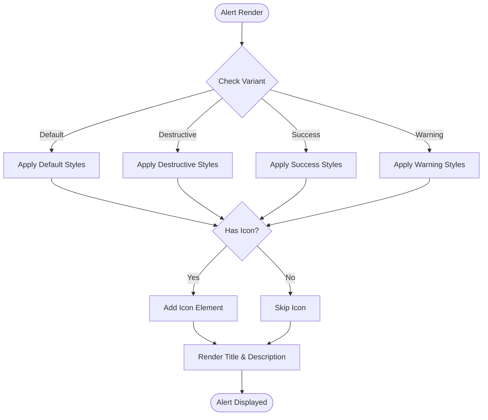
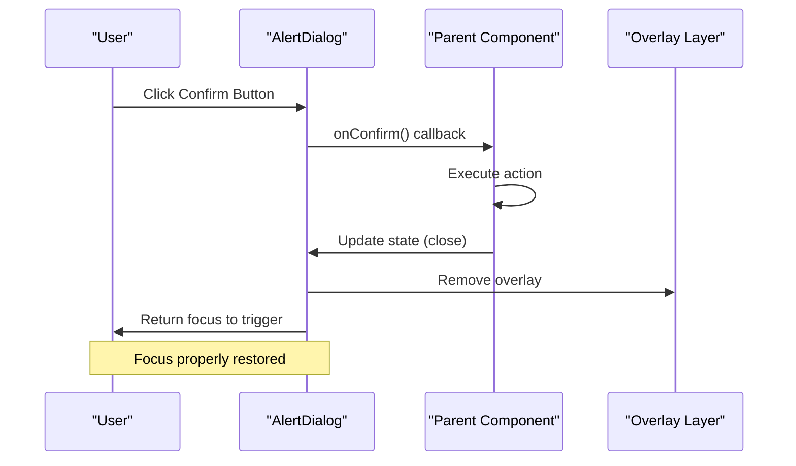
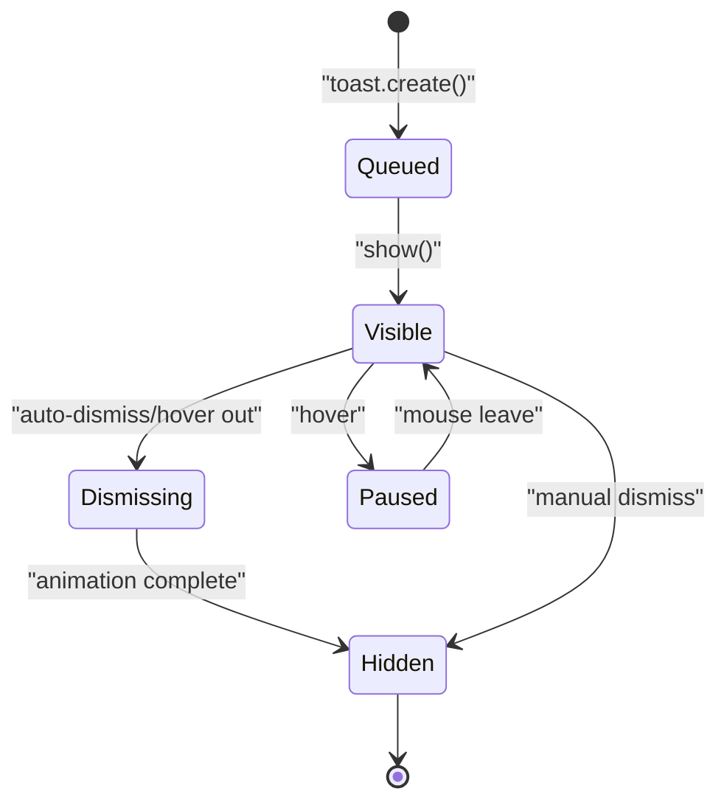

# Feedback & Status Components

<cite>
**Referenced Files in This Document**
- [alert.tsx](file://src/components/ui/alert.tsx)
- [alert-dialog.tsx](file://src/components/ui/alert-dialog.tsx)
- [dialog.tsx](file://src/components/ui/dialog.tsx)
- [sonner.tsx](file://src/components/ui/sonner.tsx)
- [progress.tsx](file://src/components/ui/progress.tsx)
</cite>

## Table of Contents
1. [Introduction](#introduction)
2. [Project Structure](#project-structure)
3. [Core Components](#core-components)
4. [Architecture Overview](#architecture-overview)
5. [Detailed Component Analysis](#detailed-component-analysis)
6. [Accessibility Guidelines](#accessibility-guidelines)
7. [Internationalization Support](#internationalization-support)
8. [Performance Considerations](#performance-considerations)
9. [Troubleshooting Guide](#troubleshooting-guide)
10. [Conclusion](#conclusion)

## Introduction

This document provides comprehensive documentation for feedback and status components in the application, including Alert, AlertDialog, Dialog, Toast, Progress, and Sonner notification components. These components are essential for providing users with clear feedback about system status, actions, and progress updates.

The components follow modern React patterns and accessibility best practices, ensuring they work seamlessly across different devices and assistive technologies. Each component is designed with customization options, event handling capabilities, and internationalization support.

## Project Structure

The feedback and status components are organized within the `src/components/ui` directory, following a modular architecture where each component is contained in its own file. This structure promotes reusability and maintainability while keeping related functionality grouped together.



**Diagram sources**
- [alert.tsx:1-50](file://src/components/ui/alert.tsx#L1-L50)
- [dialog.tsx:1-50](file://src/components/ui/dialog.tsx#L1-L50)
- [progress.tsx:1-50](file://src/components/ui/progress.tsx#L1-L50)

## Core Components

### Alert Component
The Alert component provides contextual feedback messages for typical user actions. It supports multiple variants including default, destructive, success, and warning states.

**Key Features:**
- Multiple visual variants for different message types
- Icon support for enhanced visual communication
- Customizable styling through props
- Responsive design considerations

### AlertDialog Component
The AlertDialog component builds upon the base Dialog component to provide confirmation dialogs for critical actions that require user acknowledgment before proceeding.

**Key Features:**
- Modal overlay behavior
- Keyboard navigation support
- Focus management
- Escape key handling
- Click-outside-to-close functionality

### Dialog Component
The Dialog component serves as the foundation for modal interactions, providing a flexible container for content that requires user attention or interaction.

**Key Features:**
- Controllable open/close state
- Customizable backdrop behavior
- Focus trapping within dialog
- Scroll lock when open
- Portal rendering for proper z-index management

### Toast Component
The Toast component delivers non-intrusive notifications that appear temporarily and automatically dismiss after a specified duration.

**Key Features:**
- Automatic dismissal with configurable timing
- Manual dismissal controls
- Stacking behavior for multiple toasts
- Position control (top-right, bottom-left, etc.)
- Action buttons within toasts

### Progress Component
The Progress component indicates the completion status of an operation, supporting both determinate and indeterminate states.

**Key Features:**
- Determinate progress with percentage values
- Indeterminate mode for unknown completion times
- Animated transitions
- Accessible progress announcements
- Customizable styling and colors

### Sonner Component
The Sonner component provides a sophisticated notification system built on top of the sonner library, offering advanced toast functionality with enhanced features.

**Key Features:**
- Rich notification types (success, error, warning, info)
- Custom positioning and stacking
- Duration control per notification
- Action callbacks
- Theme customization

**Section sources**
- [alert.tsx:1-100](file://src/components/ui/alert.tsx#L1-L100)
- [alert-dialog.tsx:1-100](file://src/components/ui/alert-dialog.tsx#L1-L100)
- [dialog.tsx:1-100](file://src/components/ui/dialog.tsx#L1-L100)
- [sonner.tsx:1-100](file://src/components/ui/sonner.tsx#L1-L100)
- [progress.tsx:1-100](file://src/components/ui/progress.tsx#L1-L100)

## Architecture Overview

The feedback and status components follow a layered architecture pattern, with base primitives from Radix UI providing accessibility and behavior, while custom implementations handle styling and specific business logic.



**Diagram sources**
- [dialog.tsx:1-150](file://src/components/ui/dialog.tsx#L1-L150)
- [alert-dialog.tsx:1-150](file://src/components/ui/alert-dialog.tsx#L1-L150)
- [toast.tsx:1-150](file://src/components/ui/toast.tsx#L1-L150)

## Detailed Component Analysis

### Alert Component Implementation

The Alert component implements a flexible messaging system with support for multiple variants and customizable styling.

#### API Surface
- **Props**: variant, title, description, icon, className
- **Events**: onClick, onDismiss
- **States**: hidden, visible, transitioning

#### Event Handling
The component handles user interactions through callback functions, allowing parent components to respond to alert dismissals or actions.

#### Customization Options
- Visual variants (default, destructive, success, warning)
- Icon integration
- Custom styling through className prop
- Animation controls



**Diagram sources**
- [alert.tsx:50-150](file://src/components/ui/alert.tsx#L50-L150)

### AlertDialog Component Pattern

The AlertDialog component provides a robust confirmation dialog pattern with proper focus management and keyboard navigation.

#### Modal Dialog Patterns
- Confirmation dialogs for destructive actions
- Multi-step form validation
- Important information display
- User consent collection

#### Accessibility Features
- Proper ARIA attributes
- Focus trapping within dialog
- Escape key to close
- Screen reader announcements
- Keyboard navigation support



**Diagram sources**
- [alert-dialog.tsx:100-250](file://src/components/ui/alert-dialog.tsx#L100-L250)

### Toast Notification System

The Toast component implements a sophisticated notification system with stacking behavior and automatic dismissal.

#### Timing Controls
- Configurable auto-dismiss duration
- Manual dismissal override
- Pause on hover functionality
- Queue management for multiple toasts

#### Stacking Behaviors
- Vertical stacking with overlap
- Horizontal positioning control
- Z-index management
- Overflow handling

#### Internationalization Support
- Dynamic message content
- Pluralization support
- Date/time formatting
- RTL layout support



**Diagram sources**
- [sonner.tsx:100-300](file://src/components/ui/sonner.tsx#L100-L300)

### Progress Indicator Implementation

The Progress component provides visual feedback for long-running operations with both determinate and indeterminate modes.

#### Progress States
- **Indeterminate**: Unknown completion time with animated indicator
- **Determinate**: Known completion percentage with precise progress
- **Error**: Failed state with retry option
- **Complete**: Successful completion with optional success message

#### Performance Optimizations
- Hardware-accelerated animations
- Efficient re-rendering with memoization
- Debounced progress updates
- Memory leak prevention

```mermaid
flowchart TD
Start([Progress Init]) --> CheckType{"Progress Type?"}
CheckType --> |Indeterminate| AnimateLoop["Start Animation Loop"]
CheckType --> |Determinate| SetInitial["Set Initial Value"]
AnimateLoop --> UpdateAnimation["Update Animation Frame"]
UpdateAnimation --> CheckComplete{"Complete?"}
CheckComplete --> |No| AnimateLoop
CheckComplete --> |Yes| ShowComplete["Show Complete State"]
SetInitial --> UpdateValue["Update Value"]
UpdateValue --> CheckRange{"Value Valid?"}
CheckRange --> |Invalid| ClampValue["Clamp to 0-100"]
CheckRange --> |Valid| UpdateDisplay["Update Display"]
ClampValue --> UpdateDisplay
UpdateDisplay --> CheckComplete
ShowComplete --> End([Progress Complete])
End --> [*]
```

**Diagram sources**
- [progress.tsx:100-250](file://src/components/ui/progress.tsx#L100-L250)

## Accessibility Guidelines

### Interactive Dialogs
All interactive components follow WAI-ARIA best practices for accessibility:

#### Focus Management
- Focus trap within modal dialogs
- Logical tab order within components
- Focus restoration to trigger element
- Skip links for complex interfaces

#### Screen Reader Support
- Proper ARIA labels and descriptions
- Live regions for dynamic content
- Role attributes for semantic meaning
- Announcements for state changes

#### Keyboard Navigation
- Tab navigation between interactive elements
- Enter/Space activation for buttons
- Escape key to close modals
- Arrow key navigation where appropriate

### Color Contrast and Visual Design
- Minimum 4.5:1 contrast ratio for text
- Focus indicators with sufficient visibility
- Non-color dependent status indicators
- Scalable text without loss of functionality

## Internationalization Support

### Message Localization
Components support dynamic content localization through:
- Props-based message injection
- Context-aware translations
- Pluralization rules
- Date/time formatting

### Layout Adaptation
- RTL language support
- Text direction detection
- Flexible sizing for longer text
- Cultural date/time formats

## Performance Considerations

### Rendering Optimization
- Memoized component instances
- Conditional rendering based on state
- Efficient animation frames
- Lazy loading for heavy components

### Memory Management
- Cleanup of event listeners
- Removal of DOM nodes on unmount
- Prevention of memory leaks
- Efficient state updates

### Bundle Size Optimization
- Tree shaking support
- Code splitting for large components
- Lazy imports for optional features
- Minimal dependencies

## Troubleshooting Guide

### Common Issues and Solutions

#### Focus Not Restoring
**Problem**: Focus doesn't return to trigger element after closing dialog
**Solution**: Ensure proper focus management implementation and check for async operations

#### Toast Not Dismissing
**Problem**: Toast notifications don't auto-dismiss
**Solution**: Verify timer cleanup and check for browser tab visibility changes

#### Progress Animation Stuttering
**Problem**: Progress animations are not smooth
**Solution**: Use requestAnimationFrame and avoid blocking main thread operations

#### Accessibility Violations
**Problem**: Screen readers not announcing component state
**Solution**: Implement proper ARIA live regions and role attributes

### Debugging Tips
- Use React DevTools to inspect component state
- Check console for warnings and errors
- Test with actual screen readers
- Validate keyboard navigation manually
- Monitor performance metrics during development

## Conclusion

The feedback and status components provide a comprehensive solution for user interface feedback in the application. With their robust accessibility features, extensive customization options, and performance optimizations, these components ensure a consistent and inclusive user experience across all platforms and devices.

The modular architecture allows for easy maintenance and extension, while the adherence to web standards ensures compatibility with future browser versions and assistive technologies. By following the guidelines and patterns outlined in this document, developers can effectively implement user feedback mechanisms that enhance usability and accessibility.