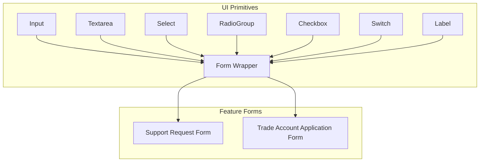
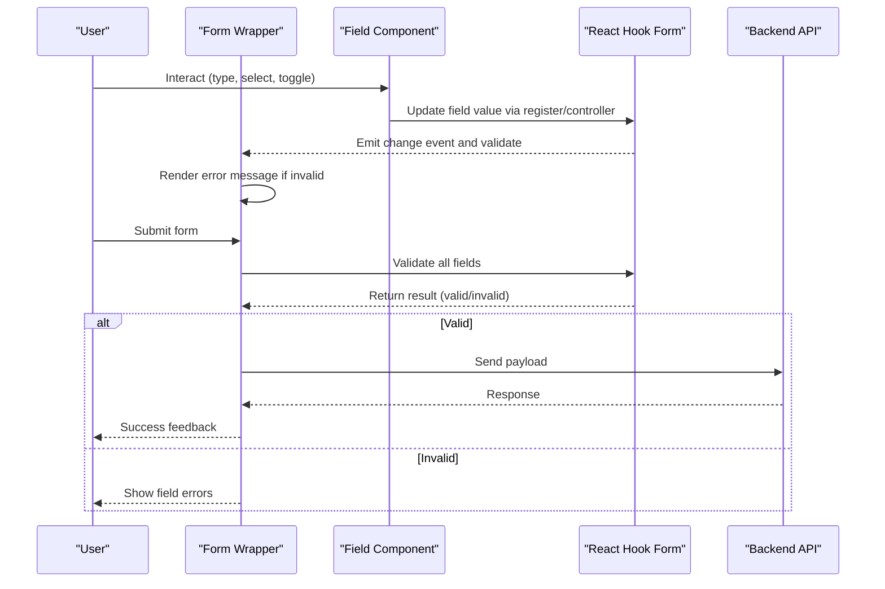
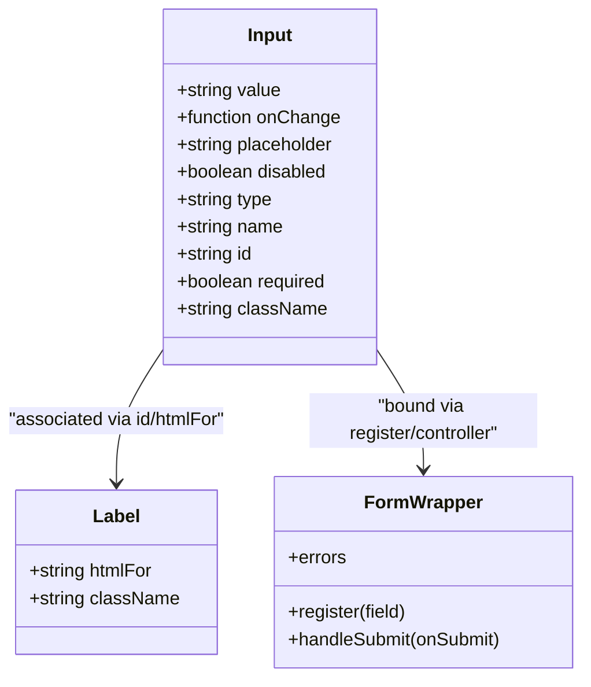
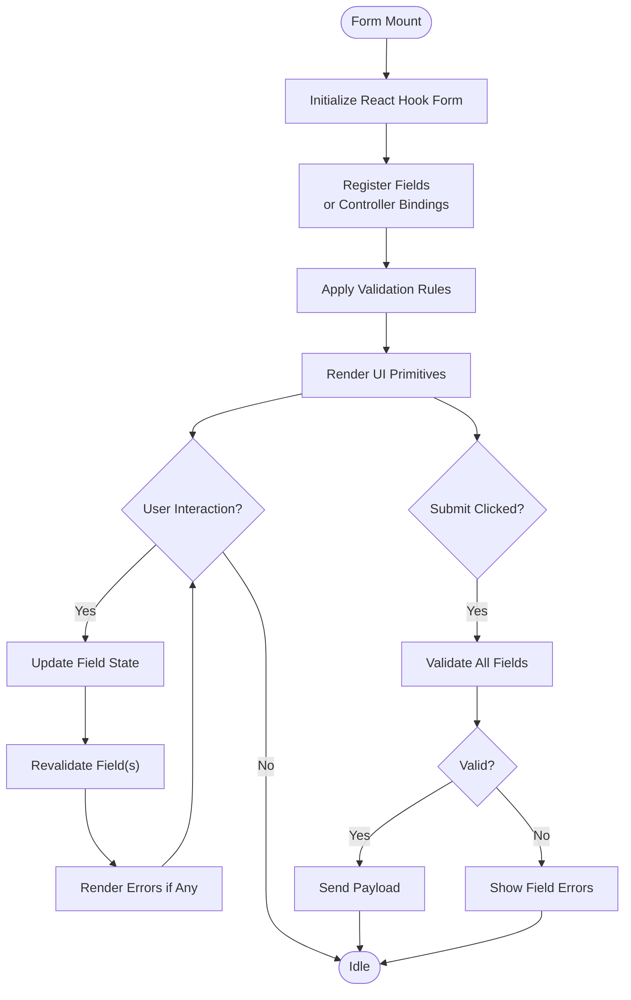
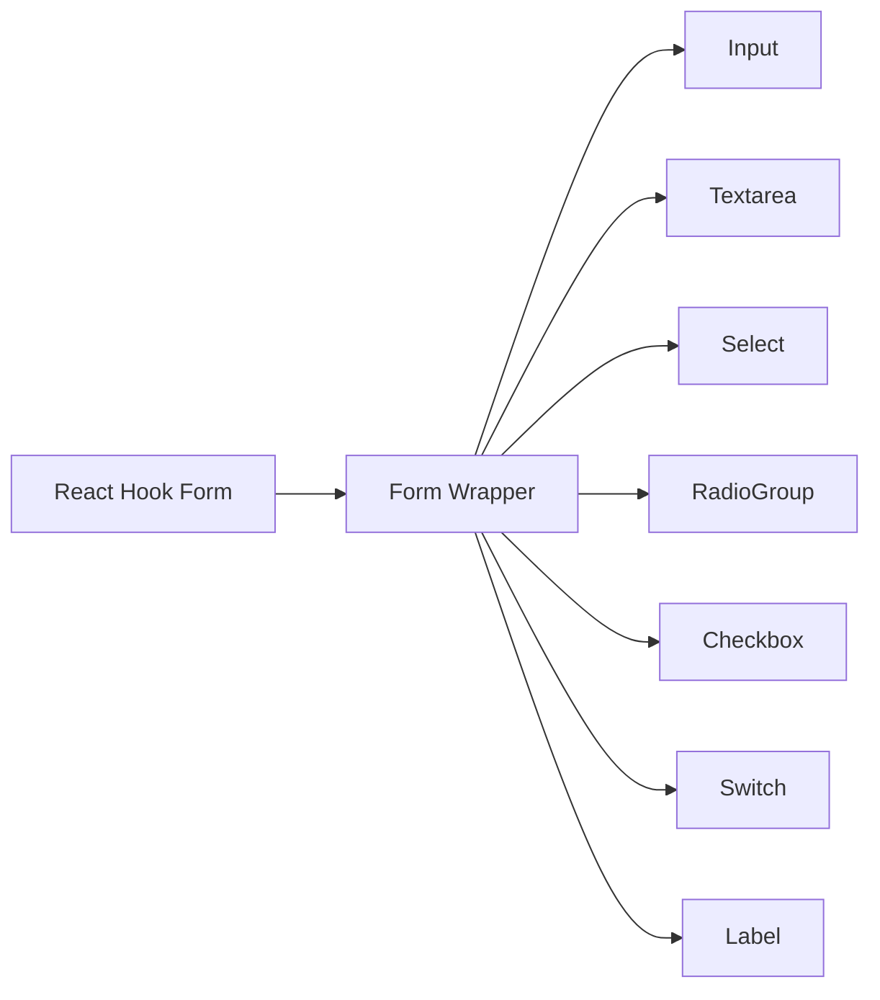

# Form Components

<cite>
**Referenced Files in This Document**
- [input.tsx](file://src/components/ui/input.tsx)
- [textarea.tsx](file://src/components/ui/textarea.tsx)
- [select.tsx](file://src/components/ui/select.tsx)
- [radio-group.tsx](file://src/components/ui/radio-group.tsx)
- [checkbox.tsx](file://src/components/ui/checkbox.tsx)
- [switch.tsx](file://src/components/ui/switch.tsx)
- [form.tsx](file://src/components/ui/form.tsx)
- [label.tsx](file://src/components/ui/label.tsx)
- [SupportRequestForm.tsx](file://src/components/shopify/SupportRequestForm.tsx)
- [TradeAccountApplicationForm.tsx](file://src/components/shopify/TradeAccountApplicationForm.tsx)
</cite>

## Table of Contents
1. [Introduction](#introduction)
2. [Project Structure](#project-structure)
3. [Core Components](#core-components)
4. [Architecture Overview](#architecture-overview)
5. [Detailed Component Analysis](#detailed-component-analysis)
6. [Dependency Analysis](#dependency-analysis)
7. [Performance Considerations](#performance-considerations)
8. [Troubleshooting Guide](#troubleshooting-guide)
9. [Conclusion](#conclusion)
10. [Appendices](#appendices)

## Introduction
This document provides comprehensive documentation for form-related UI components used across the application, including Input, Textarea, Select, RadioGroup, Checkbox, Switch, and a Form wrapper that integrates with React Hook Form. It covers props, validation integration, error handling, styling customization, accessibility, keyboard navigation, responsive behavior, and practical patterns for building robust forms. Guidance is provided for common scenarios such as conditional fields, dynamic forms, and complex validation rules, with references to concrete examples from the codebase.

## Project Structure
The form components are implemented as reusable primitives under src/components/ui and are composed into feature-specific forms under src/components/shopify. The Form wrapper component centralizes React Hook Form integration, while individual input components focus on presentation and accessibility.

**Diagram sources**
- [input.tsx:1-200](file://src/components/ui/input.tsx#L1-L200)
- [textarea.tsx:1-200](file://src/components/ui/textarea.tsx#L1-L200)
- [select.tsx:1-200](file://src/components/ui/select.tsx#L1-L200)
- [radio-group.tsx:1-200](file://src/components/ui/radio-group.tsx#L1-L200)
- [checkbox.tsx:1-200](file://src/components/ui/checkbox.tsx#L1-L200)
- [switch.tsx:1-200](file://src/components/ui/switch.tsx#L1-L200)
- [label.tsx:1-200](file://src/components/ui/label.tsx#L1-L200)
- [form.tsx:1-200](file://src/components/ui/form.tsx#L1-L200)
- [SupportRequestForm.tsx:1-200](file://src/components/shopify/SupportRequestForm.tsx#L1-L200)
- [TradeAccountApplicationForm.tsx:1-200](file://src/components/shopify/TradeAccountApplicationForm.tsx#L1-L200)

**Section sources**
- [input.tsx:1-200](file://src/components/ui/input.tsx#L1-L200)
- [textarea.tsx:1-200](file://src/components/ui/textarea.tsx#L1-L200)
- [select.tsx:1-200](file://src/components/ui/select.tsx#L1-L200)
- [radio-group.tsx:1-200](file://src/components/ui/radio-group.tsx#L1-L200)
- [checkbox.tsx:1-200](file://src/components/ui/checkbox.tsx#L1-L200)
- [switch.tsx:1-200](file://src/components/ui/switch.tsx#L1-L200)
- [label.tsx:1-200](file://src/components/ui/label.tsx#L1-L200)
- [form.tsx:1-200](file://src/components/ui/form.tsx#L1-L200)
- [SupportRequestForm.tsx:1-200](file://src/components/shopify/SupportRequestForm.tsx#L1-L200)
- [TradeAccountApplicationForm.tsx:1-200](file://src/components/shopify/TradeAccountApplicationForm.tsx#L1-L200)

## Core Components
This section summarizes each form primitive’s purpose, typical props, validation integration, error display, styling options, and accessibility considerations.

- Input
  - Purpose: Single-line text entry.
  - Typical props: value, onChange, placeholder, disabled, readOnly, type, name, id, required, autoFocus, className, size variants, and any standard HTML input attributes.
  - Validation integration: Controlled via React Hook Form using register or controller; errors surfaced through the Form wrapper’s error rendering.
  - Error handling: Displayed adjacent to the field when present; visually highlighted by default styles.
  - Styling: Customizable via className and internal variant classes; supports focus states and disabled visuals.
  - Accessibility: Proper label association via htmlFor/id; aria-invalid and aria-describedby can be managed by the Form wrapper.

- Textarea
  - Purpose: Multi-line text entry.
  - Props: Similar to Input plus rows, resize, maxLength, minLength, and other textarea-specific attributes.
  - Validation: Integrated with React Hook Form; supports custom validation messages.
  - Styling: Resizable controls and consistent sizing with Input.
  - Accessibility: Label association and error announcements follow the same pattern as Input.

- Select
  - Purpose: Dropdown selection from a list of options.
  - Props: options array (value/label), value, onChange, placeholder, disabled, multiple support if applicable, and trigger/button customization.
  - Validation: Works with React Hook Form; ensure option values match schema expectations.
  - Styling: Trigger button and popover content can be styled via className and internal composition.
  - Accessibility: Keyboard navigation (arrow keys, Enter/Space), role="combobox", aria-expanded, aria-controls, and aria-selected are handled by the underlying implementation.

- RadioGroup
  - Purpose: Mutually exclusive selection among options.
  - Props: value, onValueChange, orientation (horizontal/vertical), disabled, and item-level props for labels and descriptions.
  - Validation: Integrates with React Hook Form; single selected value maps to a form field.
  - Styling: Group container and items can be customized; supports focus rings and checked states.
  - Accessibility: Uses radio roles, aria-checked, and proper grouping with aria-labelledby/aria-describedby.

- Checkbox
  - Purpose: Binary toggle or multi-select option.
  - Props: checked, onCheckedChange, disabled, indeterminate state, label text, and optional description.
  - Validation: Controlled via React Hook Form; boolean values map directly to form state.
  - Styling: Checkmark indicator and label alignment; customizable via className.
  - Accessibility: Role="checkbox", aria-checked, and label association.

- Switch
  - Purpose: On/off toggle control.
  - Props: checked, onCheckedChange, disabled, label, and visual variants.
  - Validation: Boolean binding with React Hook Form.
  - Styling: Track and thumb visuals; focus and active states.
  - Accessibility: Role="switch", aria-checked, and keyboard activation (Space/Enter).

- Label
  - Purpose: Accessible label element for inputs.
  - Props: htmlFor/id association, className, and text content.
  - Usage: Pair with Input, Textarea, Select, RadioGroup, Checkbox, and Switch for screen reader compatibility.

- Form Wrapper
  - Purpose: Centralized React Hook Form integration for composing multiple fields.
  - Responsibilities: Provide form context, handle submit/reset, manage global and per-field errors, render field arrays, and expose helper hooks for accessing field state and errors.
  - Integration: Exposes methods to register fields, bind values, and subscribe to changes; renders error messages consistently.
  - Accessibility: Ensures aria-invalid and aria-describedby are applied where appropriate.

**Section sources**
- [input.tsx:1-200](file://src/components/ui/input.tsx#L1-L200)
- [textarea.tsx:1-200](file://src/components/ui/textarea.tsx#L1-L200)
- [select.tsx:1-200](file://src/components/ui/select.tsx#L1-L200)
- [radio-group.tsx:1-200](file://src/components/ui/radio-group.tsx#L1-L200)
- [checkbox.tsx:1-200](file://src/components/ui/checkbox.tsx#L1-L200)
- [switch.tsx:1-200](file://src/components/ui/switch.tsx#L1-L200)
- [label.tsx:1-200](file://src/components/ui/label.tsx#L1-L200)
- [form.tsx:1-200](file://src/components/ui/form.tsx#L1-L200)

## Architecture Overview
The form architecture separates concerns between presentation primitives and orchestration logic:

- Presentation layer: Input, Textarea, Select, RadioGroup, Checkbox, Switch, and Label provide accessible, stylable UI elements.
- Orchestration layer: Form wrapper composes primitives, binds them to React Hook Form, and manages validation and error display.
- Feature forms: SupportRequestForm and TradeAccountApplicationForm demonstrate real-world usage patterns, combining primitives within the Form wrapper.

**Diagram sources**
- [form.tsx:1-200](file://src/components/ui/form.tsx#L1-L200)
- [input.tsx:1-200](file://src/components/ui/input.tsx#L1-L200)
- [textarea.tsx:1-200](file://src/components/ui/textarea.tsx#L1-L200)
- [select.tsx:1-200](file://src/components/ui/select.tsx#L1-L200)
- [radio-group.tsx:1-200](file://src/components/ui/radio-group.tsx#L1-L200)
- [checkbox.tsx:1-200](file://src/components/ui/checkbox.tsx#L1-L200)
- [switch.tsx:1-200](file://src/components/ui/switch.tsx#L1-L200)

## Detailed Component Analysis

### Input Component
- Props overview: Accepts standard HTML input attributes plus controlled value/onChange bindings and className for styling.
- Validation integration: Use register or controller to bind to React Hook Form; set rules for required, min/max length, pattern, etc.
- Error handling: Errors are surfaced by the Form wrapper; Input should not render its own error UI unless explicitly designed to do so.
- Styling: Supports focus ring, disabled state, and size variants via internal class composition.
- Accessibility: Ensure htmlFor/id pairing with Label; aria-invalid and aria-describedby are typically managed by the Form wrapper.

**Diagram sources**
- [input.tsx:1-200](file://src/components/ui/input.tsx#L1-L200)
- [label.tsx:1-200](file://src/components/ui/label.tsx#L1-L200)
- [form.tsx:1-200](file://src/components/ui/form.tsx#L1-L200)

**Section sources**
- [input.tsx:1-200](file://src/components/ui/input.tsx#L1-L200)
- [label.tsx:1-200](file://src/components/ui/label.tsx#L1-L200)
- [form.tsx:1-200](file://src/components/ui/form.tsx#L1-L200)

### Textarea Component
- Props overview: Extends Input-like props with rows, resize, and character limits.
- Validation integration: Same as Input; use React Hook Form rules for min/max length and required checks.
- Error handling: Consistent error display via Form wrapper.
- Styling: Resizable handles and consistent typography.
- Accessibility: Label association and error announcements mirror Input.

**Section sources**
- [textarea.tsx:1-200](file://src/components/ui/textarea.tsx#L1-L200)
- [form.tsx:1-200](file://src/components/ui/form.tsx#L1-L200)

### Select Component
- Props overview: Options array with value/label pairs; supports placeholder and disabled states.
- Validation integration: Ensure selected value matches expected schema; integrate with React Hook Form.
- Error handling: Errors displayed by Form wrapper.
- Styling: Trigger and dropdown content customizable.
- Accessibility: Keyboard navigation and ARIA attributes handled internally.

**Section sources**
- [select.tsx:1-200](file://src/components/ui/select.tsx#L1-L200)
- [form.tsx:1-200](file://src/components/ui/form.tsx#L1-L200)

### RadioGroup Component
- Props overview: Value and onValueChange for selection; orientation and disabled states; item-level labels/descriptions.
- Validation integration: Single value bound to a form field; required validation ensures an option is chosen.
- Error handling: Errors surfaced by Form wrapper.
- Styling: Group layout and item visuals customizable.
- Accessibility: Roles and ARIA attributes for radio buttons and group semantics.

**Section sources**
- [radio-group.tsx:1-200](file://src/components/ui/radio-group.tsx#L1-L200)
- [form.tsx:1-200](file://src/components/ui/form.tsx#L1-L200)

### Checkbox Component
- Props overview: Checked and onCheckedChange; supports indeterminate state; label and description props.
- Validation integration: Boolean field binding; required checks ensure selection when needed.
- Error handling: Errors surfaced by Form wrapper.
- Styling: Indicator and label alignment; focus and checked states.
- Accessibility: Role and aria-checked; label association.

**Section sources**
- [checkbox.tsx:1-200](file://src/components/ui/checkbox.tsx#L1-L200)
- [form.tsx:1-200](file://src/components/ui/form.tsx#L1-L200)

### Switch Component
- Props overview: Checked and onCheckedChange; disabled state; label prop.
- Validation integration: Boolean field binding; required checks when mandatory.
- Error handling: Errors surfaced by Form wrapper.
- Styling: Track and thumb visuals; focus and active states.
- Accessibility: Role="switch"; aria-checked; keyboard activation.

**Section sources**
- [switch.tsx:1-200](file://src/components/ui/switch.tsx#L1-L200)
- [form.tsx:1-200](file://src/components/ui/form.tsx#L1-L200)

### Form Wrapper Component
- Responsibilities:
  - Initialize React Hook Form instance and provide context.
  - Register fields and bind values/onChange handlers.
  - Handle submit and reset actions.
  - Aggregate and render field errors.
  - Expose helpers for accessing field state and validation results.
- Integration patterns:
  - Use register for simple fields.
  - Use controller for complex components (Select, RadioGroup, Checkbox, Switch) requiring custom value/onChange mapping.
  - Apply validation rules at registration time or via resolver for cross-field validation.
- Accessibility:
  - Ensure aria-invalid and aria-describedby are applied based on validation state.
  - Maintain logical tab order and focus management.

**Diagram sources**
- [form.tsx:1-200](file://src/components/ui/form.tsx#L1-L200)

**Section sources**
- [form.tsx:1-200](file://src/components/ui/form.tsx#L1-L200)

### Practical Examples from Codebase
- Support Request Form
  - Demonstrates composing Input, Textarea, Select, and Button within the Form wrapper.
  - Shows required field validation, error display, and submission flow.
  - References: [SupportRequestForm.tsx:1-200](file://src/components/shopify/SupportRequestForm.tsx#L1-L200)

- Trade Account Application Form
  - Demonstrates complex forms with multiple sections, conditional fields, and advanced validation.
  - Uses RadioGroup and Checkbox for preference selections; integrates with React Hook Form for cross-field rules.
  - References: [TradeAccountApplicationForm.tsx:1-200](file://src/components/shopify/TradeAccountApplicationForm.tsx#L1-L200)

**Section sources**
- [SupportRequestForm.tsx:1-200](file://src/components/shopify/SupportRequestForm.tsx#L1-L200)
- [TradeAccountApplicationForm.tsx:1-200](file://src/components/shopify/TradeAccountApplicationForm.tsx#L1-L200)

## Dependency Analysis
The form components rely on React Hook Form for state and validation orchestration. The Form wrapper acts as the integration point, while primitives remain agnostic of validation details.

**Diagram sources**
- [form.tsx:1-200](file://src/components/ui/form.tsx#L1-L200)
- [input.tsx:1-200](file://src/components/ui/input.tsx#L1-L200)
- [textarea.tsx:1-200](file://src/components/ui/textarea.tsx#L1-L200)
- [select.tsx:1-200](file://src/components/ui/select.tsx#L1-L200)
- [radio-group.tsx:1-200](file://src/components/ui/radio-group.tsx#L1-L200)
- [checkbox.tsx:1-200](file://src/components/ui/checkbox.tsx#L1-L200)
- [switch.tsx:1-200](file://src/components/ui/switch.tsx#L1-L200)
- [label.tsx:1-200](file://src/components/ui/label.tsx#L1-L200)

**Section sources**
- [form.tsx:1-200](file://src/components/ui/form.tsx#L1-L200)
- [input.tsx:1-200](file://src/components/ui/input.tsx#L1-L200)
- [textarea.tsx:1-200](file://src/components/ui/textarea.tsx#L1-L200)
- [select.tsx:1-200](file://src/components/ui/select.tsx#L1-L200)
- [radio-group.tsx:1-200](file://src/components/ui/radio-group.tsx#L1-L200)
- [checkbox.tsx:1-200](file://src/components/ui/checkbox.tsx#L1-L200)
- [switch.tsx:1-200](file://src/components/ui/switch.tsx#L1-L200)
- [label.tsx:1-200](file://src/components/ui/label.tsx#L1-L200)

## Performance Considerations
- Prefer register for simple fields to minimize re-renders; use controller only when necessary for complex components.
- Debounce expensive validations (e.g., server-side uniqueness checks) to avoid excessive revalidation.
- Memoize large option lists for Select to prevent unnecessary computations.
- Avoid heavy inline functions in props; lift callbacks out or memoize them.
- Use lazy loading for large forms split across tabs or steps.

[No sources needed since this section provides general guidance]

## Troubleshooting Guide
Common issues and resolutions:
- Field not updating: Ensure the field is registered or properly bound via controller; verify value/onChange mapping.
- Validation not triggering: Confirm rules are attached at registration time or via resolver; check field names match schema.
- Error messages not showing: Verify Form wrapper is rendering error containers and that aria-describedby points to the correct message IDs.
- Keyboard navigation broken: For Select, RadioGroup, Checkbox, and Switch, ensure underlying implementations maintain focus management and ARIA attributes.
- Conditional fields: Use watch or useEffect to conditionally register fields and apply validation rules dynamically.

**Section sources**
- [form.tsx:1-200](file://src/components/ui/form.tsx#L1-L200)
- [select.tsx:1-200](file://src/components/ui/select.tsx#L1-L200)
- [radio-group.tsx:1-200](file://src/components/ui/radio-group.tsx#L1-L200)
- [checkbox.tsx:1-200](file://src/components/ui/checkbox.tsx#L1-L200)
- [switch.tsx:1-200](file://src/components/ui/switch.tsx#L1-L200)

## Conclusion
The form components provide a cohesive, accessible, and customizable foundation for building robust user interfaces. By leveraging the Form wrapper and React Hook Form, developers can implement reliable validation, clear error handling, and consistent styling across Input, Textarea, Select, RadioGroup, Checkbox, and Switch. Real-world examples in SupportRequestForm and TradeAccountApplicationForm illustrate effective patterns for both simple and complex forms. Following the guidelines here will help ensure accessibility compliance, responsive behavior, and smooth keyboard navigation.

[No sources needed since this section summarizes without analyzing specific files]

## Appendices

### Accessibility Checklist
- Associate every input with a visible label using htmlFor/id.
- Ensure aria-invalid and aria-describedby are applied when fields have errors.
- Provide meaningful role attributes and ARIA states for interactive components (Select, RadioGroup, Checkbox, Switch).
- Maintain logical tab order and visible focus indicators.
- Test with screen readers and keyboard-only navigation.

[No sources needed since this section provides general guidance]

### Responsive Layout Patterns
- Stack fields vertically on small screens; switch to horizontal layouts on larger breakpoints.
- Use consistent spacing and alignment to improve readability.
- Ensure touch targets meet minimum size requirements for mobile devices.

[No sources needed since this section provides general guidance]

### Common Scenarios and Patterns
- Conditional fields: Dynamically register/unregister fields based on parent field values; adjust validation rules accordingly.
- Dynamic forms: Build forms from configuration objects; iterate over fields to render primitives and attach validation.
- Complex validation: Use resolver or cross-field rules to enforce dependencies between fields (e.g., password confirmation).

**Section sources**
- [form.tsx:1-200](file://src/components/ui/form.tsx#L1-L200)
- [SupportRequestForm.tsx:1-200](file://src/components/shopify/SupportRequestForm.tsx#L1-L200)
- [TradeAccountApplicationForm.tsx:1-200](file://src/components/shopify/TradeAccountApplicationForm.tsx#L1-L200)