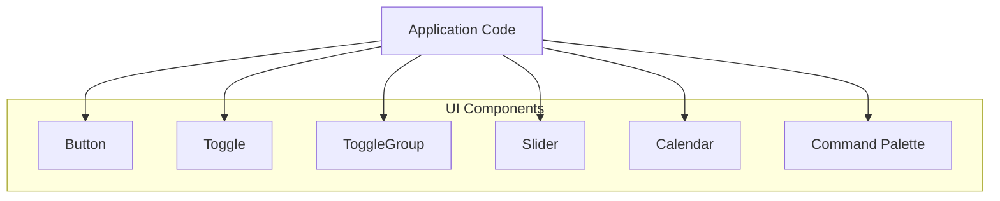
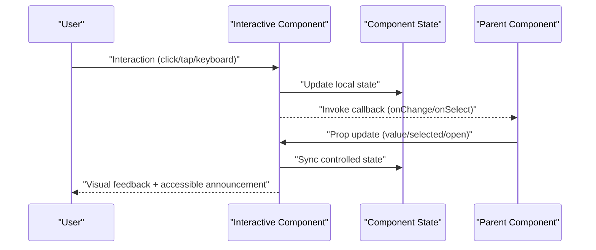
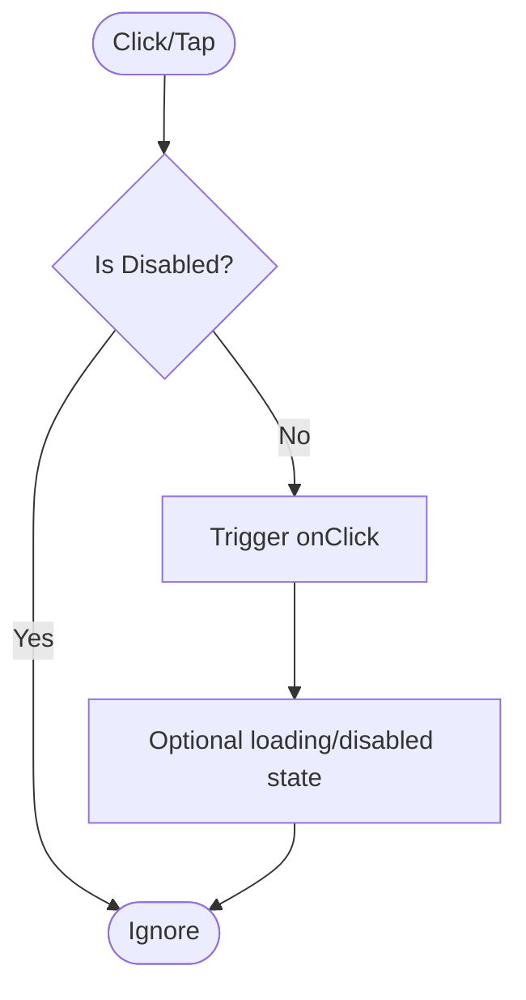
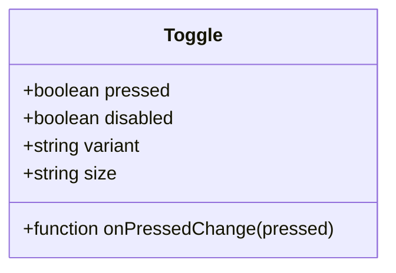
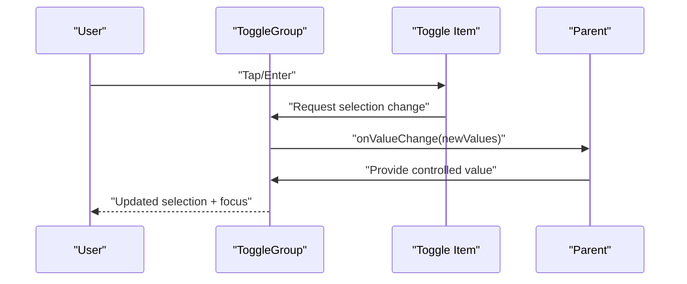
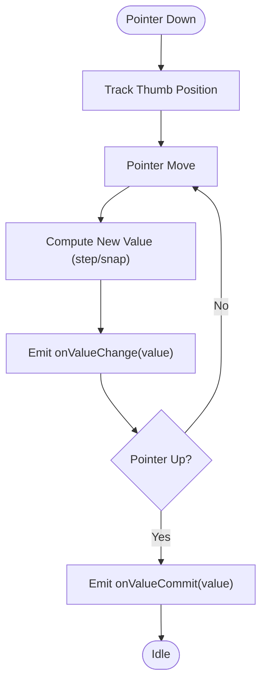
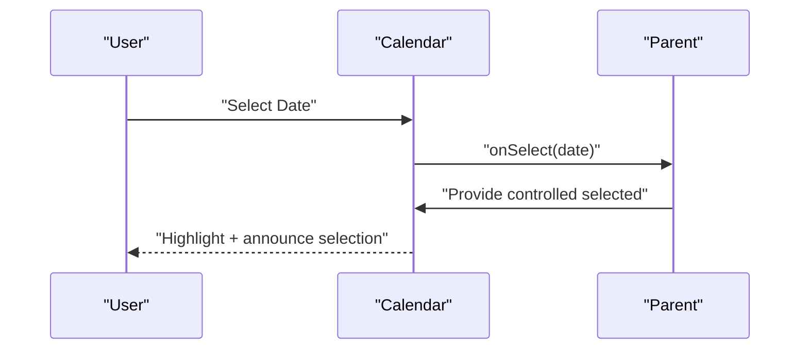
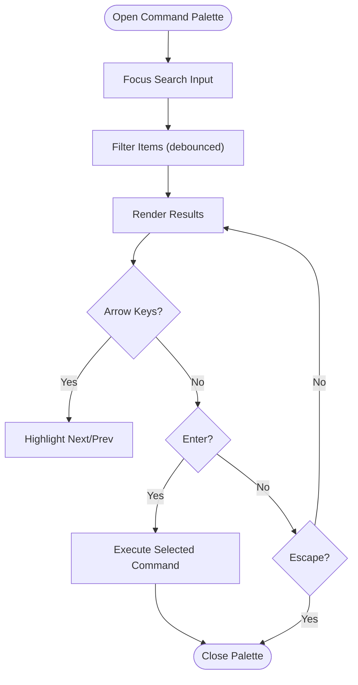
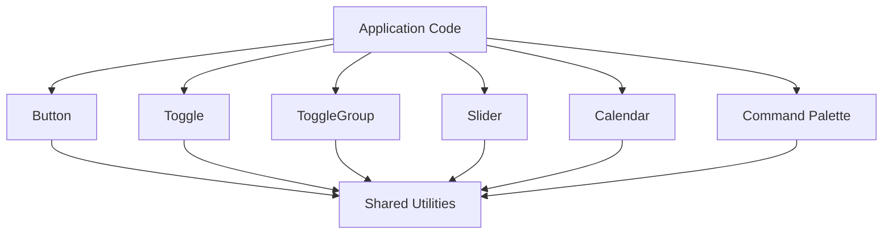

# Interactive & Action Components

<cite>
**Referenced Files in This Document**
- [button.tsx](file://src/components/ui/button.tsx)
- [toggle.tsx](file://src/components/ui/toggle.tsx)
- [toggle-group.tsx](file://src/components/ui/toggle-group.tsx)
- [slider.tsx](file://src/components/ui/slider.tsx)
- [calendar.tsx](file://src/components/ui/calendar.tsx)
- [command.tsx](file://src/components/ui/command.tsx)
</cite>

## Table of Contents
1. [Introduction](#introduction)
2. [Project Structure](#project-structure)
3. [Core Components](#core-components)
4. [Architecture Overview](#architecture-overview)
5. [Detailed Component Analysis](#detailed-component-analysis)
6. [Dependency Analysis](#dependency-analysis)
7. [Performance Considerations](#performance-considerations)
8. [Troubleshooting Guide](#troubleshooting-guide)
9. [Conclusion](#conclusion)

## Introduction
This document provides comprehensive documentation for interactive and action components: Button, Toggle, ToggleGroup, Slider, Calendar, and Command palette. It focuses on props, event handlers, state management patterns, keyboard shortcuts, touch gestures, accessibility (focus management and ARIA attributes), complex interaction scenarios, performance optimization for frequently updated components, and animation smoothness considerations. The guidance is tailored to the UI component implementations located under src/components/ui.

## Project Structure
The interactive components are implemented as individual React components within the UI library directory. Each component encapsulates its own behavior, styling, and accessibility concerns while remaining composable with other components.

[No sources needed since this diagram shows conceptual structure, not specific code mappings]

## Core Components
This section summarizes each component’s purpose, typical props, events, and state patterns. For precise prop names and behaviors, refer to the linked source files.

- Button
  - Purpose: Triggers actions or navigations; supports variants and states.
  - Common props: variant, size, disabled, loading, type, href, onClick.
  - Events: onClick, onKeyDown, onFocus, onBlur.
  - State: Controlled via disabled/loading; uncontrolled usage supported when appropriate.
  - Accessibility: Semantic button element, focus styles, aria-* attributes as needed.
  - Keyboard: Enter/Space activation; Tab navigation.
  - Touch: Tap triggers click; ensure adequate hit area.
  - Performance: Avoid heavy work in onClick; debounce if necessary.

- Toggle
  - Purpose: Binary on/off control; often used for preferences or filters.
  - Common props: pressed, onPressedChange, disabled, variant, size.
  - Events: onPressedChange, onKeyDown, onFocus, onBlur.
  - State: Controlled via pressed; can be uncontrolled with defaultPressed.
  - Accessibility: role="switch", aria-pressed, focus ring, label association.
  - Keyboard: Space toggles; Arrow keys may navigate groups when applicable.
  - Touch: Tap toggles; ensure sufficient target size.
  - Performance: Minimal re-renders; avoid unnecessary state updates.

- ToggleGroup
  - Purpose: Manages a group of toggles with single or multiple selection modes.
  - Common props: orientation, loop, defaultValue, value, onValueChange, disabled.
  - Events: onValueChange, item selection/deselection callbacks.
  - State: Controlled via value; uncontrolled via defaultValue.
  - Accessibility: role="group" or radio-like semantics depending on mode; arrow key navigation; focus containment.
  - Keyboard: Arrow keys move focus between items; Enter/Space activates.
  - Touch: Swipe may be supported by underlying primitives; tap selects.
  - Performance: Batch updates; avoid per-item re-renders where possible.

- Slider
  - Purpose: Select a value from a range; supports single and multiple thumbs.
  - Common props: min, max, step, value, defaultValue, onValueChange, disabled, orientation.
  - Events: onValueChange, onValueCommit, onKeyDown, onPointerDown/Move/Up.
  - State: Controlled via value; uncontrolled via defaultValue.
  - Accessibility: role="slider", aria-valuenow/min/max, aria-label, focusable thumb.
  - Keyboard: Arrow keys adjust value; Page Up/Down for larger steps; Home/End at bounds.
  - Touch: Drag to change; snap to step if configured.
  - Performance: Throttle frequent updates; use requestAnimationFrame for animations.

- Calendar
  - Purpose: Date selection interface; supports single/multiple ranges and locale formatting.
  - Common props: mode, selected, onSelect, defaultMonth, month, onMonthChange, locale, formatters.
  - Events: onSelect, onMonthChange, onYearChange.
  - State: Controlled via selected/month; uncontrolled via defaults.
  - Accessibility: Grid/list roles for cells; aria-selected; focus trap within calendar; labels for month/year controls.
  - Keyboard: Arrow keys navigate days; Enter/Space selects; Month/Year navigation via dedicated keys.
  - Touch: Tap to select; swipe to navigate months.
  - Performance: Virtualization for large calendars; memoize cell rendering.

- Command Palette
  - Purpose: Quick search and command execution overlay; fuzzy matching and grouping.
  - Common props: items, filterFn, renderCommand, open, onOpenChange, defaultOpen.
  - Events: onOpenChange, onSelect, onFilterChange.
  - State: Controlled via open; uncontrolled via defaultOpen; internal query state.
  - Accessibility: role="dialog" or listbox; aria-expanded; focus management; keyboard navigation.
  - Keyboard: Type to filter; Arrow keys navigate; Enter executes; Escape closes.
  - Touch: Tap to select; scroll to browse; optional gesture to dismiss.
  - Performance: Debounce filtering; virtualized lists; memoized match scoring.

**Section sources**
- [button.tsx](file://src/components/ui/button.tsx)
- [toggle.tsx](file://src/components/ui/toggle.tsx)
- [toggle-group.tsx](file://src/components/ui/toggle-group.tsx)
- [slider.tsx](file://src/components/ui/slider.tsx)
- [calendar.tsx](file://src/components/ui/calendar.tsx)
- [command.tsx](file://src/components/ui/command.tsx)

## Architecture Overview
The components follow a consistent pattern:
- Controlled/uncontrolled state support via value/defaultValue pairs.
- Event-driven updates through onChange/onSelect/onValueChange callbacks.
- Accessibility baked into base elements and primitive interactions.
- Composable design enabling complex scenarios like grouped toggles, filtered commands, and multi-thumb sliders.

[No sources needed since this diagram shows conceptual workflow, not actual code structure]

## Detailed Component Analysis

### Button
- Props overview: variant, size, disabled, loading, type, href, onClick, className, style.
- Event handling: onClick for primary action; onKeyDown for custom keyboard behaviors; onFocus/onBlur for focus-visible styles.
- State management: Typically uncontrolled; disabled/loading can be externally controlled.
- Accessibility: Uses native <button>; ensures focus ring; supports aria-busy when loading; aria-disabled when disabled.
- Keyboard: Enter/Space triggers click; Tab moves focus.
- Touch: Tap maps to click; ensure minimum 44px hit area.
- Complex scenario: Loading state with spinner and disabled overlay; async action with optimistic UI and rollback on error.

**Section sources**
- [button.tsx](file://src/components/ui/button.tsx)

### Toggle
- Props overview: pressed, onPressedChange, disabled, variant, size, aria-label.
- Event handling: onPressedChange for state sync; onKeyDown for Space toggle.
- State management: Controlled via pressed; uncontrolled via defaultPressed.
- Accessibility: role="switch"; aria-pressed; associated label via htmlFor or aria-labelledby.
- Keyboard: Space toggles; Arrow keys may navigate within ToggleGroup.
- Touch: Tap toggles; ensure adequate target size.
- Complex scenario: Grouped toggles with single-select mode using ToggleGroup; persist preference to storage.

**Diagram sources**
- [toggle.tsx](file://src/components/ui/toggle.tsx)

**Section sources**
- [toggle.tsx](file://src/components/ui/toggle.tsx)

### ToggleGroup
- Props overview: orientation, loop, defaultValue, value, onValueChange, disabled.
- Event handling: onValueChange returns array of selected values; item-level events delegated.
- State management: Controlled via value; uncontrolled via defaultValue; maintains focus and active item.
- Accessibility: Role depends on mode; arrow key navigation; focus containment; aria-selected on items.
- Keyboard: Arrow keys navigate; Enter/Space activates; Shift+Tab/Tab manage focus flow.
- Touch: Tap selects; swipe may be supported by underlying primitives.
- Complex scenario: Multi-select filter panel with persistent selections and clear-all action.

**Diagram sources**
- [toggle-group.tsx](file://src/components/ui/toggle-group.tsx)

**Section sources**
- [toggle-group.tsx](file://src/components/ui/toggle-group.tsx)

### Slider
- Props overview: min, max, step, value, defaultValue, onValueChange, disabled, orientation, marks.
- Event handling: onValueChange for live updates; onValueCommit for final commit; pointer and keyboard events handled internally.
- State management: Controlled via value; uncontrolled via defaultValue; supports multiple thumbs.
- Accessibility: role="slider"; aria-valuenow/min/max; aria-label; focusable thumb; announcements for changes.
- Keyboard: Arrow keys adjust by step; Page Up/Down for larger increments; Home/End at boundaries.
- Touch: Drag to adjust; snap to step; visual feedback during drag.
- Complex scenario: Dual-thumb range slider with formatted labels and debounced commits.

**Diagram sources**
- [slider.tsx](file://src/components/ui/slider.tsx)

**Section sources**
- [slider.tsx](file://src/components/ui/slider.tsx)

### Calendar
- Props overview: mode, selected, onSelect, defaultMonth, month, onMonthChange, locale, formatters, disabledDates.
- Event handling: onSelect for date selection; onMonthChange for navigation; year/month controls emit events.
- State management: Controlled via selected/month; uncontrolled via defaults; supports single/multi/range modes.
- Accessibility: Grid/list roles for cells; aria-selected; focus trap; labels for controls; screen reader announcements.
- Keyboard: Arrow keys navigate days; Enter/Space selects; Month/Year navigation via dedicated keys.
- Touch: Tap to select; swipe to navigate months; pinch-to-zoom not required.
- Complex scenario: Range selection with start/end highlighting and keyboard-only workflows.

**Diagram sources**
- [calendar.tsx](file://src/components/ui/calendar.tsx)

**Section sources**
- [calendar.tsx](file://src/components/ui/calendar.tsx)

### Command Palette
- Props overview: items, filterFn, renderCommand, open, onOpenChange, defaultOpen, placeholder, emptyMessage.
- Event handling: onOpenChange for visibility; onSelect for execution; onFilterChange for custom filtering.
- State management: Controlled via open; uncontrolled via defaultOpen; internal query state managed locally.
- Accessibility: Dialog/listbox roles; aria-expanded; focus management; keyboard navigation; escape to close.
- Keyboard: Type to filter; Arrow keys navigate; Enter executes; Escape closes; Ctrl/Cmd+K to toggle.
- Touch: Tap to select; scroll to browse; optional gesture to dismiss.
- Complex scenario: Hierarchical commands with sections, icons, and dynamic loading; debounced search with caching.

**Diagram sources**
- [command.tsx](file://src/components/ui/command.tsx)

**Section sources**
- [command.tsx](file://src/components/ui/command.tsx)

## Dependency Analysis
Components rely on shared UI primitives and utility functions for styling, focus management, and accessibility. They maintain low coupling by exposing simple props and events, enabling composition across the application.

[No sources needed since this diagram shows conceptual relationships, not specific code mappings]

## Performance Considerations
- Debounce/throttle frequent updates:
  - Slider: Use onValueCommit for expensive operations; throttle onValueChange for live previews.
  - Command Palette: Debounce filtering; cache results; virtualize long lists.
- Memoization:
  - Memoize computed props and rendered items (e.g., calendar cells, command items).
- Rendering efficiency:
  - Avoid re-rendering entire groups; split into smaller components.
  - Use React.memo for pure presentational components.
- Animation smoothness:
  - Prefer CSS transitions and transforms over JS-based animations.
  - Use requestAnimationFrame for custom animations tied to user input.
- Memory management:
  - Clean up event listeners and timers in useEffect cleanup.
  - Avoid storing large datasets in component state; prefer refs or external stores.

[No sources needed since this section provides general guidance]

## Troubleshooting Guide
- Focus management issues:
  - Ensure focus traps in dialogs/palettes; restore focus on close.
  - Verify tabIndex and focus-visible styles for custom interactive elements.
- Accessibility gaps:
  - Confirm aria-* attributes reflect current state (aria-pressed, aria-valuenow, aria-selected).
  - Provide descriptive labels via aria-label or aria-labelledby.
- Keyboard behavior:
  - Test Enter/Space activation; verify Arrow key navigation and Escape dismissal.
- Touch interactions:
  - Validate tap targets meet minimum sizes; test drag gestures on mobile.
- State synchronization:
  - Ensure controlled props match internal state; handle edge cases for out-of-range values.
- Performance regressions:
  - Profile re-renders; identify unnecessary updates; apply memoization and batching.

[No sources needed since this section provides general guidance]

## Conclusion
These interactive components provide robust, accessible, and performant building blocks for user interfaces. By leveraging controlled/uncontrolled patterns, adhering to keyboard and touch best practices, and optimizing for frequent updates, you can create responsive and inclusive experiences. Use the provided guidance to implement complex scenarios such as grouped toggles, dual-thumb sliders, range calendars, and powerful command palettes.

[No sources needed since this section summarizes without analyzing specific files]