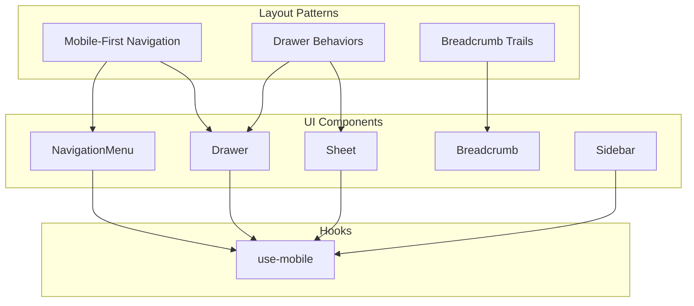
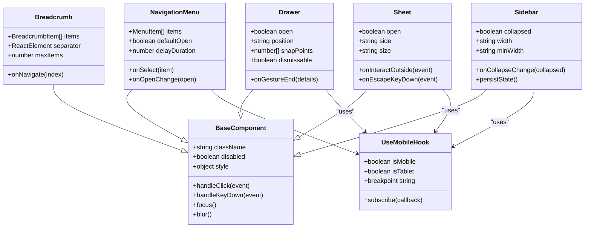
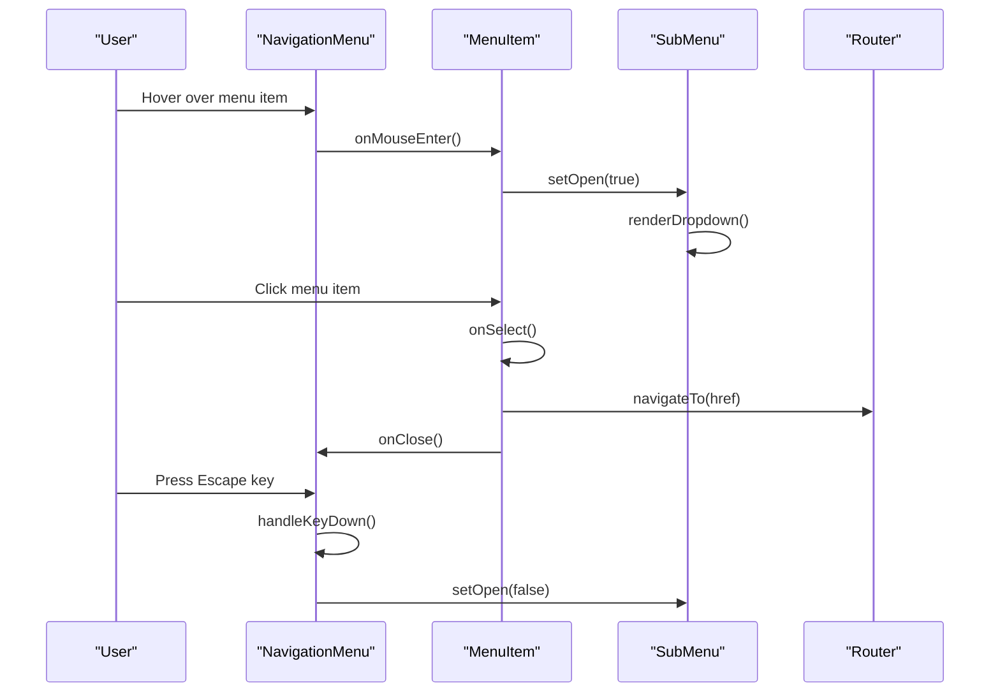
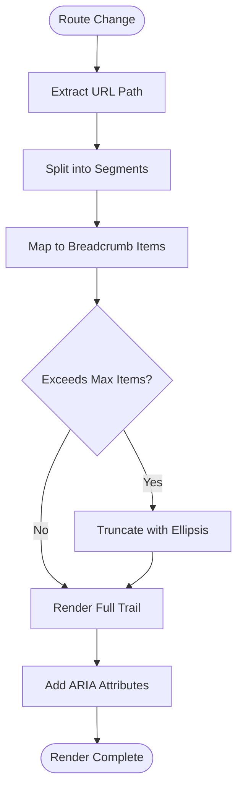
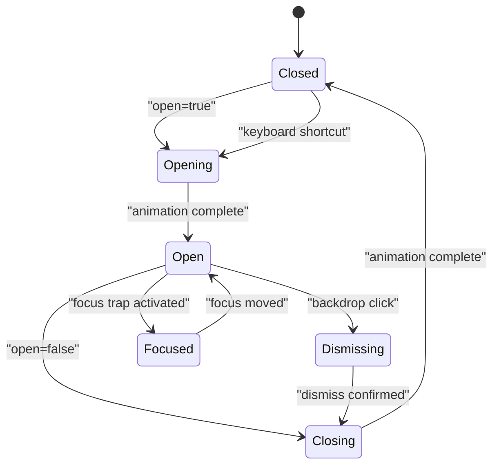
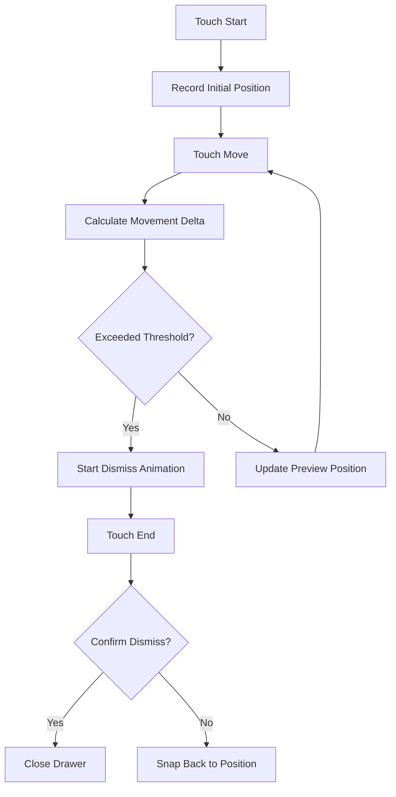
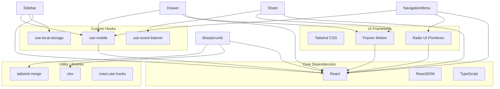
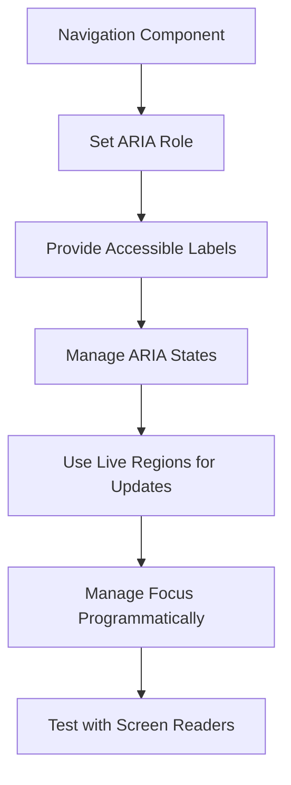
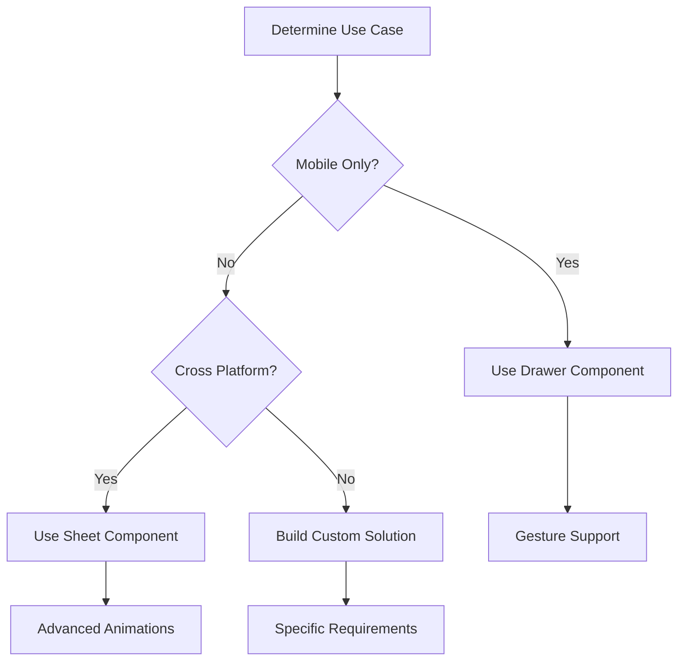

# Layout & Navigation Components

<cite>
**Referenced Files in This Document**
- [navigation-menu.tsx](file://src/components/ui/navigation-menu.tsx)
- [breadcrumb.tsx](file://src/components/ui/breadcrumb.tsx)
- [sheet.tsx](file://src/components/ui/sheet.tsx)
- [drawer.tsx](file://src/components/ui/drawer.tsx)
- [sidebar.tsx](file://src/components/ui/sidebar.tsx)
- [use-mobile.tsx](file://src/hooks/use-mobile.tsx)
</cite>

## Table of Contents
1. [Introduction](#introduction)
2. [Project Structure](#project-structure)
3. [Core Components](#core-components)
4. [Architecture Overview](#architecture-overview)
5. [Detailed Component Analysis](#detailed-component-analysis)
6. [Dependency Analysis](#dependency-analysis)
7. [Performance Considerations](#performance-considerations)
8. [Accessibility Guide](#accessibility-guide)
9. [Mobile-First Implementation Patterns](#mobile-first-implementation-patterns)
10. [Troubleshooting Guide](#troubleshooting-guide)
11. [Conclusion](#conclusion)

## Introduction

This document provides comprehensive documentation for layout and navigation components including NavigationMenu, Breadcrumb, Sheet, Drawer, and Sidebar components. These components are essential building blocks for creating responsive, accessible, and performant user interfaces in modern web applications. The documentation covers component props, event handlers, customization options, accessibility considerations, and performance optimization techniques.

## Project Structure

The layout and navigation components are organized within a modular architecture that promotes reusability and maintainability:

**Diagram sources**
- [navigation-menu.tsx](file://src/components/ui/navigation-menu.tsx)
- [breadcrumb.tsx](file://src/components/ui/breadcrumb.tsx)
- [sheet.tsx](file://src/components/ui/sheet.tsx)
- [drawer.tsx](file://src/components/ui/drawer.tsx)
- [sidebar.tsx](file://src/components/ui/sidebar.tsx)
- [use-mobile.tsx](file://src/hooks/use-mobile.tsx)

## Core Components

### NavigationMenu Component

The NavigationMenu component provides a comprehensive navigation solution with support for dropdown menus, keyboard navigation, and responsive behavior.

#### Key Features
- Hierarchical menu structure support
- Keyboard navigation with arrow keys and escape key
- Dropdown menu functionality
- Mobile-responsive design
- Customizable styling through CSS classes
- Event handling for menu interactions

#### Props Interface
- `items`: Array of navigation items with nested structure
- `className`: Additional CSS classes for styling
- `onSelect`: Callback function for item selection
- `defaultOpen`: Boolean to control initial open state
- `delayDuration`: Number for animation timing
- `skipCloseDelay`: Boolean to skip close delay animations

#### Event Handlers
- `onValueChange`: Triggered when menu state changes
- `onSelect`: Called when a menu item is selected
- `onOpenChange`: Fired when menu opens or closes

**Section sources**
- [navigation-menu.tsx](file://src/components/ui/navigation-menu.tsx)

### Breadcrumb Component

The Breadcrumb component creates navigational trails that help users understand their current location within the application hierarchy.

#### Key Features
- Dynamic breadcrumb generation from route data
- Clickable breadcrumb items for navigation
- Responsive design with overflow handling
- Custom separator support
- Accessibility attributes for screen readers

#### Props Interface
- `items`: Array of breadcrumb items with label and href properties
- `separator`: Custom separator element or character
- `className`: Additional CSS classes for styling
- `maxItems`: Maximum number of visible items before truncation

#### Navigation Patterns
- Supports both internal and external links
- Handles dynamic route parameters
- Provides visual feedback on hover states
- Maintains focus management for keyboard navigation

**Section sources**
- [breadcrumb.tsx](file://src/components/ui/breadcrumb.tsx)

### Sheet Component

The Sheet component implements a modal overlay pattern that slides content from the edge of the viewport, commonly used for side panels and temporary content displays.

#### Key Features
- Slide-in/out animations from different edges (top, right, bottom, left)
- Backdrop click to dismiss functionality
- Focus trapping within the sheet
- Scroll lock when sheet is open
- Responsive sizing and positioning

#### Props Interface
- `open`: Controlled open state
- `onOpenChange`: Handler for open state changes
- `side`: Position of the sheet ('top', 'right', 'bottom', 'left')
- `size`: Width/height of the sheet ('sm', 'md', 'lg', 'xl', 'full')
- `className`: Additional CSS classes for styling
- `onInteractOutside`: Handler for outside clicks

#### Animation Properties
- `duration`: Animation duration in milliseconds
- `easing`: CSS easing function for transitions
- `transformOrigin`: Origin point for transform animations

**Section sources**
- [sheet.tsx](file://src/components/ui/sheet.tsx)

### Drawer Component

The Drawer component provides a mobile-optimized overlay pattern similar to Sheet but specifically designed for touch interactions and mobile gestures.

#### Key Features
- Touch gesture support (swipe to dismiss)
- Bottom sheet behavior on mobile devices
- Smooth animations optimized for mobile performance
- Safe area handling for notched devices
- Haptic feedback integration points

#### Props Interface
- `open`: Controlled open state
- `onOpenChange`: Handler for open state changes
- `position`: Vertical position ('bottom', 'center', 'top')
- `snapPoints`: Array of snap positions for multi-level drawers
- `dismissable`: Whether drawer can be dismissed by swiping
- `className`: Additional CSS classes for styling

#### Gesture Handling
- Swipe down to dismiss (bottom drawers)
- Swipe up to expand (multi-level drawers)
- Touch start/move/end event tracking
- Velocity-based dismissal detection

**Section sources**
- [drawer.tsx](file://src/components/ui/drawer.tsx)

### Sidebar Component

The Sidebar component creates persistent navigation panels that can be collapsed, expanded, or hidden based on screen size and user interaction.

#### Key Features
- Collapsible/expandable navigation panel
- Persistent state across page navigation
- Responsive behavior (hidden on mobile, visible on desktop)
- Nested navigation support
- Customizable width and styling

#### Props Interface
- `collapsed`: Controlled collapse state
- `onCollapseChange`: Handler for collapse state changes
- `defaultCollapsed`: Initial collapse state
- `width`: Width of the sidebar when expanded
- `minWidth`: Minimum width when partially collapsed
- `className`: Additional CSS classes for styling

#### State Management
- Local storage persistence for collapse state
- Route-based active item highlighting
- Keyboard shortcuts for collapse/expand
- Integration with routing systems

**Section sources**
- [sidebar.tsx](file://src/components/ui/sidebar.tsx)

## Architecture Overview

The layout and navigation components follow a consistent architectural pattern that emphasizes composition, accessibility, and performance:

**Diagram sources**
- [navigation-menu.tsx](file://src/components/ui/navigation-menu.tsx)
- [breadcrumb.tsx](file://src/components/ui/breadcrumb.tsx)
- [sheet.tsx](file://src/components/ui/sheet.tsx)
- [drawer.tsx](file://src/components/ui/drawer.tsx)
- [sidebar.tsx](file://src/components/ui/sidebar.tsx)
- [use-mobile.tsx](file://src/hooks/use-mobile.tsx)

## Detailed Component Analysis

### NavigationMenu Implementation Pattern

The NavigationMenu follows a hierarchical composition pattern that supports complex navigation structures:

**Diagram sources**
- [navigation-menu.tsx](file://src/components/ui/navigation-menu.tsx)

### Breadcrumb Trail Generation

The Breadcrumb component dynamically generates navigation trails based on route information:

**Diagram sources**
- [breadcrumb.tsx](file://src/components/ui/breadcrumb.tsx)

### Sheet Animation Flow

The Sheet component manages complex animation states and user interactions:

**Diagram sources**
- [sheet.tsx](file://src/components/ui/sheet.tsx)

### Drawer Gesture Handling

The Drawer component implements sophisticated touch gesture recognition:

**Diagram sources**
- [drawer.tsx](file://src/components/ui/drawer.tsx)

## Dependency Analysis

The layout and navigation components have well-defined dependency relationships that promote modularity and testability:

**Diagram sources**
- [navigation-menu.tsx](file://src/components/ui/navigation-menu.tsx)
- [breadcrumb.tsx](file://src/components/ui/breadcrumb.tsx)
- [sheet.tsx](file://src/components/ui/sheet.tsx)
- [drawer.tsx](file://src/components/ui/drawer.tsx)
- [sidebar.tsx](file://src/components/ui/sidebar.tsx)
- [use-mobile.tsx](file://src/hooks/use-mobile.tsx)

**Section sources**
- [navigation-menu.tsx](file://src/components/ui/navigation-menu.tsx)
- [breadcrumb.tsx](file://src/components/ui/breadcrumb.tsx)
- [sheet.tsx](file://src/components/ui/sheet.tsx)
- [drawer.tsx](file://src/components/ui/drawer.tsx)
- [sidebar.tsx](file://src/components/ui/sidebar.tsx)
- [use-mobile.tsx](file://src/hooks/use-mobile.tsx)

## Performance Considerations

### Large Navigation Structures Optimization

For applications with extensive navigation hierarchies, implement the following optimization strategies:

#### Virtual Scrolling
- Implement virtual scrolling for navigation menus with 100+ items
- Use windowing techniques to render only visible items
- Debounce scroll events to prevent excessive re-renders

#### Lazy Loading
- Load submenu content on-demand when parent items are opened
- Implement code splitting for large navigation sections
- Use React.lazy() for heavy navigation components

#### Memory Management
- Clean up event listeners when components unmount
- Use WeakMap for storing DOM references
- Implement proper cleanup in useEffect hooks

#### Rendering Optimization
- Memoize expensive calculations with useMemo
- Prevent unnecessary re-renders with React.memo
- Use shouldComponentUpdate for custom optimizations

### Animation Performance

Optimize animations for smooth 60fps performance:

- Use CSS transforms instead of layout-affecting properties
- Implement will-change hints for animated elements
- Batch DOM reads and writes to avoid layout thrashing
- Use requestAnimationFrame for custom animations

**Section sources**
- [navigation-menu.tsx](file://src/components/ui/navigation-menu.tsx)
- [drawer.tsx](file://src/components/ui/drawer.tsx)

## Accessibility Guide

### Keyboard Navigation Support

All navigation components must provide comprehensive keyboard navigation:

#### Tab Order Management
- Logical tab order following visual layout
- Skip links for main navigation areas
- Focus indicators with high contrast visibility

#### Arrow Key Navigation
- Up/Down arrows for vertical navigation menus
- Left/Right arrows for horizontal navigation
- Enter/Space for activating interactive elements
- Escape for closing dropdowns and overlays

#### Screen Reader Compatibility

Implement proper ARIA attributes and roles:

**Diagram sources**
- [navigation-menu.tsx](file://src/components/ui/navigation-menu.tsx)
- [breadcrumb.tsx](file://src/components/ui/breadcrumb.tsx)

### Focus Management

Proper focus management ensures predictable keyboard navigation:

- Trap focus within modal-like components (Sheet, Drawer)
- Return focus to trigger element after closing overlays
- Maintain focus ring visibility throughout interactions
- Handle focus restoration on route changes

### Color Contrast and Visual Indicators

- Ensure minimum 4.5:1 contrast ratio for text
- Provide non-color visual indicators for state changes
- Support high contrast mode and reduced motion preferences
- Test with various color blindness simulators

**Section sources**
- [navigation-menu.tsx](file://src/components/ui/navigation-menu.tsx)
- [breadcrumb.tsx](file://src/components/ui/breadcrumb.tsx)
- [sheet.tsx](file://src/components/ui/sheet.tsx)
- [drawer.tsx](file://src/components/ui/drawer.tsx)

## Mobile-First Implementation Patterns

### Responsive Navigation Strategies

Implement mobile-first navigation patterns that adapt seamlessly across devices:

#### Breakpoint-Based Behavior
- Hide complex navigation on small screens
- Replace with hamburger menu or bottom navigation
- Use progressive disclosure for deep hierarchies

#### Touch-Optimized Interactions
- Increase touch target sizes to minimum 44x44 pixels
- Implement swipe gestures for navigation
- Provide haptic feedback for important actions

#### Performance Considerations
- Optimize images and assets for mobile networks
- Minimize JavaScript execution on mobile devices
- Use CSS media queries for efficient responsive design

### Drawer vs Sheet Selection Guide

Choose the appropriate overlay component based on use case:

**Diagram sources**
- [drawer.tsx](file://src/components/ui/drawer.tsx)
- [sheet.tsx](file://src/components/ui/sheet.tsx)

### Mobile Navigation Examples

#### Bottom Navigation Bar
- Primary navigation items at screen bottom
- Icon-based navigation with labels
- Active state indication with color or underline

#### Hamburger Menu with Overlay
- Compact menu trigger icon
- Full-screen overlay menu on mobile
- Smooth slide-in animation from left or right

#### Accordion Navigation
- Expandable/collapsible navigation sections
- Space-efficient for deep hierarchies
- Touch-friendly expand/collapse interactions

**Section sources**
- [use-mobile.tsx](file://src/hooks/use-mobile.tsx)
- [drawer.tsx](file://src/components/ui/drawer.tsx)
- [sheet.tsx](file://src/components/ui/sheet.tsx)

## Troubleshooting Guide

### Common Issues and Solutions

#### Navigation Menu Not Responding to Keyboard Input
- Verify focus management implementation
- Check event listener attachment and cleanup
- Ensure proper ARIA attributes are set

#### Drawer/Sheet Not Closing Properly
- Validate open state management
- Check backdrop click event handling
- Verify focus trap cleanup on unmount

#### Performance Issues with Large Navigation Trees
- Implement virtual scrolling for 100+ items
- Use lazy loading for nested menus
- Optimize re-rendering with memoization

#### Accessibility Violations
- Run automated accessibility testing
- Manually test with screen readers
- Verify keyboard navigation completeness

### Debugging Techniques

#### Development Tools
- Use React DevTools to inspect component state
- Monitor performance with browser dev tools
- Test responsiveness across device breakpoints

#### Logging and Monitoring
- Implement error boundaries for graceful degradation
- Add logging for critical navigation events
- Track user interactions for analytics

**Section sources**
- [navigation-menu.tsx](file://src/components/ui/navigation-menu.tsx)
- [drawer.tsx](file://src/components/ui/drawer.tsx)
- [sheet.tsx](file://src/components/ui/sheet.tsx)

## Conclusion

The layout and navigation components provide a comprehensive foundation for building responsive, accessible, and performant user interfaces. By following the patterns and guidelines outlined in this documentation, developers can create navigation experiences that work seamlessly across all devices and assistive technologies.

Key takeaways include:
- Prioritize accessibility from the beginning of development
- Implement mobile-first responsive design patterns
- Optimize performance for large navigation structures
- Follow consistent API patterns across components
- Test thoroughly with real users and assistive technologies

These components serve as building blocks for creating intuitive navigation experiences that enhance user productivity and satisfaction while maintaining high standards of accessibility and performance.