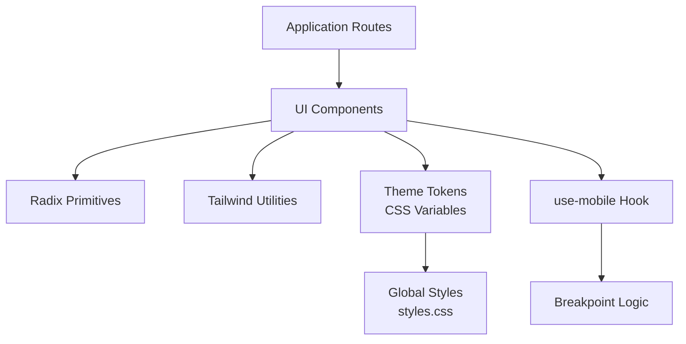
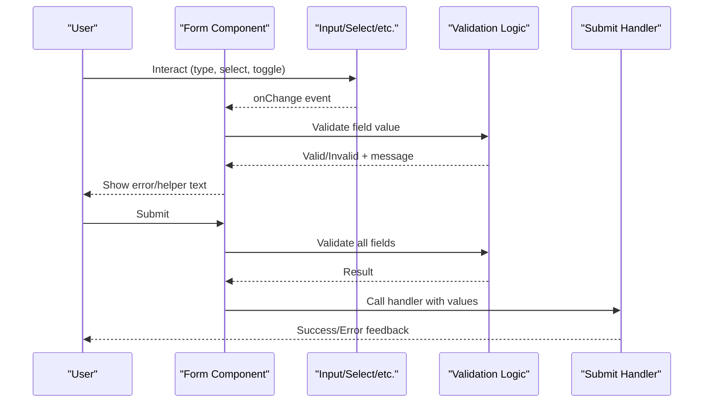
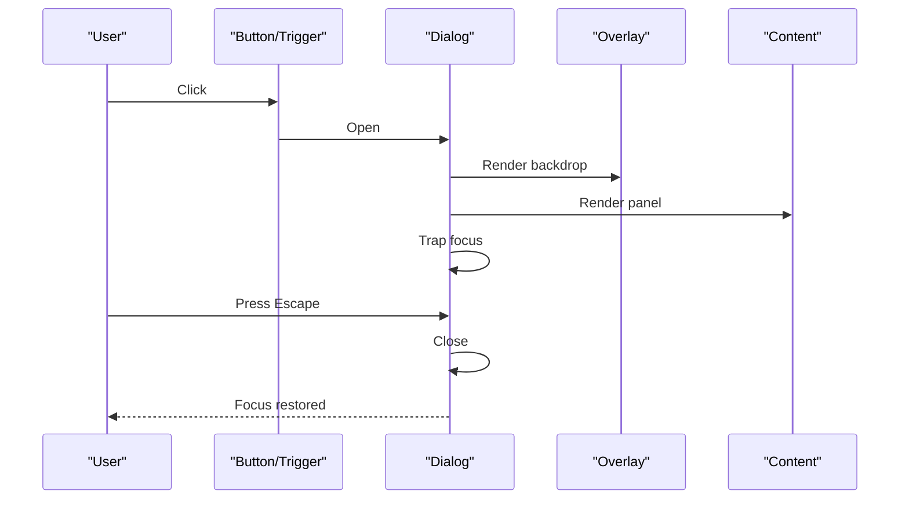
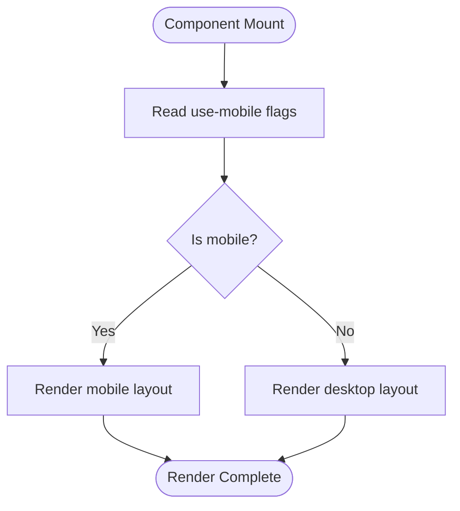
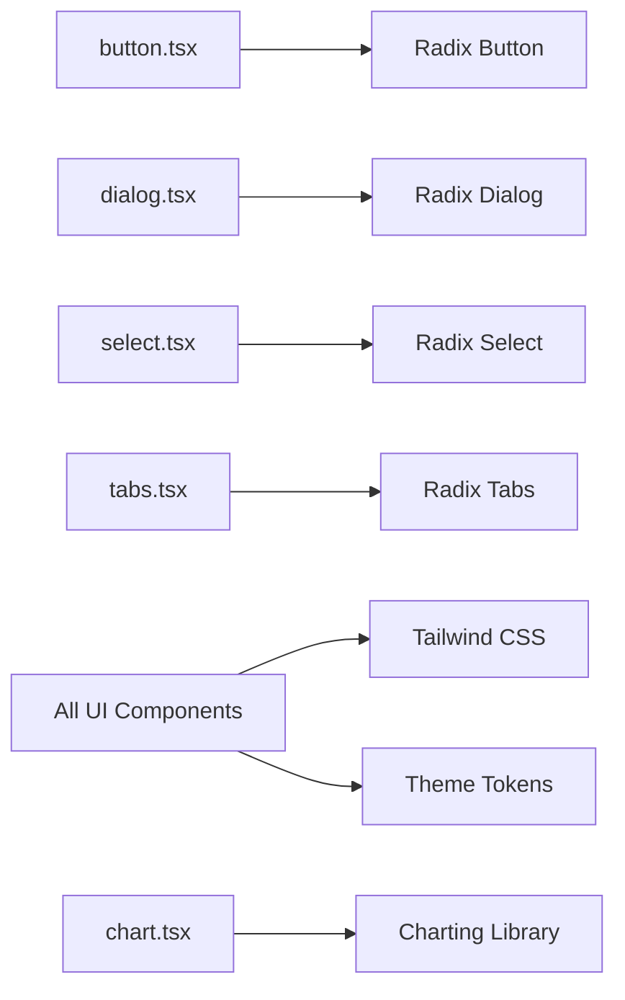

# UI Component Library

<cite>
**Referenced Files in This Document**
- [components.json](file://components.json)
- [src/components/ui/button.tsx](file://src/components/ui/button.tsx)
- [src/components/ui/input.tsx](file://src/components/ui/input.tsx)
- [src/components/ui/card.tsx](file://src/components/ui/card.tsx)
- [src/components/ui/dialog.tsx](file://src/components/ui/dialog.tsx)
- [src/components/ui/dropdown-menu.tsx](file://src/components/ui/dropdown-menu.tsx)
- [src/components/ui/select.tsx](file://src/components/ui/select.tsx)
- [src/components/ui/form.tsx](file://src/components/ui/form.tsx)
- [src/components/ui/label.tsx](file://src/components/ui/label.tsx)
- [src/components/ui/checkbox.tsx](file://src/components/ui/checkbox.tsx)
- [src/components/ui/radio-group.tsx](file://src/components/ui/radio-group.tsx)
- [src/components/ui/switch.tsx](file://src/components/ui/switch.tsx)
- [src/components/ui/tabs.tsx](file://src/components/ui/tabs.tsx)
- [src/components/ui/table.tsx](file://src/components/ui/table.tsx)
- [src/components/ui/badge.tsx](file://src/components/ui/badge.tsx)
- [src/components/ui/alert.tsx](file://src/components/ui/alert.tsx)
- [src/components/ui/avatar.tsx](file://src/components/ui/avatar.tsx)
- [src/components/ui/sheet.tsx](file://src/components/ui/sheet.tsx)
- [src/components/ui/popover.tsx](file://src/components/ui/popover.tsx)
- [src/components/ui/tooltip.tsx](file://src/components/ui/tooltip.tsx)
- [src/components/ui/collapsible.tsx](file://src/components/ui/collapsible.tsx)
- [src/components/ui/accordion.tsx](file://src/components/ui/accordion.tsx)
- [src/components/ui/calendar.tsx](file://src/components/ui/calendar.tsx)
- [src/components/ui/command.tsx](file://src/components/ui/command.tsx)
- [src/components/ui/navigation-menu.tsx](file://src/components/ui/navigation-menu.tsx)
- [src/components/ui/pagination.tsx](file://src/components/ui/pagination.tsx)
- [src/components/ui/slider.tsx](file://src/components/ui/slider.tsx)
- [src/components/ui/progress.tsx](file://src/components/ui/progress.tsx)
- [src/components/ui/carousel.tsx](file://src/components/ui/carousel.tsx)
- [src/components/ui/chart.tsx](file://src/components/ui/chart.tsx)
- [src/components/ui/resizable.tsx](file://src/components/ui/resizable.tsx)
- [src/components/ui/scroll-area.tsx](file://src/components/ui/scroll-area.tsx)
- [src/components/ui/hover-card.tsx](file://src/components/ui/hover-card.tsx)
- [src/components/ui/menubar.tsx](file://src/components/ui/menubar.tsx)
- [src/components/ui/context-menu.tsx](file://src/components/ui/context-menu.tsx)
- [src/components/ui/separator.tsx](file://src/components/ui/separator.tsx)
- [src/components/ui/skeleton.tsx](file://src/components/ui/skeleton.tsx)
- [src/components/ui/aspect-ratio.tsx](file://src/components/ui/aspect-ratio.tsx)
- [src/components/ui/input-otp.tsx](file://src/components/ui/input-otp.tsx)
- [src/components/ui/toggle.tsx](file://src/components/ui/toggle.tsx)
- [src/components/ui/toggle-group.tsx](file://src/components/ui/toggle-group.tsx)
- [src/components/ui/breadcrumb.tsx](file://src/components/ui/breadcrumb.tsx)
- [src/hooks/use-mobile.tsx](file://src/hooks/use-mobile.tsx)
- [src/styles.css](file://src/styles.css)
- [package.json](file://package.json)
</cite>

## Table of Contents
1. [Introduction](#introduction)
2. [Project Structure](#project-structure)
3. [Core Components](#core-components)
4. [Architecture Overview](#architecture-overview)
5. [Detailed Component Analysis](#detailed-component-analysis)
6. [Dependency Analysis](#dependency-analysis)
7. [Performance Considerations](#performance-considerations)
8. [Troubleshooting Guide](#troubleshooting-guide)
9. [Conclusion](#conclusion)
10. [Appendices](#appendices)

## Introduction
This document describes the UI component library used throughout SpareAutomation. The library follows shadcn/ui principles: components are unstyled primitives composed from Radix UI, styled with Tailwind CSS, and designed to be fully customizable via props, slots, and theme tokens. It emphasizes accessibility, composability, and a mobile-first responsive approach.

Key goals covered here:
- Architecture based on shadcn/ui patterns
- Available components and their customization options
- Props, events, slots, and styling approaches
- Responsive design, accessibility, and theming guidelines
- Composition patterns, state management within components, and form integration
- Mobile-first breakpoints, cross-browser considerations
- Performance optimization, lazy loading strategies, and bundle size impact analysis

## Project Structure
The UI components live under src/components/ui and are configured via components.json for shadcn/ui tooling. Shared hooks (e.g., use-mobile) reside under src/hooks, and global styles are defined in src/styles.css.

```mermaid
graph TB
subgraph "UI Components"
A["button.tsx"]
B["input.tsx"]
C["card.tsx"]
D["dialog.tsx"]
E["dropdown-menu.tsx"]
F["select.tsx"]
G["form.tsx"]
H["label.tsx"]
I["checkbox.tsx"]
J["radio-group.tsx"]
K["switch.tsx"]
L["tabs.tsx"]
M["table.tsx"]
N["badge.tsx"]
O["alert.tsx"]
P["avatar.tsx"]
Q["sheet.tsx"]
R["popover.tsx"]
S["tooltip.tsx"]
T["collapsible.tsx"]
U["accordion.tsx"]
V["calendar.tsx"]
W["command.tsx"]
X["navigation-menu.tsx"]
Y["pagination.tsx"]
Z["slider.tsx"]
AA["progress.tsx"]
AB["carousel.tsx"]
AC["chart.tsx"]
AD["resizable.tsx"]
AE["scroll-area.tsx"]
AF["hover-card.tsx"]
AG["menubar.tsx"]
AH["context-menu.tsx"]
AI["separator.tsx"]
AJ["skeleton.tsx"]
AK["aspect-ratio.tsx"]
AL["input-otp.tsx"]
AM["toggle.tsx"]
AN["toggle-group.tsx"]
AO["breadcrumb.tsx"]
end
subgraph "Shared"
HM["use-mobile.tsx"]
ST["styles.css"]
CJ["components.json"]
end
A --> ST
B --> ST
C --> ST
D --> ST
E --> ST
F --> ST
G --> ST
H --> ST
I --> ST
J --> ST
K --> ST
L --> ST
M --> ST
N --> ST
O --> ST
P --> ST
Q --> ST
R --> ST
S --> ST
T --> ST
U --> ST
V --> ST
W --> ST
X --> ST
Y --> ST
Z --> ST
AA --> ST
AB --> ST
AC --> ST
AD --> ST
AE --> ST
AF --> ST
AG --> ST
AH --> ST
AI --> ST
AJ --> ST
AK --> ST
AL --> ST
AM --> ST
AN --> ST
AO --> ST
HM --> ST
CJ --> ST
```

**Diagram sources**
- [components.json](file://components.json)
- [src/components/ui/button.tsx](file://src/components/ui/button.tsx)
- [src/components/ui/input.tsx](file://src/components/ui/input.tsx)
- [src/components/ui/card.tsx](file://src/components/ui/card.tsx)
- [src/components/ui/dialog.tsx](file://src/components/ui/dialog.tsx)
- [src/components/ui/dropdown-menu.tsx](file://src/components/ui/dropdown-menu.tsx)
- [src/components/ui/select.tsx](file://src/components/ui/select.tsx)
- [src/components/ui/form.tsx](file://src/components/ui/form.tsx)
- [src/components/ui/label.tsx](file://src/components/ui/label.tsx)
- [src/components/ui/checkbox.tsx](file://src/components/ui/checkbox.tsx)
- [src/components/ui/radio-group.tsx](file://src/components/ui/radio-group.tsx)
- [src/components/ui/switch.tsx](file://src/components/ui/switch.tsx)
- [src/components/ui/tabs.tsx](file://src/components/ui/tabs.tsx)
- [src/components/ui/table.tsx](file://src/components/ui/table.tsx)
- [src/components/ui/badge.tsx](file://src/components/ui/badge.tsx)
- [src/components/ui/alert.tsx](file://src/components/ui/alert.tsx)
- [src/components/ui/avatar.tsx](file://src/components/ui/avatar.tsx)
- [src/components/ui/sheet.tsx](file://src/components/ui/sheet.tsx)
- [src/components/ui/popover.tsx](file://src/components/ui/popover.tsx)
- [src/components/ui/tooltip.tsx](file://src/components/ui/tooltip.tsx)
- [src/components/ui/collapsible.tsx](file://src/components/ui/collapsible.tsx)
- [src/components/ui/accordion.tsx](file://src/components/ui/accordion.tsx)
- [src/components/ui/calendar.tsx](file://src/components/ui/calendar.tsx)
- [src/components/ui/command.tsx](file://src/components/ui/command.tsx)
- [src/components/ui/navigation-menu.tsx](file://src/components/ui/navigation-menu.tsx)
- [src/components/ui/pagination.tsx](file://src/components/ui/pagination.tsx)
- [src/components/ui/slider.tsx](file://src/components/ui/slider.tsx)
- [src/components/ui/progress.tsx](file://src/components/ui/progress.tsx)
- [src/components/ui/carousel.tsx](file://src/components/ui/carousel.tsx)
- [src/components/ui/chart.tsx](file://src/components/ui/chart.tsx)
- [src/components/ui/resizable.tsx](file://src/components/ui/resizable.tsx)
- [src/components/ui/scroll-area.tsx](file://src/components/ui/scroll-area.tsx)
- [src/components/ui/hover-card.tsx](file://src/components/ui/hover-card.tsx)
- [src/components/ui/menubar.tsx](file://src/components/ui/menubar.tsx)
- [src/components/ui/context-menu.tsx](file://src/components/ui/context-menu.tsx)
- [src/components/ui/separator.tsx](file://src/components/ui/separator.tsx)
- [src/components/ui/skeleton.tsx](file://src/components/ui/skeleton.tsx)
- [src/components/ui/aspect-ratio.tsx](file://src/components/ui/aspect-ratio.tsx)
- [src/components/ui/input-otp.tsx](file://src/components/ui/input-otp.tsx)
- [src/components/ui/toggle.tsx](file://src/components/ui/toggle.tsx)
- [src/components/ui/toggle-group.tsx](file://src/components/ui/toggle-group.tsx)
- [src/components/ui/breadcrumb.tsx](file://src/components/ui/breadcrumb.tsx)
- [src/hooks/use-mobile.tsx](file://src/hooks/use-mobile.tsx)
- [src/styles.css](file://src/styles.css)

**Section sources**
- [components.json](file://components.json)
- [src/styles.css](file://src/styles.css)

## Core Components
This section summarizes the most commonly used primitives and how they are customized. For each component, we describe props, events, slots, and styling options. Where applicable, we include usage examples by referencing source files.

- Button
  - Purpose: Primary interactive element for actions.
  - Props: variant, size, disabled, asChild, className, and standard HTML button attributes.
  - Events: onClick, onKeyDown, onFocus, onBlur.
  - Slots: default slot for content; supports asChild composition.
  - Styling: Tailwind classes controlled by variant and size; extend via theme tokens or override classes.
  - Example usage: [src/components/ui/button.tsx](file://src/components/ui/button.tsx)

- Input
  - Purpose: Text input field.
  - Props: type, placeholder, value, defaultValue, onChange, disabled, readOnly, className, and other native input attributes.
  - Events: onChange, onFocus, onBlur, onKeyDown.
  - Slots: none; label typically provided via Label.
  - Styling: Base styles plus focus ring; customize via className or theme tokens.
  - Example usage: [src/components/ui/input.tsx](file://src/components/ui/input.tsx)

- Card
  - Purpose: Container for grouped content.
  - Props: className, and children.
  - Slots: header, body, footer via composition.
  - Styling: Padding, border, shadow via Tailwind utilities.
  - Example usage: [src/components/ui/card.tsx](file://src/components/ui/card.tsx)

- Dialog
  - Purpose: Modal overlay for focused interactions.
  - Props: open, defaultOpen, onOpenChange, modal, and Radix dialog props.
  - Events: onOpenChange, onClose.
  - Slots: trigger, content, header, footer.
  - Styling: Overlay and panel styles; customize via className.
  - Example usage: [src/components/ui/dialog.tsx](file://src/components/ui/dialog.tsx)

- Dropdown Menu
  - Purpose: Contextual menu for actions.
  - Props: align, sideOffset, collisionPadding, and Radix menu props.
  - Events: onOpenChange.
  - Slots: trigger, content, item, separator.
  - Styling: Menu container and items via Tailwind.
  - Example usage: [src/components/ui/dropdown-menu.tsx](file://src/components/ui/dropdown-menu.tsx)

- Select
  - Purpose: Accessible select replacement.
  - Props: value, onValueChange, disabled, placeholder, and Radix select props.
  - Events: onValueChange.
  - Slots: trigger, content, item, group, label.
  - Styling: Trigger and list via Tailwind.
  - Example usage: [src/components/ui/select.tsx](file://src/components/ui/select.tsx)

- Form Integration
  - Purpose: Unified form handling with validation.
  - Props: form instance, fields, validators, onSubmit.
  - Events: onSubmit, onChange, onBlur.
  - Slots: field wrappers, error messages, submit buttons.
  - Styling: Error states and helper text via Tailwind.
  - Example usage: [src/components/ui/form.tsx](file://src/components/ui/form.tsx), [src/components/ui/label.tsx](file://src/components/ui/label.tsx)

- Checkbox, Radio Group, Switch
  - Purpose: Selection controls.
  - Props: checked/defaultChecked, onCheckedChange, disabled, name, value, id, aria-label.
  - Events: onCheckedChange.
  - Slots: label via Label.
  - Styling: Checked and focus states via Tailwind.
  - Example usage: [src/components/ui/checkbox.tsx](file://src/components/ui/checkbox.tsx), [src/components/ui/radio-group.tsx](file://src/components/ui/radio-group.tsx), [src/components/ui/switch.tsx](file://src/components/ui/switch.tsx)

- Tabs
  - Purpose: Tabbed navigation and content switching.
  - Props: value, onValueChange, orientation, activationMode.
  - Events: onValueChange.
  - Slots: list, trigger, content.
  - Styling: Indicator and selected state via Tailwind.
  - Example usage: [src/components/ui/tabs.tsx](file://src/components/ui/tabs.tsx)

- Table
  - Purpose: Data display with headers, rows, cells.
  - Props: data, columns, sortable, pagination props.
  - Events: onSort, onPageChange.
  - Slots: header, row, cell, footer.
  - Styling: Borders, hover, sticky headers via Tailwind.
  - Example usage: [src/components/ui/table.tsx](file://src/components/ui/table.tsx)

- Badge
  - Purpose: Status indicators and labels.
  - Props: variant, size, className.
  - Slots: default content.
  - Styling: Color variants via Tailwind.
  - Example usage: [src/components/ui/badge.tsx](file://src/components/ui/badge.tsx)

- Alert
  - Purpose: Feedback messages (info, success, warning, error).
  - Props: variant, title, description, icon, action.
  - Slots: title, description, action.
  - Styling: Variant-based colors and icons.
  - Example usage: [src/components/ui/alert.tsx](file://src/components/ui/alert.tsx)

- Avatar
  - Props: src, alt, fallback, size, className.
  - Slots: image, fallback text.
  - Styling: Rounded shape and sizes.
  - Example usage: [src/components/ui/avatar.tsx](file://src/components/ui/avatar.tsx)

- Sheet
  - Purpose: Side panel drawer.
  - Props: side, open, defaultOpen, onOpenChange.
  - Events: onOpenChange.
  - Slots: trigger, content, header, footer.
  - Styling: Slide-in panel and backdrop.
  - Example usage: [src/components/ui/sheet.tsx](file://src/components/ui/sheet.tsx)

- Popover, Tooltip, Hover Card
  - Purpose: Floating context overlays.
  - Props: align, side, sideOffset, collisionPadding, showDelay, hideDelay.
  - Events: onOpenChange.
  - Slots: trigger, content.
  - Styling: Floating containers and arrows.
  - Example usage: [src/components/ui/popover.tsx](file://src/components/ui/popover.tsx), [src/components/ui/tooltip.tsx](file://src/components/ui/tooltip.tsx), [src/components/ui/hover-card.tsx](file://src/components/ui/hover-card.tsx)

- Collapsible, Accordion
  - Purpose: Expandable sections.
  - Props: collapsible/open, onOpenChange, multiple for accordion.
  - Events: onOpenChange.
  - Slots: trigger, content.
  - Styling: Chevron rotation and spacing.
  - Example usage: [src/components/ui/collapsible.tsx](file://src/components/ui/collapsible.tsx), [src/components/ui/accordion.tsx](file://src/components/ui/accordion.tsx)

- Calendar, Command, Navigation Menu, Pagination, Slider, Progress, Carousel, Chart, Resizable, Scroll Area, Menubar, Context Menu, Separator, Skeleton, Aspect Ratio, Input OTP, Toggle, Toggle Group, Breadcrumb
  - Purpose: Specialized UI elements for complex interactions and layouts.
  - Props/Events/Slots/Styling: Follow shadcn/ui conventions; see individual files for specifics.
  - Example usages:
    - [src/components/ui/calendar.tsx](file://src/components/ui/calendar.tsx)
    - [src/components/ui/command.tsx](file://src/components/ui/command.tsx)
    - [src/components/ui/navigation-menu.tsx](file://src/components/ui/navigation-menu.tsx)
    - [src/components/ui/pagination.tsx](file://src/components/ui/pagination.tsx)
    - [src/components/ui/slider.tsx](file://src/components/ui/slider.tsx)
    - [src/components/ui/progress.tsx](file://src/components/ui/progress.tsx)
    - [src/components/ui/carousel.tsx](file://src/components/ui/carousel.tsx)
    - [src/components/ui/chart.tsx](file://src/components/ui/chart.tsx)
    - [src/components/ui/resizable.tsx](file://src/components/ui/resizable.tsx)
    - [src/components/ui/scroll-area.tsx](file://src/components/ui/scroll-area.tsx)
    - [src/components/ui/menubar.tsx](file://src/components/ui/menubar.tsx)
    - [src/components/ui/context-menu.tsx](file://src/components/ui/context-menu.tsx)
    - [src/components/ui/separator.tsx](file://src/components/ui/separator.tsx)
    - [src/components/ui/skeleton.tsx](file://src/components/ui/skeleton.tsx)
    - [src/components/ui/aspect-ratio.tsx](file://src/components/ui/aspect-ratio.tsx)
    - [src/components/ui/input-otp.tsx](file://src/components/ui/input-otp.tsx)
    - [src/components/ui/toggle.tsx](file://src/components/ui/toggle.tsx)
    - [src/components/ui/toggle-group.tsx](file://src/components/ui/toggle-group.tsx)
    - [src/components/ui/breadcrumb.tsx](file://src/components/ui/breadcrumb.tsx)

**Section sources**
- [src/components/ui/button.tsx](file://src/components/ui/button.tsx)
- [src/components/ui/input.tsx](file://src/components/ui/input.tsx)
- [src/components/ui/card.tsx](file://src/components/ui/card.tsx)
- [src/components/ui/dialog.tsx](file://src/components/ui/dialog.tsx)
- [src/components/ui/dropdown-menu.tsx](file://src/components/ui/dropdown-menu.tsx)
- [src/components/ui/select.tsx](file://src/components/ui/select.tsx)
- [src/components/ui/form.tsx](file://src/components/ui/form.tsx)
- [src/components/ui/label.tsx](file://src/components/ui/label.tsx)
- [src/components/ui/checkbox.tsx](file://src/components/ui/checkbox.tsx)
- [src/components/ui/radio-group.tsx](file://src/components/ui/radio-group.tsx)
- [src/components/ui/switch.tsx](file://src/components/ui/switch.tsx)
- [src/components/ui/tabs.tsx](file://src/components/ui/tabs.tsx)
- [src/components/ui/table.tsx](file://src/components/ui/table.tsx)
- [src/components/ui/badge.tsx](file://src/components/ui/badge.tsx)
- [src/components/ui/alert.tsx](file://src/components/ui/alert.tsx)
- [src/components/ui/avatar.tsx](file://src/components/ui/avatar.tsx)
- [src/components/ui/sheet.tsx](file://src/components/ui/sheet.tsx)
- [src/components/ui/popover.tsx](file://src/components/ui/popover.tsx)
- [src/components/ui/tooltip.tsx](file://src/components/ui/tooltip.tsx)
- [src/components/ui/collapsible.tsx](file://src/components/ui/collapsible.tsx)
- [src/components/ui/accordion.tsx](file://src/components/ui/accordion.tsx)
- [src/components/ui/calendar.tsx](file://src/components/ui/calendar.tsx)
- [src/components/ui/command.tsx](file://src/components/ui/command.tsx)
- [src/components/ui/navigation-menu.tsx](file://src/components/ui/navigation-menu.tsx)
- [src/components/ui/pagination.tsx](file://src/components/ui/pagination.tsx)
- [src/components/ui/slider.tsx](file://src/components/ui/slider.tsx)
- [src/components/ui/progress.tsx](file://src/components/ui/progress.tsx)
- [src/components/ui/carousel.tsx](file://src/components/ui/carousel.tsx)
- [src/components/ui/chart.tsx](file://src/components/ui/chart.tsx)
- [src/components/ui/resizable.tsx](file://src/components/ui/resizable.tsx)
- [src/components/ui/scroll-area.tsx](file://src/components/ui/scroll-area.tsx)
- [src/components/ui/hover-card.tsx](file://src/components/ui/hover-card.tsx)
- [src/components/ui/menubar.tsx](file://src/components/ui/menubar.tsx)
- [src/components/ui/context-menu.tsx](file://src/components/ui/context-menu.tsx)
- [src/components/ui/separator.tsx](file://src/components/ui/separator.tsx)
- [src/components/ui/skeleton.tsx](file://src/components/ui/skeleton.tsx)
- [src/components/ui/aspect-ratio.tsx](file://src/components/ui/aspect-ratio.tsx)
- [src/components/ui/input-otp.tsx](file://src/components/ui/input-otp.tsx)
- [src/components/ui/toggle.tsx](file://src/components/ui/toggle.tsx)
- [src/components/ui/toggle-group.tsx](file://src/components/ui/toggle-group.tsx)
- [src/components/ui/breadcrumb.tsx](file://src/components/ui/breadcrumb.tsx)

## Architecture Overview
The UI layer is built on shadcn/ui principles:
- Unstyled primitives powered by Radix UI for robust accessibility and behavior.
- Tailwind CSS for consistent, composable styling.
- Theme tokens and utility classes enable customization without breaking encapsulation.
- Hooks like use-mobile provide device-aware logic for responsive behavior.

**Diagram sources**
- [src/hooks/use-mobile.tsx](file://src/hooks/use-mobile.tsx)
- [src/styles.css](file://src/styles.css)
- [components.json](file://components.json)

## Detailed Component Analysis

### Form Integration Pattern
Forms combine controlled inputs, validation, and submission. Typical flow:
- Define schema and initial values.
- Bind fields using form helpers.
- Handle submit and errors.
- Render feedback via Alert or inline messages.

**Diagram sources**
- [src/components/ui/form.tsx](file://src/components/ui/form.tsx)
- [src/components/ui/input.tsx](file://src/components/ui/input.tsx)
- [src/components/ui/select.tsx](file://src/components/ui/select.tsx)
- [src/components/ui/label.tsx](file://src/components/ui/label.tsx)
- [src/components/ui/alert.tsx](file://src/components/ui/alert.tsx)

**Section sources**
- [src/components/ui/form.tsx](file://src/components/ui/form.tsx)
- [src/components/ui/input.tsx](file://src/components/ui/input.tsx)
- [src/components/ui/select.tsx](file://src/components/ui/select.tsx)
- [src/components/ui/label.tsx](file://src/components/ui/label.tsx)
- [src/components/ui/alert.tsx](file://src/components/ui/alert.tsx)

### Dialog Flow
Dialog manages focus trapping, portal rendering, and keyboard interactions.

**Diagram sources**
- [src/components/ui/dialog.tsx](file://src/components/ui/dialog.tsx)

**Section sources**
- [src/components/ui/dialog.tsx](file://src/components/ui/dialog.tsx)

### Responsive Behavior with use-mobile
The hook exposes boolean flags for common breakpoints, enabling mobile-first conditional rendering and layout changes.

**Diagram sources**
- [src/hooks/use-mobile.tsx](file://src/hooks/use-mobile.tsx)

**Section sources**
- [src/hooks/use-mobile.tsx](file://src/hooks/use-mobile.tsx)

## Dependency Analysis
Components depend on:
- Radix UI primitives for accessible behaviors.
- Tailwind CSS for styling.
- Theme tokens defined in global styles.
- Optional third-party libraries for specialized features (e.g., charts).

**Diagram sources**
- [src/components/ui/button.tsx](file://src/components/ui/button.tsx)
- [src/components/ui/dialog.tsx](file://src/components/ui/dialog.tsx)
- [src/components/ui/select.tsx](file://src/components/ui/select.tsx)
- [src/components/ui/tabs.tsx](file://src/components/ui/tabs.tsx)
- [src/components/ui/chart.tsx](file://src/components/ui/chart.tsx)
- [src/styles.css](file://src/styles.css)

**Section sources**
- [src/components/ui/button.tsx](file://src/components/ui/button.tsx)
- [src/components/ui/dialog.tsx](file://src/components/ui/dialog.tsx)
- [src/components/ui/select.tsx](file://src/components/ui/select.tsx)
- [src/components/ui/tabs.tsx](file://src/components/ui/tabs.tsx)
- [src/components/ui/chart.tsx](file://src/components/ui/chart.tsx)
- [src/styles.css](file://src/styles.css)

## Performance Considerations
- Lazy load heavy components:
  - Use dynamic imports for chart, calendar, command, carousel, resizable, and similar feature-rich components to reduce initial bundle size.
  - Example pattern: import Chart only when needed in route-level code.
- Memoize expensive computations:
  - Wrap large lists or computed props with memoization to avoid re-renders.
- Virtualize long lists:
  - For tables or paginated lists, consider virtualization libraries to render only visible rows.
- Avoid unnecessary re-renders:
  - Keep component state minimal; lift state where appropriate; pass stable references for callbacks.
- Optimize images and avatars:
  - Use responsive images and lazy loading attributes.
- Tree-shake unused components:
  - Import only what you need; avoid wildcard imports.
- Bundle size impact analysis:
  - Measure with build tools to identify heavy dependencies (e.g., charting libraries).
  - Prefer lightweight alternatives or lazy-load them.

[No sources needed since this section provides general guidance]

## Troubleshooting Guide
Common issues and resolutions:
- Accessibility pitfalls:
  - Ensure labels are associated with inputs; use aria-describedby for helper text.
  - Verify focus management in dialogs and menus.
- Styling conflicts:
  - Avoid overriding base classes directly; prefer extending via className or theme tokens.
  - Check specificity and ensure Tailwind order is correct.
- Form validation:
  - Confirm that onChange handlers update form state consistently.
  - Display errors near fields and keep them accessible.
- Responsive breakpoints:
  - Use the mobile hook to conditionally render layouts; test across devices.
- Cross-browser compatibility:
  - Test dialogs, popovers, and overlays on Safari, Firefox, Chrome, Edge.
  - Validate touch interactions on mobile browsers.

**Section sources**
- [src/components/ui/dialog.tsx](file://src/components/ui/dialog.tsx)
- [src/components/ui/form.tsx](file://src/components/ui/form.tsx)
- [src/components/ui/input.tsx](file://src/components/ui/input.tsx)
- [src/components/ui/label.tsx](file://src/components/ui/label.tsx)
- [src/hooks/use-mobile.tsx](file://src/hooks/use-mobile.tsx)

## Conclusion
The UI component library provides a robust, accessible, and highly customizable foundation aligned with shadcn/ui principles. By composing primitives, leveraging Tailwind utilities, and following mobile-first patterns, teams can build consistent interfaces efficiently. Adopt lazy loading and performance best practices to maintain optimal bundle sizes and runtime performance.

[No sources needed since this section summarizes without analyzing specific files]

## Appendices

### Theming and Customization Guidelines
- Define theme tokens (colors, spacing, typography) in global styles.
- Extend components via className and variant props rather than modifying internals.
- Maintain consistency by centralizing style overrides.

**Section sources**
- [src/styles.css](file://src/styles.css)
- [components.json](file://components.json)

### Responsive Design Implementation
- Use the mobile hook to detect breakpoints and switch layouts.
- Apply mobile-first Tailwind classes; progressively enhance for larger screens.
- Test touch targets and gestures on real devices.

**Section sources**
- [src/hooks/use-mobile.tsx](file://src/hooks/use-mobile.tsx)

### State Management Within Components
- Prefer local state for isolated concerns; lift state to parent when shared.
- Use controlled components for inputs and forms.
- Debounce expensive operations (search, filtering) to improve responsiveness.

**Section sources**
- [src/components/ui/input.tsx](file://src/components/ui/input.tsx)
- [src/components/ui/select.tsx](file://src/components/ui/select.tsx)
- [src/components/ui/form.tsx](file://src/components/ui/form.tsx)

### Integration With Form Libraries
- Combine form helpers with validation schemas.
- Bind fields to inputs/selects and render error messages via alerts or inline text.
- Provide clear user feedback on submit outcomes.

**Section sources**
- [src/components/ui/form.tsx](file://src/components/ui/form.tsx)
- [src/components/ui/alert.tsx](file://src/components/ui/alert.tsx)

### Cross-Browser Compatibility Considerations
- Validate overlay positioning and z-index stacking contexts.
- Ensure keyboard navigation works across browsers.
- Test date pickers and time inputs on mobile platforms.

**Section sources**
- [src/components/ui/dialog.tsx](file://src/components/ui/dialog.tsx)
- [src/components/ui/calendar.tsx](file://src/components/ui/calendar.tsx)

### Package Dependencies Overview
Review package.json to understand core dependencies such as Radix UI, Tailwind CSS, and optional libraries like charting packages. Adjust versions and tree-shaking settings to optimize bundle size.

**Section sources**
- [package.json](file://package.json)