# Utility & Container Components

<cite>
**Referenced Files in This Document**
- [accordion.tsx](file://src/components/ui/accordion.tsx)
- [collapsible.tsx](file://src/components/ui/collapsible.tsx)
- [carousel.tsx](file://src/components/ui/carousel.tsx)
- [context-menu.tsx](file://src/components/ui/context-menu.tsx)
- [popover.tsx](file://src/components/ui/popover.tsx)
- [hover-card.tsx](file://src/components/ui/hover-card.tsx)
- [separator.tsx](file://src/components/ui/separator.tsx)
- [resizable.tsx](file://src/components/ui/resizable.tsx)
</cite>

## Table of Contents
1. [Introduction](#introduction)
2. [Project Structure](#project-structure)
3. [Core Components](#core-components)
4. [Architecture Overview](#architecture-overview)
5. [Detailed Component Analysis](#detailed-component-analysis)
6. [Dependency Analysis](#dependency-analysis)
7. [Performance Considerations](#performance-considerations)
8. [Troubleshooting Guide](#troubleshooting-guide)
9. [Conclusion](#conclusion)

## Introduction
This document provides comprehensive documentation for utility and container components used to build complex interfaces: Accordion, Collapsible, Carousel, ContextMenu, Popover, HoverCard, Separator, and Resizable. It covers APIs, slot patterns, composition strategies, nested usage, event propagation handling, z-index management, responsive behavior, touch interactions, performance optimization, accessibility considerations, and keyboard navigation patterns.

## Project Structure
The components are implemented as individual files under the UI library directory. Each component encapsulates its own logic and styling while following consistent patterns for props, slots, and accessibility.

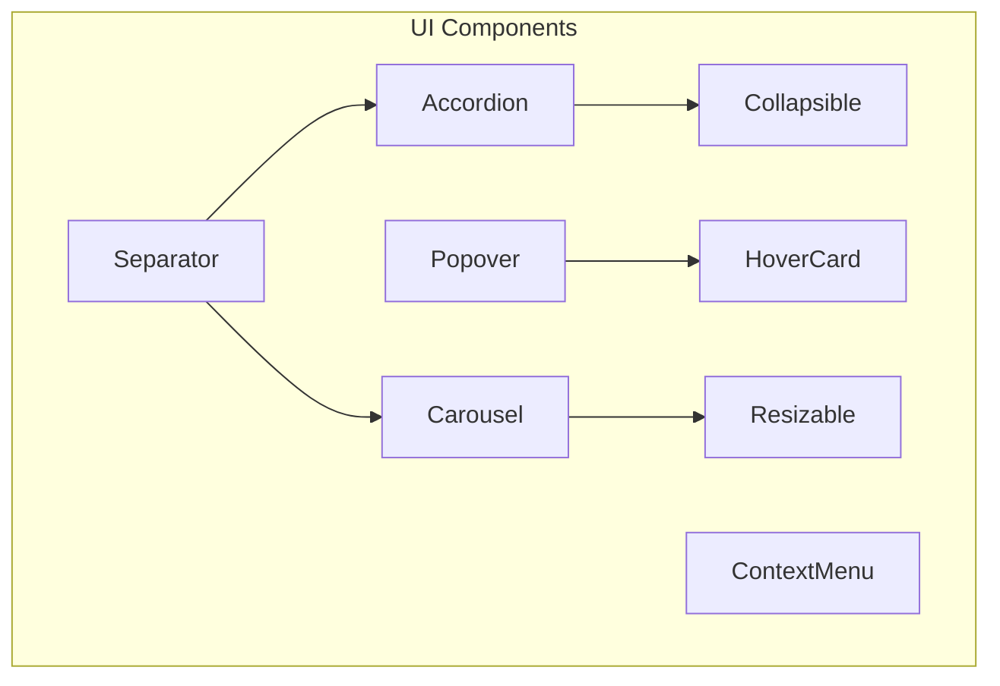

[No sources needed since this diagram shows conceptual structure]

## Core Components
This section summarizes each component’s purpose, key props, slots, events, and typical composition patterns. For exact prop names and behaviors, refer to the file-level analysis below.

- Accordion
  - Purpose: Multi-section content that can be expanded or collapsed independently.
  - Key concepts: Controlled/uncontrolled state, multiple expansion, keyboard navigation, focus management.
  - Slots: Trigger items, content panels, optional headers/actions.
  - Events: onValueChange, onFocusChange (when applicable).
  - Accessibility: ARIA roles for accordion/heading/content, arrow keys, Enter/Space activation.

- Collapsible
  - Purpose: Toggle a single region open/closed.
  - Key concepts: Controlled/uncontrolled state, open/close transitions.
  - Slots: Trigger element, collapsible content.
  - Events: onOpenChange.
  - Accessibility: aria-expanded, focus trapping when open if needed.

- Carousel
  - Purpose: Horizontal scrollable list with navigation controls and optional autoplay.
  - Key concepts: Slide index, loop, snap alignment, touch/mouse drag, responsive breakpoints.
  - Slots: Individual slides, prev/next buttons, indicators.
  - Events: onChange, onSlideEnter/Leave (if provided), onDragStart/End.
  - Accessibility: role="region", aria-label, keyboard arrows, focus ring on controls.

- ContextMenu
  - Purpose: Platform-native context menu triggered by right-click or long-press.
  - Key concepts: Positioning, portal rendering, item selection, disabled states.
  - Slots: Menu items, separators, submenus.
  - Events: onOpenChange, onSelect.
  - Accessibility: roving tabindex, arrow keys, Escape to close.

- Popover
  - Purpose: Floating panel anchored to a trigger with focus management and backdrop click-to-close.
  - Key concepts: Portal, positioning, modal vs non-modal, trap focus when modal.
  - Slots: Trigger, content.
  - Events: onOpenChange.
  - Accessibility: aria-haspopup/dialog depending on mode, focus trap, Escape to dismiss.

- HoverCard
  - Purpose: Lightweight floating card shown on hover/focus with delay and pointer interaction.
  - Key concepts: Delayed open/close, pointer enter/leave, safe area positioning.
  - Slots: Trigger, content.
  - Events: onOpenChange.
  - Accessibility: aria-describedby, focus-visible styles.

- Separator
  - Purpose: Visual divider for grouping content.
  - Key concepts: Orientation (horizontal/vertical), decorative vs semantic.
  - Slots: None (decorative) or label content (semantic).
  - Accessibility: role="separator" when semantic; aria-orientation.

- Resizable
  - Purpose: Draggable panes or panels with resize handles.
  - Key concepts: Min/max sizes, axis constraints, persistence, touch support.
  - Slots: Resize handle, resizable content.
  - Events: onResize, onResizeEnd.
  - Accessibility: aria-valuenow/min/max, keyboard increment/decrement.

**Section sources**
- [accordion.tsx](file://src/components/ui/accordion.tsx)
- [collapsible.tsx](file://src/components/ui/collapsible.tsx)
- [carousel.tsx](file://src/components/ui/carousel.tsx)
- [context-menu.tsx](file://src/components/ui/context-menu.tsx)
- [popover.tsx](file://src/components/ui/popover.tsx)
- [hover-card.tsx](file://src/components/ui/hover-card.tsx)
- [separator.tsx](file://src/components/ui/separator.tsx)
- [resizable.tsx](file://src/components/ui/resizable.tsx)

## Architecture Overview
These components follow a common architecture:
- Composition-first design using children/slots.
- Controlled and uncontrolled modes via props.
- Portal-based overlays for floating elements (Popover, HoverCard, ContextMenu).
- Shared utilities for positioning, focus management, and event handling.

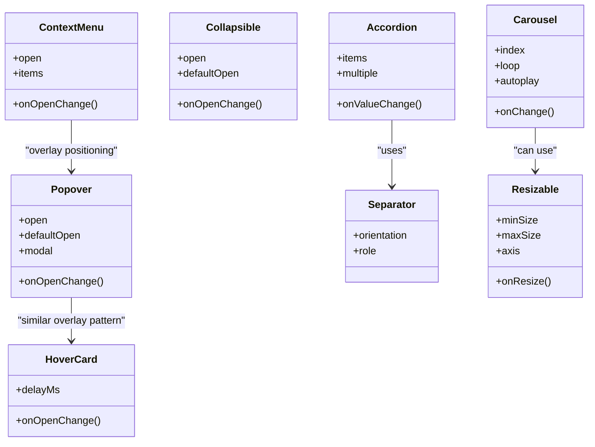

**Diagram sources**
- [accordion.tsx](file://src/components/ui/accordion.tsx)
- [collapsible.tsx](file://src/components/ui/collapsible.tsx)
- [carousel.tsx](file://src/components/ui/carousel.tsx)
- [context-menu.tsx](file://src/components/ui/context-menu.tsx)
- [popover.tsx](file://src/components/ui/popover.tsx)
- [hover-card.tsx](file://src/components/ui/hover-card.tsx)
- [separator.tsx](file://src/components/ui/separator.tsx)
- [resizable.tsx](file://src/components/ui/resizable.tsx)

## Detailed Component Analysis

### Accordion
- API highlights
  - Controlled/uncontrolled value via props.
  - Multiple expansion toggle.
  - Keyboard: Arrow Up/Down to move focus between triggers; Enter/Space to toggle.
- Slot patterns
  - Trigger nodes (headers) and content panels.
  - Optional actions inside triggers.
- Composition strategies
  - Nest within cards or lists.
  - Combine with Separator for visual grouping.
- Event propagation
  - Ensure trigger clicks do not bubble into parent interactive elements.
- Z-index management
  - Content typically renders inline; no overlay z-index concerns.
- Responsive behavior
  - Collapse on small screens; expand sections progressively.
- Touch interactions
  - Tap to toggle; ensure large enough hit targets.
- Performance
  - Lazy render heavy content inside collapsed panels.
- Accessibility
  - Roles: accordion, heading, region.
  - aria-expanded on triggers; aria-controls linking to content.

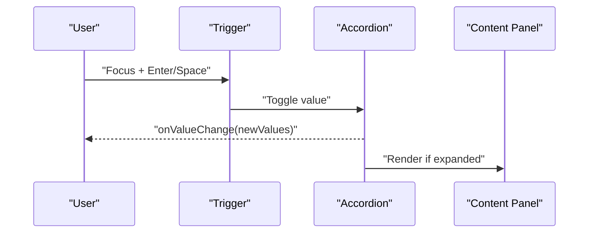

**Diagram sources**
- [accordion.tsx](file://src/components/ui/accordion.tsx)

**Section sources**
- [accordion.tsx](file://src/components/ui/accordion.tsx)

### Collapsible
- API highlights
  - Open state controlled or defaultOpen.
  - onOpenChange callback for sync.
- Slot patterns
  - Single trigger and one content block.
- Composition strategies
  - Use inside Accordion items or standalone sections.
- Event propagation
  - Prevent bubbling from nested interactive elements.
- Z-index management
  - Inline content; no overlay.
- Responsive behavior
  - Auto-collapse on narrow viewports if desired.
- Touch interactions
  - Tap to toggle; ensure accessible labels.
- Performance
  - Defer expensive content until opened.
- Accessibility
  - aria-expanded toggled on trigger; focus management when opening.

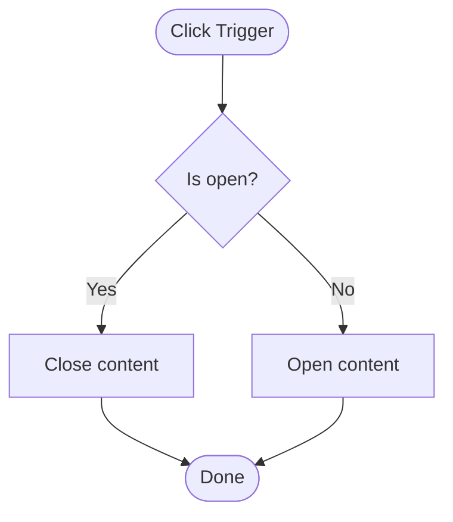

**Diagram sources**
- [collapsible.tsx](file://src/components/ui/collapsible.tsx)

**Section sources**
- [collapsible.tsx](file://src/components/ui/collapsible.tsx)

### Carousel
- API highlights
  - Index control, loop mode, autoplay interval.
  - Drag/swipe gestures and keyboard navigation.
- Slot patterns
  - Slides, prev/next buttons, indicators.
- Composition strategies
  - Combine with Resizable for dynamic widths; use Separator between slides if needed.
- Event propagation
  - Stop propagation on button clicks to avoid unintended handlers.
- Z-index management
  - Overlay controls should sit above slide content.
- Responsive behavior
  - Show more slides on larger screens; snap scrolling.
- Touch interactions
  - Pointer events for drag; momentum and inertia if supported.
- Performance
  - Virtualize or lazy-load offscreen slides.
- Accessibility
  - Role="region", aria-label, aria-live for active slide changes.
  - Arrow keys navigate slides; focus visible on controls.

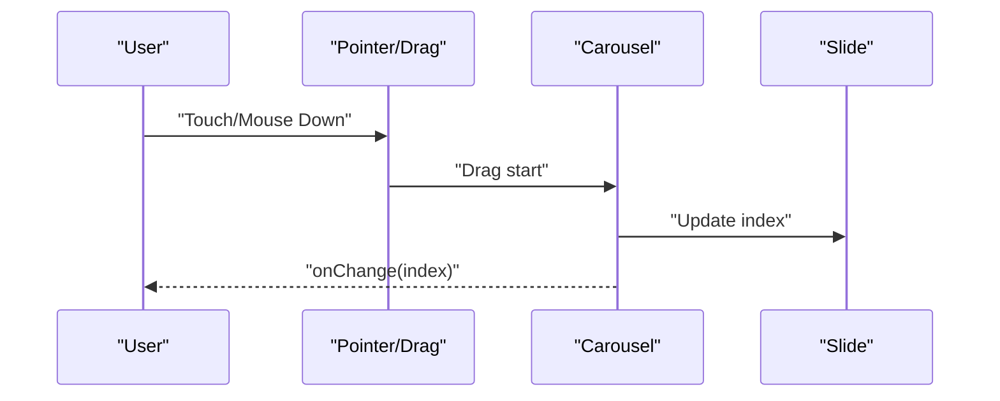

**Diagram sources**
- [carousel.tsx](file://src/components/ui/carousel.tsx)

**Section sources**
- [carousel.tsx](file://src/components/ui/carousel.tsx)

### ContextMenu
- API highlights
  - Open state control, items array, disabled states.
  - Positioning relative to trigger or cursor.
- Slot patterns
  - Items, separators, submenus.
- Composition strategies
  - Wrap actionable areas; combine with Tooltip for hints.
- Event propagation
  - Prevent default context menu; stop propagation on item clicks.
- Z-index management
  - Render in portal with high z-index; ensure stacking context is correct.
- Responsive behavior
  - Adjust placement near edges; flip direction if needed.
- Touch interactions
  - Long-press to open; tap outside to close.
- Performance
  - Memoize items; avoid re-renders on hover.
- Accessibility
  - Roving tabindex, arrow keys, Escape to close; role="menu".

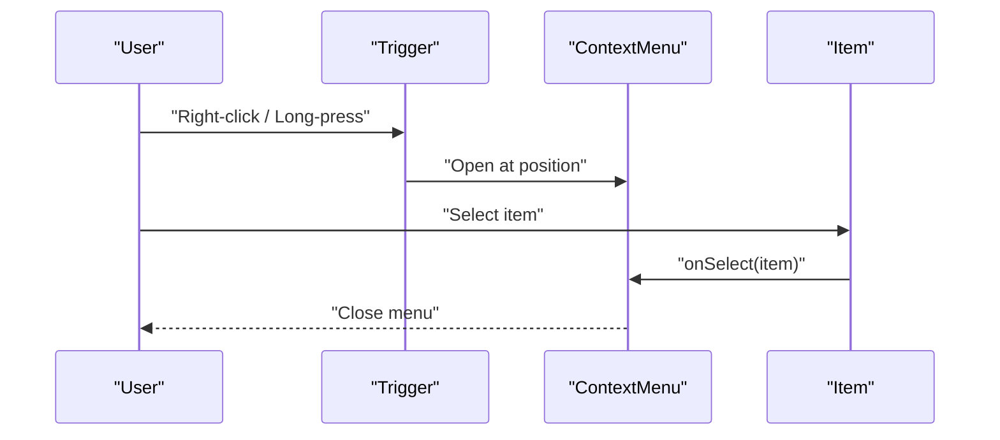

**Diagram sources**
- [context-menu.tsx](file://src/components/ui/context-menu.tsx)

**Section sources**
- [context-menu.tsx](file://src/components/ui/context-menu.tsx)

### Popover
- API highlights
  - Controlled/uncontrolled open state, modal option.
  - Focus trap when modal; click-outside to close.
- Slot patterns
  - Trigger and content.
- Composition strategies
  - Use for lightweight dialogs; nest within Accordion/Collapsible carefully.
- Event propagation
  - Stop propagation on trigger to avoid background clicks.
- Z-index management
  - Portal with elevated z-index; coordinate with other overlays.
- Responsive behavior
  - Reposition near viewport edges; switch placement on small screens.
- Touch interactions
  - Tap trigger to open; tap outside to close.
- Performance
  - Lazy render content; memoize popover content.
- Accessibility
  - aria-haspopup/dialog; focus trap; Escape to dismiss.

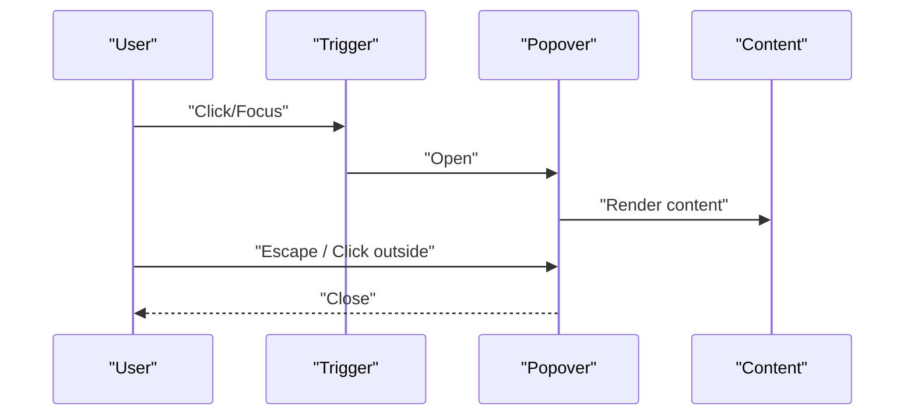

**Diagram sources**
- [popover.tsx](file://src/components/ui/popover.tsx)

**Section sources**
- [popover.tsx](file://src/components/ui/popover.tsx)

### HoverCard
- API highlights
  - Delayed open/close; pointer enter/leave; safe area positioning.
- Slot patterns
  - Trigger and content.
- Composition strategies
  - Use for quick previews; pair with Separator for layout.
- Event propagation
  - Avoid triggering parent hover handlers unintentionally.
- Z-index management
  - Portal with moderate z-index; ensure it appears above content but below modals.
- Responsive behavior
  - Adjust placement based on available space.
- Touch interactions
  - Focus to open; blur to close.
- Performance
  - Debounce open/close; avoid frequent reflows.
- Accessibility
  - aria-describedby; focus-visible styles.

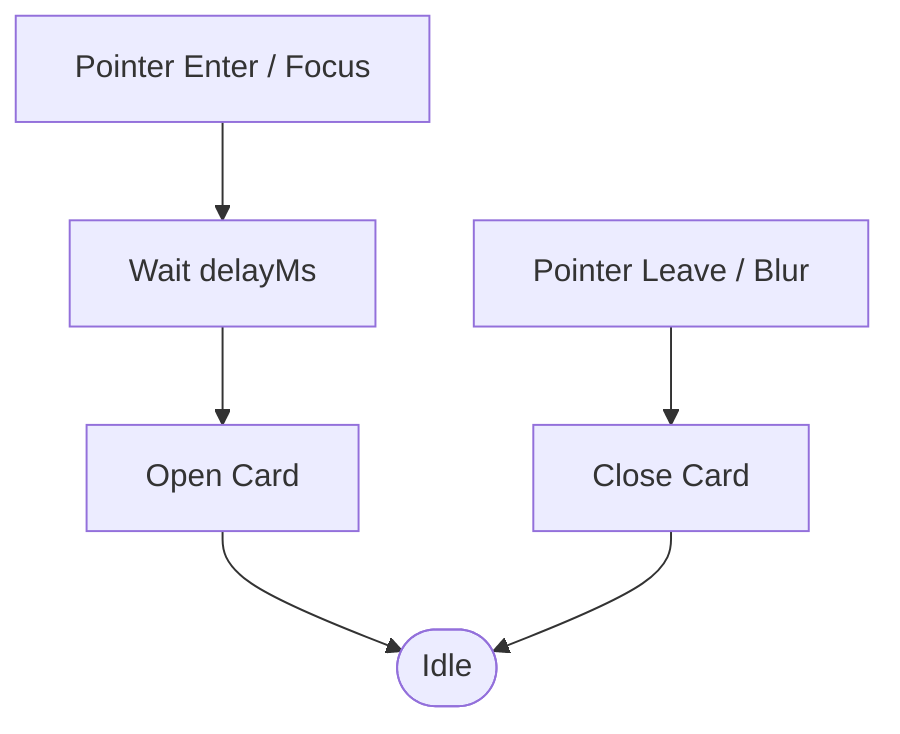

**Diagram sources**
- [hover-card.tsx](file://src/components/ui/hover-card.tsx)

**Section sources**
- [hover-card.tsx](file://src/components/ui/hover-card.tsx)

### Separator
- API highlights
  - Orientation (horizontal/vertical); semantic role.
- Slot patterns
  - Optional label content for semantic separators.
- Composition strategies
  - Use between Accordion items, Carousel slides, or form fields.
- Event propagation
  - Decorative separators should not capture events.
- Z-index management
  - No overlay; normal flow.
- Responsive behavior
  - Switch orientation based on layout.
- Touch interactions
  - Not interactive.
- Performance
  - Lightweight; negligible cost.
- Accessibility
  - role="separator"; aria-orientation when semantic.

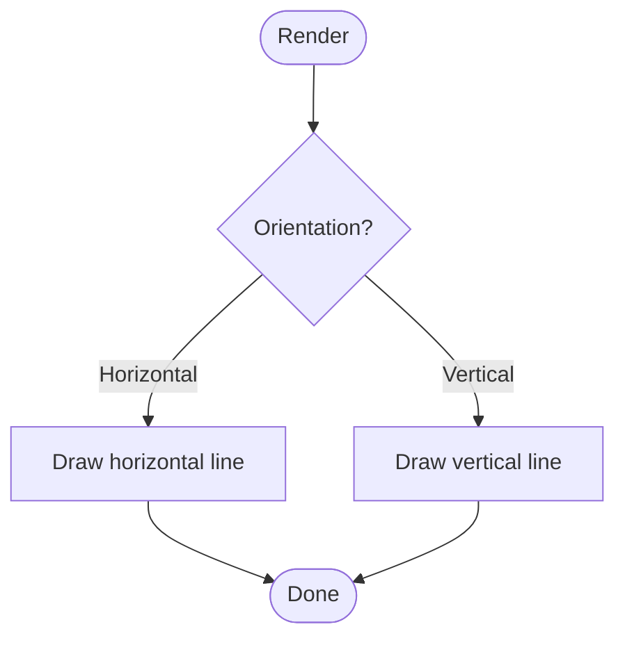

**Diagram sources**
- [separator.tsx](file://src/components/ui/separator.tsx)

**Section sources**
- [separator.tsx](file://src/components/ui/separator.tsx)

### Resizable
- API highlights
  - Min/max sizes, axis constraints, persistence, onResize/onResizeEnd.
- Slot patterns
  - Resize handle and resizable content.
- Composition strategies
  - Pair with Carousel for adjustable slide widths; use with Accordion panels.
- Event propagation
  - Capture pointer events on handle; prevent default dragging behavior.
- Z-index management
  - Handle sits above content; ensure pointer-events are correct.
- Responsive behavior
  - Constrain min/max per breakpoint.
- Touch interactions
  - Support touch drag; provide visual feedback.
- Performance
  - Throttle resize updates; avoid layout thrashing.
- Accessibility
  - aria-valuenow/min/max; keyboard increment/decrement.

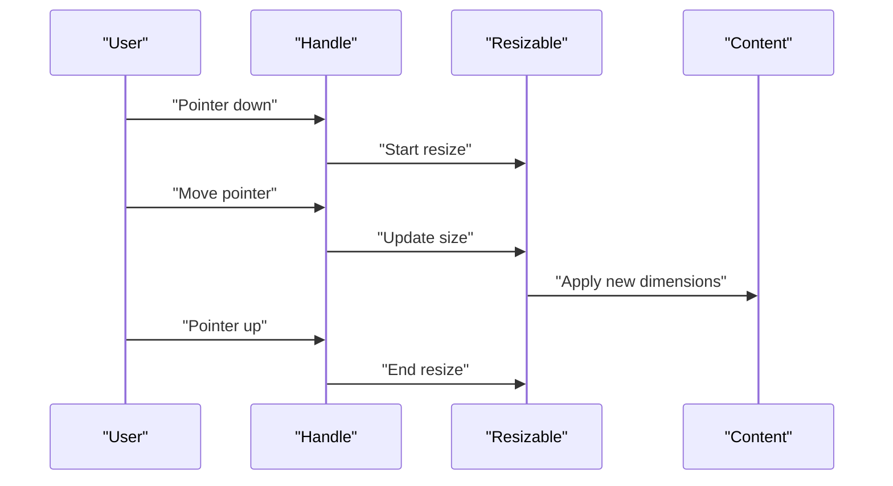

**Diagram sources**
- [resizable.tsx](file://src/components/ui/resizable.tsx)

**Section sources**
- [resizable.tsx](file://src/components/ui/resizable.tsx)

## Dependency Analysis
- Composition relationships
  - Accordion often uses Separator for visual grouping.
  - Carousel may integrate Resizable for dynamic slide sizing.
  - Popover and HoverCard share overlay patterns; ContextMenu builds on similar positioning.
- External dependencies
  - All components rely on shared UI primitives and positioning utilities.
- Potential circular dependencies
  - Keep components decoupled; avoid importing each other directly unless necessary.

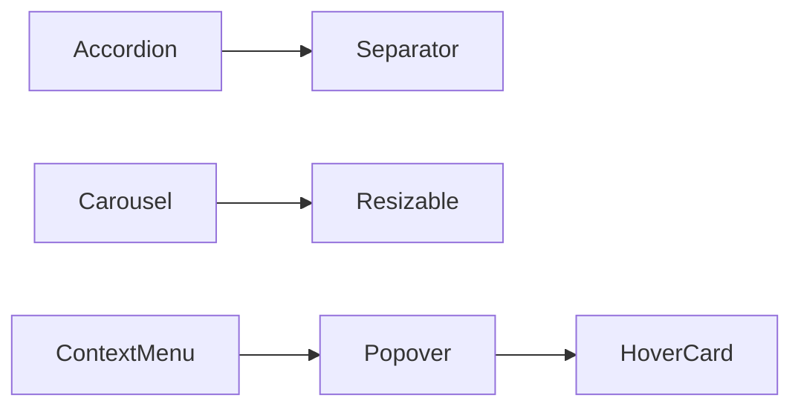

**Diagram sources**
- [accordion.tsx](file://src/components/ui/accordion.tsx)
- [carousel.tsx](file://src/components/ui/carousel.tsx)
- [context-menu.tsx](file://src/components/ui/context-menu.tsx)
- [hover-card.tsx](file://src/components/ui/hover-card.tsx)
- [popover.tsx](file://src/components/ui/popover.tsx)
- [resizable.tsx](file://src/components/ui/resizable.tsx)
- [separator.tsx](file://src/components/ui/separator.tsx)

**Section sources**
- [accordion.tsx](file://src/components/ui/accordion.tsx)
- [carousel.tsx](file://src/components/ui/carousel.tsx)
- [context-menu.tsx](file://src/components/ui/context-menu.tsx)
- [hover-card.tsx](file://src/components/ui/hover-card.tsx)
- [popover.tsx](file://src/components/ui/popover.tsx)
- [resizable.tsx](file://src/components/ui/resizable.tsx)
- [separator.tsx](file://src/components/ui/separator.tsx)

## Performance Considerations
- Lazy loading: Defer rendering of heavy content in Accordion/Collapsible panels and Carousel slides until needed.
- Virtualization: For large lists in Carousel or menus, virtualize visible items.
- Memoization: Memoize computed props and child components to reduce re-renders.
- Event throttling: Throttle resize and drag events in Resizable and Carousel.
- Portal efficiency: Reuse portals for overlays; avoid creating many independent portals.
- CSS containment: Use contain and will-change sparingly to improve paint performance.
- Memory management: Clean up listeners and timers on unmount.

[No sources needed since this section provides general guidance]

## Troubleshooting Guide
- Overlays hidden behind other elements
  - Ensure portal containers have appropriate z-index stacking contexts.
  - Verify no ancestor has a lower stacking context blocking overlays.
- Focus not trapped in Popover/ContextMenu
  - Confirm modal mode is enabled and focus trap is initialized.
  - Check that focus is moved to the first focusable element on open.
- Carousel swipe conflicts
  - Stop propagation on nested interactive elements.
  - Disable drag when hovering over inputs or buttons.
- Resizable handle not responding
  - Verify pointer-events are set correctly on handle and content.
  - Ensure min/max constraints are valid.
- Keyboard navigation broken
  - Confirm roving tabindex implementation and arrow key handlers.
  - Test Escape to close overlays and Enter/Space to activate triggers.
- Touch interactions unreliable
  - Use pointer events for unified mouse/touch handling.
  - Provide sufficient touch target sizes and visual feedback.

**Section sources**
- [popover.tsx](file://src/components/ui/popover.tsx)
- [context-menu.tsx](file://src/components/ui/context-menu.tsx)
- [carousel.tsx](file://src/components/ui/carousel.tsx)
- [resizable.tsx](file://src/components/ui/resizable.tsx)

## Conclusion
These utility and container components provide a robust foundation for building complex, accessible, and performant interfaces. By leveraging their APIs, slot patterns, and composition strategies—while paying attention to event propagation, z-index management, responsiveness, touch interactions, and accessibility—you can create rich user experiences that work well across devices and assistive technologies.

[No sources needed since this section summarizes without analyzing specific files]